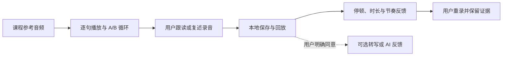
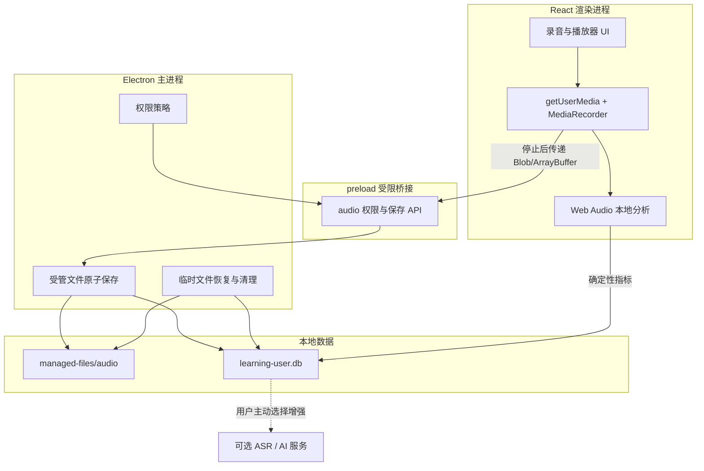
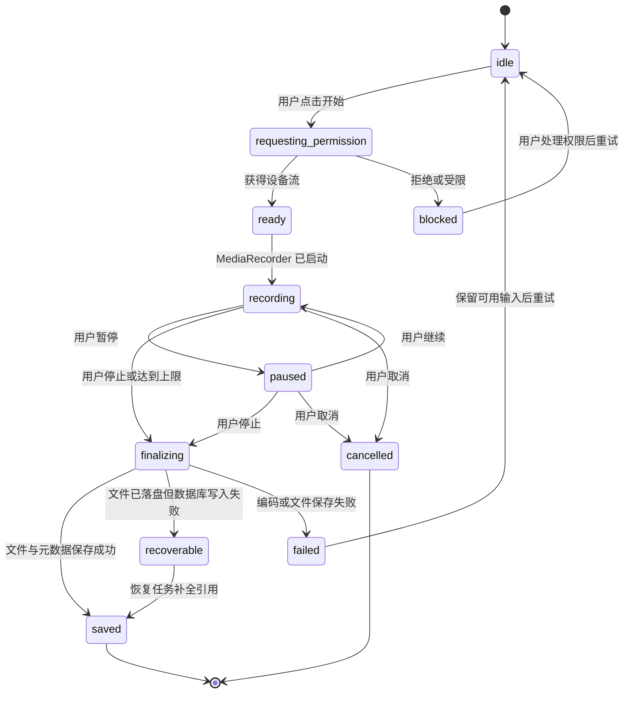

# OmniBox 英语 MVP 音频、录音与反馈技术验证方案

> 文档状态：技术验证方案，可进入 Spike 与技术评审
> 对应产品版本：`0.1.0` 规划，不修改应用版本号
> 依赖文档：`learning-center-prd.md`、`learning-center-interaction-spec.md`、`learning-center-database-design.md`、`learning-center-course-catalog.md`
> 当前范围：只定义验证目标、技术边界、接口草案和验收方法，不实现学习中心功能

## 1. 目标与结论摘要

本方案验证英语 MVP 中以下闭环能否在 OmniBox 的 Electron、React 和本地数据架构内稳定成立：



建议的首期技术基线：

- 录音使用 Chromium 提供的 `getUserMedia` 和 `MediaRecorder`，不让 Python 后端参与实时采集。
- 录音格式在运行时检测，优先使用 `audio/webm;codecs=opus`，不假定所有平台都支持同一 MIME。
- 播放使用浏览器原生音频能力；首期的逐句定位依赖课程内容包提供的时间码，不自动切句。
- 原始录音保持本地，默认不转码；需要分析时通过 Web Audio 解码为内存中的单声道 PCM。
- 本地反馈只输出可解释的时长、停顿、语速和文本差异，不输出未经验证的“发音分数”。
- FFmpeg 首期只作为开发验证工具和算法对照，不作为应用运行时依赖。
- 联网转写和 AI 反馈必须由用户单次主动触发，并在调用前展示将发送的录音或文本。

该基线只有通过开发模式与 macOS、Windows 安装包 Spike 后才能转为正式实现决策。

## 2. 当前仓库基础与缺口

### 2.1 可复用基础

当前 OmniBox 已具备：

- Electron 主进程、preload 隔离层和 React 渲染进程。
- `contextIsolation: true`、`nodeIntegration: false` 的桌面窗口配置。
- 受限的 `window.desktop` 桥接方式，可沿用为音频权限和文件保存接口。
- Python FastAPI 本地服务，但它不应进入录音实时路径。
- Electron Builder 的 macOS、Windows 打包配置。
- 学习中心 DDL 草案中的 `audio_recordings` 和 `speech_assessments`。

### 2.2 尚未具备

当前代码中尚未发现：

- 麦克风权限检查、请求与拒绝后的引导。
- `getUserMedia`、`MediaRecorder` 或录音状态机。
- 音频专用 IPC、受管文件目录和原子保存流程。
- 播放器、句子时间码、波形和 A/B 循环。
- 停顿检测、语速统计、录音对比或语音识别。
- macOS `NSMicrophoneUsageDescription` 打包配置。

因此“浏览器开发页可以录音”不能直接视为“安装包录音通过”。

## 3. P0 范围与明确排除项

### 3.1 P0 必须验证

| 能力 | P0 验证结果 |
|---|---|
| 麦克风权限 | 可解释 `未询问/允许/拒绝/受限/无设备`，拒绝后不反复弹窗 |
| 录音 | 开始、暂停、继续、停止、取消和异常退出行为明确 |
| 格式 | 实际 MIME、编码、采样率、声道和时长可记录 |
| 本地保存 | 临时文件、哈希、原子改名、数据库引用和崩溃恢复可闭环 |
| 回放 | 播放、暂停、拖动、倍速、逐句循环和 A/B 循环可用 |
| 本地反馈 | 时长、有效发声、停顿和有文本时的语速可重复计算 |
| 隐私 | 无后台偷录；默认不联网；发送前明确同意 |
| 跨平台 | macOS arm64 和 Windows x64 的安装包均完成实测 |

### 3.2 P0 不做

- 不承诺音素级发音诊断。
- 不显示单一“口语总分”或伪精确百分制。
- 不以 Web Speech API 作为离线核心能力。
- 不默认下载本地 Whisper 等大模型包。
- 不自动把任何录音上传到模型或第三方语音服务。
- 不在首期自动从任意长音频中识别句子边界。
- 不把 FFmpeg 直接打入安装包。
- 不做实时双向语音对话代理。

## 4. 推荐音频架构



### 4.1 为什么录音不经过 Python HTTP

- 浏览器内核已经直接提供麦克风采集和编码能力。
- 通过本地 HTTP 传实时音频会增加分片、背压、端口鉴权和中断恢复复杂度。
- Python 后端进程退出不应中断正在进行的录音。
- 将权限和文件边界留在 Electron，可与安装包权限、用户数据目录和窗口生命周期保持一致。

Python 后端可在后续承担非实时、可取消的派生分析任务，但不持有麦克风。

## 5. 麦克风权限与安全策略

### 5.1 权限状态模型

界面使用统一状态，不直接暴露平台差异：

| 状态 | 含义 | 用户操作 |
|---|---|---|
| `unknown` | 尚未查询或平台未返回稳定结果 | 检查状态 |
| `not_determined` | 系统尚未询问 | 点击“启用麦克风”后请求 |
| `granted` | 已授权 | 允许开始录音 |
| `denied` | 用户或系统拒绝 | 展示系统设置路径，不循环请求 |
| `restricted` | 系统策略、家长控制或企业策略限制 | 说明无法在应用内解除 |
| `no_device` | 没有可用输入设备 | 提示连接或选择设备 |
| `busy_or_failed` | 设备被占用或初始化失败 | 保留草稿并允许重试 |

### 5.2 Electron 主进程要求

- 同时设置权限检查处理器和权限请求处理器。
- 只允许 OmniBox 主窗口可信来源请求 `media` 权限。
- 只允许 `details.mediaType === 'audio'`；摄像头、视频和未知类型全部拒绝。
- 开发环境只允许预设 Vite 地址，生产环境只允许打包页面来源。
- 校验请求来源和 frame，不因任意子页面或未来外链页面请求而放行。
- 主窗口导航、重载或退出时停止所有音轨。
- 不向 preload 暴露通用 `session`、`ipcRenderer` 或文件系统对象。

### 5.3 macOS

- 在 Electron Builder `mac.extendInfo` 中加入 `NSMicrophoneUsageDescription`。
- 首次请求前先展示 OmniBox 自己的用途说明，再触发系统授权。
- 使用系统权限状态区分 `not-determined`、`granted`、`denied` 和 `restricted`。
- 用户拒绝后不反复调用请求接口；提供“打开系统设置”的明确说明。
- 未签名测试包、签名包和最终公证包都要分别确认权限表现，避免仅在开发进程中通过。

建议文案：

> OmniBox 需要使用麦克风保存你的英语跟读和复述录音。录音默认仅保存在本机，只有你主动选择联网反馈时才会发送。

### 5.4 Windows

- 区分系统总开关、桌面应用麦克风权限和设备不可用。
- 权限被系统关闭时直接引导到 Windows 隐私设置，不连续触发请求。
- 验证安装版和便携版是否表现一致。

## 6. 录音格式与采集参数

### 6.1 MIME 选择

录音开始前按顺序调用 `MediaRecorder.isTypeSupported`：

1. `audio/webm;codecs=opus`
2. `audio/webm`
3. 不传 MIME，让 Chromium 自行选择

不能仅根据操作系统推测支持情况。保存时必须记录 `MediaRecorder.mimeType` 的实际值。

### 6.2 首期建议参数

| 参数 | 建议 | 说明 |
|---|---|---|
| 声道 | 单声道优先 | 口语反馈不需要立体声 |
| 编码 | Opus 优先 | 语音质量与体积平衡较好 |
| 目标码率 | 约 48–64 kbps | 仅作请求参数，实际值以文件为准 |
| 采样率 | 接受设备实际值 | 常见为 44.1 kHz 或 48 kHz，不强制采集端重采样 |
| 单次时长 | P0 上限 5 分钟 | 覆盖跟读、60–90 秒复述和阶段任务 |
| 分片周期 | Spike 比较 250 ms 与 1000 ms | 影响内存、停止延迟和中断恢复 |

48 kbps 的纯音频理论体积约为每分钟 360 KB，5 分钟约 1.8 MB，实际文件还包含容器开销。应用限制应同时基于时长和实际字节数。

### 6.3 原始与派生格式

- 原始录音：保留浏览器生成的 WebM/Opus，不默认转码。
- 本地分析：通过 Web Audio 解码为 `Float32Array` 单声道 PCM，只保存在内存或可重建缓存。
- 远程 ASR：若服务只接受 WAV，可临时生成 16 kHz、16-bit、单声道 WAV，调用结束后清理。
- 用户导出：后续可提供 WebM、WAV 或 MP3，属于单独的格式转换功能，不阻塞录音证据保存。

## 7. 录音状态机



关键规则：

- “开始录音”必须由用户手势触发。
- 获取流成功不等于录音已开始，只有收到 `start` 事件后才更新为 `recording`。
- 停止时先停止 `MediaRecorder`，收到最终数据后再停止所有 `MediaStreamTrack`。
- “取消”默认丢弃本次未提交录音；若文件已经进入保存阶段，走软删除流程。
- 页面切换时允许提示“结束并保存”或“取消录音”，不能在不可见页面继续无提示录音。
- 录音过程中提供持续可见的红点、计时和输入电平。

## 8. 本地文件保存与恢复

### 8.1 目录建议

```text
<userData>/learning/
├── learning-user.db
├── managed-files/
│   └── audio/
│       ├── recordings/
│       │   └── <profile-id>/<yyyy-mm>/<recording-id>.webm
│       └── tmp/
└── cache/
    └── waveforms/
```

数据库只保存相对受管路径，不能保存另一台机器无法恢复的绝对路径。

### 8.2 原子保存顺序

1. 渲染进程停止录音并获得最终 Blob。
2. 通过受限 IPC 传递幂等键、字节和允许字段。
3. 主进程校验大小、MIME 白名单和最大时长元数据。
4. 写入 `tmp/<recording-id>.partial`。
5. 关闭文件后计算 SHA-256，并验证字节数。
6. 原子改名到最终文件。
7. 在数据库事务中写入 `audio_recordings` 和提交关系。
8. 数据库成功后返回稳定 `recording_id`。

文件系统与 SQLite 无法组成同一事务，因此必须设计恢复扫描：

- 有最终文件、无数据库记录：显示为可恢复录音，确认后补建记录或删除。
- 有数据库记录、文件缺失：标记损坏，不生成有效学习证据。
- 有超时 `.partial`：确认无活动写入后放入待清理队列。
- 重试沿用同一幂等键，不能重复生成两条录音证据。

### 8.3 IPC 草案

| 通道 | 输入 | 输出 | 边界 |
|---|---|---|---|
| `audio:permission-status` | 无 | 统一权限状态 | 只读 |
| `audio:request-permission` | 用户操作标记 | 权限结果 | 只允许主窗口 |
| `audio:save-recording` | 幂等键、ArrayBuffer、白名单元数据 | `recording_id` 和摘要 | 限制大小与 MIME |
| `audio:delete-recording` | `recording_id` | 软删除结果 | 不接受任意路径 |
| `audio:recover-recordings` | 无 | 可恢复项目列表 | 不返回目录遍历能力 |
| `audio:show-in-folder` | `recording_id` | 是否成功 | 主进程解析受管路径 |

P0 的 5 分钟 Opus 文件可先验证一次性传递 ArrayBuffer。若峰值内存不达标，再切换到 `MessagePort` 分片流式写入，不能预先增加复杂度。

## 9. 播放、逐句与 A/B 循环

### 9.1 播放基线

- 使用 `HTMLAudioElement` 完成播放、暂停、拖动、倍速和音量。
- 倍速播放尽量保持音高；若当前内核不支持，界面明确提示。
- 参考音频和用户录音使用相同播放器协议，但不能混淆来源。
- 波形是可重建缓存，不能作为原始录音的唯一数据。

### 9.2 时间码来源

首期课程音频由内容包提供句子级时间码：

```json
{
  "audio_ref": "audio.english.weak_forms.dialogue_01",
  "segments": [
    {
      "id": "segment.01",
      "start_ms": 0,
      "end_ms": 1840,
      "text": "Could you give me a minute?"
    }
  ]
}
```

时间码必须满足：

- `0 <= start_ms < end_ms <= duration_ms`。
- 同一音频的句子 ID 稳定。
- 文本修订不改变已有学习记录引用。
- 内容构建阶段完成试听校验，不能只由静音算法自动生成。

### 9.3 循环策略

- 逐句循环：在 `end_ms` 前预留小于 50 ms 的检查窗口，到点回到 `start_ms`。
- A/B 循环：用户选择范围后验证最短时长，避免极短区间造成失控跳转。
- 连续循环 20 次后，播放位置漂移目标不超过 50 ms；以安装包实测决定最终阈值。
- 页面后台化、系统休眠或输出设备变化后停止循环并提示恢复。

## 10. 本地反馈设计

### 10.1 可以可靠提供的指标

| 指标 | 前提 | 展示方式 |
|---|---|---|
| 录音总时长 | 录音可解码 | `01:12.4` |
| 有效发声时长 | 本地能量分段 | 秒数和占比，说明阈值 |
| 停顿次数 | 本地能量分段 | 区分句首、句中、句尾 |
| 停顿总时长 | 本地能量分段 | 秒数和时间轴标记 |
| 句中最长停顿 | 本地能量分段 | 时间点与时长 |
| 参考/录音时长比 | 存在参考音频 | 描述快慢趋势，不直接判好坏 |
| 语速 WPM | 有可信英文转写或给定文本 | 单词数除以有效分钟数 |
| 文本差异 | 有转写和目标文本 | 漏词、增词、替换，不等同发音错误 |

### 10.2 首期不应输出

- 没有经验证声学模型时的音素准确率。
- 仅依据录音时长推断的“流利度分数”。
- 把语音识别错误直接标记为用户发音错误。
- 不说明语言、口音、设备和噪声条件的横向排名。
- 用 AI 自然语言反馈覆盖确定性指标原值。

### 10.3 停顿检测候选算法

Spike 使用可解释的能量检测基线：

1. 解码为单声道浮点 PCM。
2. 使用 20 ms 帧、10 ms hop 计算 RMS 和 dBFS。
3. 估算当前录音的低能量噪声底。
4. 候选阈值为 `max(noise_floor + 10 dB, -45 dBFS)`。
5. 使用 150–250 ms hangover 合并短暂断裂。
6. 句中停顿最短时长暂定 300 ms。
7. 句首与句尾静音独立统计，不计入句中停顿次数。

阈值只是验证起点，不能直接成为产品结论。必须使用安静房间、风扇噪声、笔记本内置麦克风、蓝牙耳机、不同说话音量的标注样本调参。

### 10.4 反馈示例

推荐：

> 这次录音 42.8 秒，检测到 3 处超过 0.3 秒的句中停顿，其中最长一处为 1.1 秒。与上一次相比，总停顿时长减少 0.8 秒。录音环境噪声可能影响检测结果。

不推荐：

> 你的流利度是 86 分，发音接近母语者。

## 11. 可选转写与 AI 增强边界

### 11.1 本地非 AI 模式

即使没有模型和网络，也必须完成：

- 录音、保存、回放和重录。
- 参考音频逐句与 A/B 循环。
- 时长、停顿和波形反馈。
- 用户基于提示清单进行自评。
- 保存原始与重录版本作为学习证据。

### 11.2 可选转写

- Web Speech API 不作为 P0 核心，因为其可用性、离线性和服务实现不稳定。
- 本地 Whisper 类模型可作为后续按需模型包，需要单独评估下载体积、CPU、内存、许可和跨平台打包。
- 第三方 ASR 只能由用户主动发起，界面显示服务商、发送的录音、用途和是否保留远端数据。
- ASR 结果标记引擎与版本，允许用户编辑；编辑后的文本与原始转写分开保存。

### 11.3 AI 反馈

AI 适合补充：

- 表达是否覆盖任务要求。
- 句子是否自然、是否可用更简单的说法。
- 根据用户主动提交的转写给出重说建议。

AI 不负责：

- 覆盖本地测得的时长、停顿和文本差异。
- 在没有专用声学证据时判断具体音素发音。
- 自动将一次反馈升级为“已掌握”。

同意范围至少区分：

```json
{
  "send_audio": false,
  "send_transcript": true,
  "provider": "configured-provider",
  "purpose": "spoken_feedback",
  "requested_at": "2026-08-10T00:00:00.000Z"
}
```

## 12. 数据模型调整建议

现有 `audio_recordings` 和 `speech_assessments` 可保留，但正式迁移前建议补足实际音频元数据。

### 12.1 `audio_recordings` 建议增加

| 字段 | 作用 |
|---|---|
| `mime_type` | 实际容器 MIME |
| `codec` | 实际音频编码，如 `opus` |
| `channels` | 声道数 |
| `bit_rate` | 可获取时记录，未知允许为空 |
| `byte_size` | 文件大小，用于完整性检查和配额 |
| `capture_settings_json` | 实际媒体轨道设置和结构版本 |
| `reference_audio_ref` | 跟读时关联课程参考音频 |
| `parent_recording_id` | 重录或对比版本的来源 |

默认不保存稳定设备 ID、完整设备名称和硬件序列信息。若排障确需设备类别，只保存 `built_in/bluetooth/usb/unknown` 等低敏分类。

### 12.2 `speech_assessments` 使用规则

- 每次算法版本变化新增一条评价记录，不覆盖旧记录。
- `engine_version` 同时标记算法版本与阈值配置版本。
- `pause_metrics_json` 保存原始指标、阈值、帧长和时间段。
- `pace_metrics_json` 明确 WPM 使用的是目标文本、原始转写还是用户修订转写。
- `pronunciation_findings_json` 在无可信专用引擎时保持空对象。
- AI 评价使用 `evaluator='ai'`，不能伪装为 `local` 或 `rule`。

波形缓存、重采样 PCM 和临时 WAV 不进入必要备份清单。

## 13. 技术 Spike 清单

### Spike A：权限与安装包

验证：

- Vite 开发环境首次允许、拒绝、再次进入。
- macOS arm64 安装包的用途描述、授权、拒绝和系统设置恢复。
- Windows x64 安装包的隐私开关、拒绝和恢复。
- 非可信 frame、摄像头和未知媒体请求被拒绝。

通过条件：状态可解释、无无限弹窗、拒绝后仍可使用非录音学习功能。

### Spike B：格式、时长与设备矩阵

验证：

- `MediaRecorder.isTypeSupported` 结果和实际 `mimeType`。
- 内置麦克风、USB 麦克风、蓝牙耳机。
- 5 秒、30 秒、2 分钟和 5 分钟录音。
- 44.1 kHz、48 kHz 输入及设备切换。

通过条件：所有成功录音可立即回放；文件探测信息与保存元数据一致；达到上限能安全停止。

### Spike C：保存、崩溃与恢复

验证：

- 正常保存、重复点击、磁盘空间不足和数据库写入失败。
- 文件落盘后进程退出、只有 `.partial`、只有最终文件等情况。
- 删除与软删除恢复。

通过条件：不生成静默损坏证据；重启后每个异常文件都有可解释状态；幂等重试不重复记录。

### Spike D：播放与循环精度

验证：

- 逐句、A/B、0.75x、1.0x、1.25x 播放。
- 连续循环 20 次的边界漂移。
- 蓝牙输出、窗口后台、系统休眠恢复。

通过条件：用户能稳定复听同一句；漂移达到验收目标；异常恢复不从错误位置突然播放。

### Spike E：停顿检测与反馈

验证集至少包含：

- 人工合成的已知静音区间。
- 安静环境的连续朗读、自然停顿和刻意长停顿。
- 风扇、键盘、街道等背景噪声。
- 小音量、正常音量和距离麦克风较远的录音。

通过条件：对人工合成样本误差可量化；真实样本由人工标注复核；噪声条件下宁可提示“不确定”，不输出伪精确结论。

### Spike F：增强模式隐私

验证：

- 只发送转写与发送音频是两个独立选择。
- 请求前可预览数据范围，请求失败不丢本地录音。
- 日志不记录音频字节、完整转写、API Key 或可恢复隐私内容。

通过条件：断网、无 Key 或服务错误时，本地闭环仍完整可用。

## 14. 测试矩阵与验收指标

### 14.1 环境矩阵

| 维度 | 最低覆盖 |
|---|---|
| 运行形态 | Vite 开发、macOS 安装包、Windows 安装包 |
| 系统 | 当前支持的 macOS arm64、Windows 10/11 x64 |
| 权限 | 未询问、允许、拒绝、系统受限 |
| 设备 | 内置、USB、蓝牙、无设备 |
| 时长 | 5 秒、30 秒、2 分钟、5 分钟 |
| 生命周期 | 页面切换、窗口关闭、应用退出、系统休眠、设备断开 |
| 故障 | 磁盘不足、数据库失败、解码失败、网络失败 |

### 14.2 候选性能目标

以下是 Spike 的候选目标，不是当前已验证结果：

| 指标 | 候选目标 |
|---|---|
| 已授权后的录音启动延迟 | P95 小于 500 ms |
| 输入电平视觉反馈延迟 | 小于 100 ms |
| 2 分钟录音停止到可回放 | 小于 1 秒 |
| 20 次 A/B 循环累计边界漂移 | 小于 50 ms |
| 5 分钟录音 | 无丢块、无未受控内存增长 |
| 保存完整性 | 文件字节、SHA-256 与数据库引用一致 |
| 恢复完整性 | 注入故障后无无法解释的孤立证据 |

若一次性 ArrayBuffer 传递导致内存峰值过高，则以流式写入作为修正方案，而不是降低文件完整性要求。

## 15. FFmpeg 验证基线

FFmpeg 只用于开发机生成固定测试夹具、探测编码信息和与本地算法对照。

### 15.1 本轮已执行验证

本机 FFmpeg `8.1.2` 已验证以下 2.5 秒测试夹具：

- 48 kHz、单声道。
- `0–1s` 为 440 Hz 声音，`1–1.5s` 静音，`1.5–2.5s` 恢复声音。
- 转换为 WebM/Opus、48 kbps 请求码率。
- `ffprobe` 识别为 Opus、48 kHz、单声道、时长 `2.508s`。
- `silencedetect=noise=-45dB:d=0.3` 检测静音为 `1.000s–1.500021s`。

该结果验证了测试方法，不验证浏览器录音、Electron 权限和安装包。

### 15.2 可重复命令

```bash
validation_dir=$(mktemp -d /tmp/omnibox-audio-validation.XXXXXX)

ffmpeg -v error \
  -f lavfi \
  -i "aevalsrc='if(between(t,1,1.5),0,0.2*sin(2*PI*440*t))':s=48000:d=2.5" \
  -ac 1 \
  -c:a pcm_s16le \
  "$validation_dir/pause-fixture.wav"

ffmpeg -v error \
  -i "$validation_dir/pause-fixture.wav" \
  -c:a libopus \
  -b:a 48k \
  "$validation_dir/pause-fixture.webm"

ffprobe -v error \
  -show_entries format=duration,size:stream=codec_name,codec_type,sample_rate,channels,bit_rate \
  -of json \
  "$validation_dir/pause-fixture.webm"

ffmpeg -hide_banner \
  -i "$validation_dir/pause-fixture.webm" \
  -af silencedetect=noise=-45dB:d=0.3 \
  -f null -
```

## 16. 决策门槛

完成 Spike 后按以下规则收敛：

| 结果 | 决策 |
|---|---|
| WebM/Opus 在目标安装包稳定录制和回放 | 采用为 P0 原始格式 |
| 某平台不支持首选 MIME | 记录实际 MIME，使用浏览器回退；不要伪造扩展名 |
| `MediaRecorder` 时间精度满足录音、回放需求 | 保持简单架构 |
| 实时分析需要更稳定 PCM 或电平 | 仅为分析增加 `AudioWorklet`，原始录音仍由 MediaRecorder 保存 |
| Web Audio 停顿检测达到标注集目标 | 不引入运行时 FFmpeg |
| 本地规则无法可靠判断某指标 | 删除该指标或标为不确定，不用 AI 猜测 |
| 本地 ASR 模型体积或性能不可接受 | 保持可选下载或只提供用户主动配置的远端能力 |

不建议使用已废弃的 `ScriptProcessorNode` 作为新实现；需要音频工作线程时使用 `AudioWorklet`。

## 17. 实施拆分建议

只有上述关键 Spike 通过后，再按以下顺序进入代码开发：

1. 麦克风权限策略和安装包声明。
2. 最小录音状态机与即时回放，不写学习数据库。
3. 受管文件保存、哈希、恢复和软删除。
4. 学习会话、录音元数据和证据事务。
5. 课程参考音频、句子时间码和 A/B 循环。
6. 本地停顿、时长和对比反馈。
7. 可选转写和 AI 反馈同意流程。

每一步都保持 `0.1.0`，不因新增功能修改版本号。

## 18. 参考规范

- [Electron `systemPreferences`](https://www.electronjs.org/docs/latest/api/system-preferences)
- [Electron `session` 权限处理](https://www.electronjs.org/docs/latest/api/session)
- [Electron 安全建议](https://www.electronjs.org/docs/latest/tutorial/security)
- [electron-builder macOS 配置](https://www.electron.build/mac/)
- [W3C Media Capture and Streams](https://www.w3.org/TR/mediacapture-streams/)
- [W3C MediaStream Recording](https://www.w3.org/TR/mediastream-recording/)
- [W3C Web Audio API](https://www.w3.org/TR/webaudio-1.0/)
