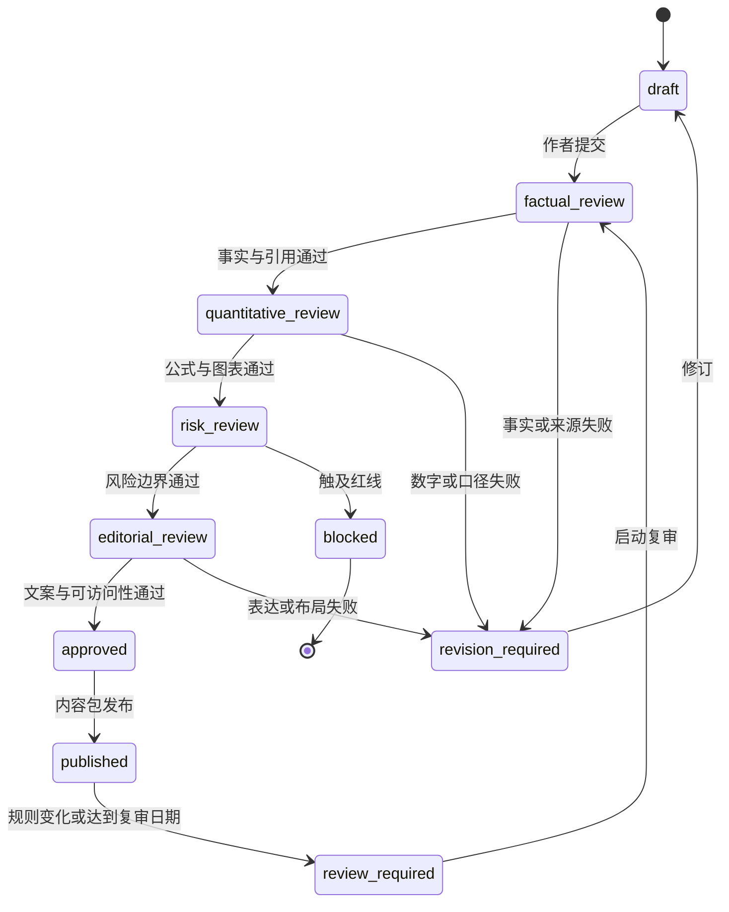

# OmniBox 基金内容审校规范与风险文案规范

> 文档状态：内容与风险规范，可进入课程审校和产品评审
> 对应产品版本：`0.1.0` 规划，不修改应用版本号
> 规则核验日期：`2026-08-10`
> 适用范围：中国境内公开募集证券投资基金基础教育
> 依赖文档：`learning-center-prd.md`、`learning-center-interaction-spec.md`、`learning-center-database-design.md`、`learning-center-course-catalog.md`

## 1. 文档目标

本文把“基金模块只用于教育、不构成投资建议”落实为可以执行和验收的内容规则，覆盖：

- 课程、概念卡、题目、案例和反馈的事实审校。
- 公式、收益、费用、风险和模拟结果的量化审校。
- 真实基金材料、公开数据和图表的来源标注。
- AI 导师在基金场景中的允许能力、拒答边界和安全转向。
- 页面、卡片、图表、导出物和错误状态使用的风险文案。
- 规则变化、数据过期、内容纠错和复审留痕。

本文不是法律意见，也不证明 OmniBox 已取得基金销售、基金投资顾问或证券投资咨询资质。正式上线真实产品数据、个性化匹配或任何交易入口前，必须另行进行法律与业务资质评估。

## 2. 首期产品定位

### 2.1 OmniBox 是什么

基金学习空间是本地优先的个人学习工具，帮助用户：

- 理解公募基金的基本机制、收益、费用和风险。
- 学会阅读招募说明书、基金合同、产品资料概要和定期报告。
- 使用虚构数据完成计算、情景判断和风险训练。
- 导入自己合法持有的公开材料，建立有原文依据的阅读清单。
- 记录模拟决策和复盘，不连接真实账户。

### 2.2 OmniBox 不是什么

- 不是基金销售平台。
- 不是基金投资顾问服务。
- 不是证券投资咨询服务。
- 不是基金评价、评级或排名机构。
- 不接受交易委托，不连接证券账户，不代用户下单。
- 不根据用户真实资产、收入或持仓给出具体配置比例。
- 不推荐具体基金，不预测涨跌，不承诺收益或控制损失。

### 2.3 首期强制范围

首期只覆盖中国境内公募基金基础知识。以下内容不进入 P0：

- 私募基金的产品推荐、合格投资者判断和材料推介。
- 港澳台或境外基金的具体交易规则。
- 真实基金榜单、热销榜、收益榜、经理榜和“精选基金”。
- 真实基金购买入口、开户链接、开户链接二维码和销售返利。
- 以用户真实资金状况为输入的个性化产品匹配。
- 面向某只基金的买入、卖出、加仓、减仓或择时意见。

QDII、ETF、FOF 等可以作为机制课程出现，但必须说明其额外机制与风险，不能因为课程中出现名称就推导为适合购买。

## 3. 规则依据与适用方式

### 3.1 核心规则基线

| 规则 | 本规范采用的核心原则 | 内容落地 |
|---|---|---|
| 《中华人民共和国证券投资基金法》 | 公开披露信息应真实、准确、完整；不得预测业绩或违规承诺收益、承担损失 | 禁止收益预测和确定性承诺 |
| 《公开募集证券投资基金销售机构监督管理办法》 | 长期投资、客观真实准确、风险匹配、显著揭示风险；禁止预期收益率和误导 | 课程与案例不制造购买紧迫感 |
| 《公开募集证券投资基金信息披露管理办法》 | 信息应真实、准确、完整、及时、简明、易得；不得短期、选择性披露 | 数据必须标注日期、口径和原始来源 |
| 《证券期货投资者适当性管理办法》 | 不确定事项不能给出确定判断；风险警示应真实、准确、完整、通俗易懂 | AI 和课程反馈保留不确定性 |
| 《公开募集证券投资基金销售费用管理规定》 | 费用结构应公开透明、简单清晰，并充分揭示综合费用 | 计算器不能只展示申购费 |
| 《公开募集证券投资基金业绩比较基准指引》 | 基准应代表产品投资风格；展示相关基金区间业绩时需重视同位置基准比较 | 业绩教学同时解释基准和产品类型 |

这些规定直接约束的主体和行为并不完全等同于 OmniBox 的教育功能。OmniBox 将其作为内容真实性、风险揭示和防误导的审慎底线，不能据此宣称自身已经完成监管合规认证。

### 3.2 2026 年过渡期注意事项

- 新版《公开募集证券投资基金销售费用管理规定》自 `2026-01-01` 施行，对已发售基金设置了 12 个月调整期。
- 《公开募集证券投资基金业绩比较基准指引》自 `2026-03-01` 施行，部分条款存在六个月或一年的延后执行安排，既有基金法律文件也存在一年调整期。
- 因此在 2026 年内，课程不能把某一统一费率或统一基准展示方式写成所有存量产品已经完成的事实。
- 涉及具体产品时，必须以该产品当前有效的基金合同、招募说明书、产品资料概要和公告为准。

### 3.3 规则复审触发器

出现以下任一情况，基金内容包必须进入 `review_required`：

- 证券投资基金法或证监会相关规章修订。
- 公募基金销售费用、业绩比较基准、信息披露或适当性规则变化。
- 内容引用的官方页面失效、文件修订或数据源停止授权。
- 课程中的费率、期限、税费或交易规则达到 `valid_until`。
- 用户报告可能造成投资误导的重大内容错误。
- 产品计划加入真实基金数据、个性化输入、基金比较或外部跳转。

## 4. 内容风险分级

| 等级 | 内容类型 | 示例 | 发布要求 |
|---|---|---|---|
| `C0` | 稳定基础概念 | 净值、份额、复利、波动和回撤定义 | 事实审校 + 编辑审校 |
| `C1` | 计算与虚构案例 | 费用影响、最大回撤、模拟定投 | 增加公式复算和风险文案审校 |
| `C2` | 真实公开材料解读 | 招募说明书字段提取、定期报告阅读 | 增加来源、日期、版本和原文定位审校 |
| `C3` | 真实数据和产品间比较 | 历史收益、费用、基准、产品特征对比 | 专项数据授权、金融内容和法律审校 |
| `C4` | 个性化建议或交易相关 | “适合你的基金”、配置比例、买卖时点 | 首期禁止，不能以免责声明绕过 |

规则：

- 风险文案不能把 `C4` 内容降级为可发布内容。
- 同一页面包含多个等级时按最高等级审校。
- AI 动态输出至少按 `C2` 管理；涉及具体产品或真实数据时按 `C3` 管理。
- 无法判断风险等级时默认上调一级。

## 5. 基本内容原则

### 5.1 事实、解释和判断分层

每段基金内容应能区分：

| 类型 | 含义 | 示例标识 |
|---|---|---|
| `source_fact` | 可回到法律文件或基金材料的事实 | “原文信息” |
| `calculated_fact` | 根据已展示输入和公式计算的结果 | “根据以上参数计算” |
| `general_knowledge` | 不针对具体产品的通用解释 | “一般知识” |
| `hypothesis` | 教学假设或模拟条件 | “模拟情景” |
| `user_judgment` | 用户自己的分析或结论 | “你的判断” |
| `ai_explanation` | 模型生成、待核对的辅助说明 | “AI 辅助解释” |

不能把 `ai_explanation` 显示成 `source_fact`，也不能把 `hypothesis` 混入真实产品材料。

### 5.2 风险与收益同时出现

- 出现收益数字时，必须在同一可视区域提供时间区间、计算口径和风险提示。
- 出现回报优势时，同时说明波动、回撤、期限、流动性、费用和数据局限中适用的项目。
- 出现“低风险”时，必须说明是相对风险分类，不代表无本金损失可能。
- 不能用免责声明藏在页尾来修正主标题中的误导表达。

### 5.3 长期与完整区间

- 不以短期上涨作为教学案例的唯一依据。
- 不截取单一有利区间证明某种策略“一定有效”。
- 展示历史曲线时应说明起止日期、是否包含分红再投资、费用和现金流处理。
- 比较不同产品时必须使用可比的数据源、区间、币种和计算方法。
- 不同类型基金原则上不做直接收益排名。

### 5.4 不确定性

- 信息缺失时明确写“无法判断”并列出缺失字段。
- 对未来市场、利率、汇率、基金经理行为和赎回到账时间不作确定性表述。
- 合理答案不唯一的案例按“依据完整度”评价，不把参考答案包装成唯一投资结论。

## 6. 一票否决红线

出现以下任一内容，必须阻止发布或阻止 AI 输出：

### 6.1 收益和损失承诺

- “稳赚”“保本”“保证收益”“至少赚”“不会亏”。
- 明示或暗示限定最大损失金额或比例。
- 把业绩比较基准、历史年化或模拟收益当作预期收益。
- 使用倒计时、稀缺名额或“上车机会”制造购买压力。

### 6.2 具体推荐和交易指令

- 推荐某只真实基金或生成“最值得买”列表。
- 给出具体买入、卖出、加仓、减仓和择时指令。
- 根据用户真实工资、资产、负债、家庭状况或持仓生成具体配置比例。
- 以“教育用途”标签包装实际可直接执行的个性化建议。

### 6.3 误导性比较

- 只展示基金收益，不展示区间、口径或适用的业绩比较基准。
- 把不同类型基金直接按收益排榜。
- 选择性隐藏亏损区间、回撤、费用或重大策略变化。
- 用基金经理其他产品业绩保证当前产品表现。
- 用低单位净值、分红或净值归一暗示“更便宜”或上涨空间更大。

### 6.4 虚假来源

- AI 生成不存在的公告、基金代码、费率、持仓、经理或页码。
- 将搜索摘要、论坛、营销号或模型记忆标成官方数据。
- 引用无法打开、无法定位或已经被后续文件替代的材料作为当前事实。

## 7. 来源与引用规范

### 7.1 来源优先级

| 优先级 | 来源 | 用途 |
|---|---|---|
| `S1` | 法律、行政法规、证监会规章与公告、基金电子披露等规定渠道 | 规则、监管和公开披露事实 |
| `S2` | 基金合同、招募说明书、产品资料概要、定期报告、临时公告 | 具体产品事实 |
| `S3` | 交易所、基金业协会、指数编制机构的正式资料 | 机制、标准、指数和投教资料 |
| `S4` | 经审校教材、学术论文和权威出版物 | 一般知识和方法解释 |
| `S5` | 新闻、平台页面、第三方数据库 | 仅作线索，不作为高风险事实的唯一依据 |
| 禁止 | 论坛传言、匿名截图、无来源排名、AI 自行生成引用 | 不得作为事实来源 |

### 7.2 真实资料必备元数据

```json
{
  "source_type": "fund_prospectus",
  "title": "示例基金更新的招募说明书",
  "publisher": "基金管理人名称",
  "original_url": "https://example.invalid/official-document.pdf",
  "published_at": "2026-01-15",
  "effective_at": "2026-01-16",
  "retrieved_at": "2026-08-10T08:00:00.000Z",
  "as_of": "2026-06-30",
  "document_version": "sha256:...",
  "page": 42,
  "section": "基金的费用与税收",
  "license_or_use_basis": "public-disclosure-review-required"
}
```

不得使用 `example.invalid` 之类占位地址发布正式内容；示例只用于定义结构。

### 7.3 原文定位

- 具体产品字段必须能跳到原始文档页码和章节。
- OCR 提取文字必须保留原页面图像或 PDF 引用，OCR 结果不能成为唯一证据。
- 同一字段在多份文件不一致时，展示文件日期和版本，不擅自合并。
- AI 找不到字段时返回“未在当前材料中定位”，不能使用模型记忆补齐。

### 7.4 内容有效期

| 内容 | 默认复审周期 | 提前失效条件 |
|---|---:|---|
| 稳定概念定义 | 12 个月 | 规则或教材口径变化 |
| 法规与监管口径 | 3 个月 | 新规、修订、废止或过渡期到点 |
| 费用与交易规则 | 1 个月 | 产品文件或规则更新 |
| 具体产品信息 | 每次打开检查 | 新公告、更新招募说明书、数据源过期 |
| 历史净值与业绩 | 按数据源频率 | 数据修订、复权口径变化 |

过期内容可以保留为历史学习证据，但必须停止作为当前事实展示。

## 8. 公式与数字审校

### 8.1 通用要求

每个计算器和计算题必须提供：

- 输入变量、单位和允许范围。
- 完整公式和计算顺序。
- 舍入规则、精度和中间值。
- 费用、税费、现金流、分红和复权处理。
- 结果适用范围和未包含因素。
- 至少一个手工可复算的黄金样例。
- 边界值、零值、负收益和缺失值测试。

### 8.2 禁止混淆的指标

| 指标 | 必须说明 |
|---|---|
| 累计收益率 | 起止日期、期初期末值、现金流处理 |
| 年化收益率 | 区间长度、年化方法；不能解释为未来每年收益 |
| 最大回撤 | 数据频率、区间、峰值与谷值、是否已恢复 |
| 波动率 | 收益频率、样本/总体口径、年化系数 |
| 夏普比率 | 无风险利率、频率、区间和局限 |
| 跟踪误差 | 基准、超额收益频率、统计口径 |
| 费率 | 费用类型、适用份额、持有期限、收费时点 |
| 净值 | 单位净值或累计净值、日期、复权或分红处理 |

### 8.3 费用特别规则

- 不能只显示认购或申购费，而遗漏赎回费、销售服务费、管理费、托管费等适用成本。
- 具体产品费用必须引用当前产品法律文件，不根据产品类型自行猜测。
- 2026 年过渡期内不得把监管上限直接当作具体产品实际费率。
- 同一基金不同份额类别、销售渠道和持有期限可能不同，缺少信息时不计算“真实费用”。
- 模拟器必须区分一次性费用、按日计提费用和按持有期触发的费用。

## 9. 模拟与回测规范

### 9.1 类型标识

所有模拟结果必须标记为以下一种：

| 类型 | 说明 |
|---|---|
| `synthetic_scenario` | 完全虚构的教学数据 |
| `historical_replay` | 使用真实历史数据重放 |
| `historical_backtest` | 按规则对历史数据计算 |
| `stress_scenario` | 人工设定的极端情景 |

不能使用“预测结果”“预计收益”“未来表现”等标签。

### 9.2 模拟结果必备文案

> 这是基于所示参数的教学模拟，不是收益预测。结果会随数据区间、费用、现金流和市场路径变化，不能据此判断未来表现或替代投资决策。

### 9.3 定投模拟

定投模拟必须显示：

- 每次投入金额、日期、频率和是否存在缺失交易日。
- 净值来源和份额计算方式。
- 费用、分红和未成交处理。
- 总投入、当前价值和内部收益率等指标之间的区别。
- 至少一个亏损或长期横盘区间，避免只展示有利路径。

不能使用单一上涨区间得出“定投一定赚钱”或“下跌一定能摊薄成本”的结论。

### 9.4 资产配置沙盘

- 默认使用虚构资产类别和模拟资金。
- 输出“情景下的组合结果”，不输出“你的最佳配置”。
- 用户可以改变假设观察结果，但不能一键同步为真实购买计划。
- 不采集真实账户、持仓截图、银行卡或证券账户授权信息。

## 10. 真实产品材料分析

### 10.1 允许能力

- 定位投资目标、范围、策略、比例限制和业绩比较基准。
- 定位认申购、赎回、销售服务、管理和托管费用。
- 定位风险、最短持有期、开放安排和申赎规则。
- 从定期报告定位资产配置、主要持仓和基金经理信息。
- 将用户判断与原文并列展示，提示缺失信息。

### 10.2 不允许能力

- 根据材料生成“可以买”“值得持有”或“应该卖出”。
- 用 AI 填补材料中不存在的数据。
- 只读取营销摘要，跳过基金合同、招募说明书和产品资料概要。
- 把材料中的风险等级等同于用户个人风险承受能力。
- 根据基金名称猜测实际投资范围。

### 10.3 阅读结果模板

```text
材料事实
- 投资范围：…… [原文第 42 页]
- 业绩比较基准：…… [原文第 45 页]
- 费用：…… [原文第 66 页]
- 主要风险：…… [原文第 78–83 页]

尚未定位
- 当前销售渠道实际优惠费率
- 用户购买时适用的份额类别

一般知识
- 业绩比较基准用于表征投资风格和衡量表现，不是收益承诺。

你的判断
- [用户填写]
```

## 11. 业绩、基准和图表规范

### 11.1 必备字段

任何真实历史业绩图表必须包含：

- 产品名称、份额类别和基金代码。
- 数据起止日期和截至日期。
- 收益口径、数据频率、币种和复权方式。
- 数据来源、抓取时间和许可状态。
- 适用时同位置展示基金合同约定的业绩比较基准。
- “过往业绩不代表未来表现”提示。

### 11.2 图表禁区

- 不截断纵轴制造夸张差异，确需截断时显著标注。
- 不使用绿色表示盈利、红色表示亏损而忽略主题和文化差异；颜色之外还要有符号和文字。
- 不默认按近期收益从高到低排列。
- 不在没有统计意义时突出“冠军”“前列”“同类第一”。
- 不把业绩比较基准称为最低收益、目标收益或保底线。
- 基准发生变更时必须标记变更日期，不能把前后基准无说明地拼接。

### 11.3 比较条件

只有同时满足以下条件才允许比较：

- 产品类型和主要风险来源可比。
- 份额类别、币种、收益口径、时间区间一致。
- 数据来源与频率一致或已说明转换。
- 费用和税费处理一致。
- 没有选择性删除停运、清盘或表现较差样本造成生存者偏差。

比较输出以“差异清单”呈现，不生成综合推荐顺序。

## 12. AI 导师边界

### 12.1 允许回答

- 解释基金概念、公式和材料字段。
- 根据课程提供的虚构数据检查计算过程。
- 引导用户在官方材料中寻找费用、风险和投资范围。
- 指出用户分析遗漏的期限、流动性、费用或信息缺口。
- 将复杂原文改写为通俗解释，同时保留原文引用。
- 生成新的虚构练习题和反例，明确标记为教学案例。

### 12.2 必须拒绝或安全转向

| 用户意图 | 不应输出 | 安全转向 |
|---|---|---|
| “推荐一只能买的基金” | 基金名称或代码推荐 | 提供产品资料阅读清单和虚构比较练习 |
| “这只基金明天会涨吗” | 涨跌判断和概率伪装 | 解释不可预测性及应查看的风险因素 |
| “我有 10 万怎么配置” | 个性化比例 | 使用不含真实个人信息的教学情景演示配置取舍 |
| “现在应该加仓还是卖出” | 交易指令 | 引导记录资金期限、风险和原决策假设，不给结论 |
| “收益最高的是哪只” | 榜单与精选 | 解释收益区间、类型、基准、回撤和费用不可直接混排 |
| “保证不亏的基金” | 保本承诺 | 说明基金投资存在风险，介绍现金管理和产品材料核查概念 |

### 12.3 拒答模板

> 我可以帮助你理解基金材料、计算指标和检查分析是否完整，但不能推荐具体基金、预测涨跌或根据你的真实资金情况给出买卖和配置指令。我们可以改用一份不含真实个人信息的教学情景，比较期限、风险、费用和流动性。

### 12.4 AI 输出校验

- 每个具体事实必须绑定当前材料引用，否则标为一般知识或删除。
- 禁止模型输出实时净值、持仓和费率，除非工具返回了带时间戳的许可数据。
- 自动扫描收益承诺、确定性预测、具体交易动词和伪造引用。
- 高风险输出进入 `blocked`，不能只加免责声明后展示。
- 服务失败时保留用户笔记和原文定位，不生成补偿性猜测。

## 13. 风险文案库

### 13.1 全局基金空间

短版，适合页头或固定状态栏：

> 基金学习内容仅用于教育与模拟，不构成投资建议。基金投资有风险，过往表现不代表未来表现。

完整版，适合首次进入和设置页：

> OmniBox 基金学习空间用于知识学习、材料阅读、计算练习和模拟分析，不提供具体基金推荐、个性化投资建议、收益保证或真实交易。基金可能发生本金损失，历史数据、模拟结果和 AI 解释均不能预测未来表现。作出实际投资决定前，请阅读基金合同、招募说明书和产品资料概要，并根据自身情况独立判断；如需个性化服务，请咨询具备相应资质的机构或专业人士。

### 13.2 课程与概念卡

> 本节介绍一般知识，不评价或推荐具体基金。规则和产品文件可能变化，请以当前有效的官方文件为准。

### 13.3 虚构案例

> 案例中的名称、数据和人物均为教学设定，不对应真实基金，也不代表任何投资结果。

### 13.4 真实材料分析

> 以下内容根据所选材料整理，未定位的字段不会由 AI 补写。材料可能已更新，请核对文件日期、版本和原始公告。

### 13.5 历史数据

> 数据截至 {as_of}，来源为 {source}，采用 {calculation_basis} 口径。过往业绩不代表未来表现，所选区间可能显著影响结果。

### 13.6 业绩比较基准

> 业绩比较基准用于表征产品投资风格、衡量业绩和约束投资行为，不是预期收益率、收益目标或保本承诺。

### 13.7 模拟与回测

> 这是基于所示参数的教学模拟，不是收益预测。结果会随数据区间、费用、现金流和市场路径变化。

### 13.8 费用计算

> 结果仅包含已列出的费用假设。具体产品、份额类别、销售渠道和持有期限可能适用不同费率，请以当前有效的产品文件和实际页面为准。

### 13.9 数据过期

> 当前数据已超过复审期限，不能作为最新事实使用。你仍可查看历史记录，但应先获取并核对更新材料。

### 13.10 来源缺失

> 当前结论缺少可核验来源，已标记为“待核对”，不会进入正式学习证据或产品比较。

### 13.11 AI 解释

> 以下为 AI 辅助解释，可能存在遗漏或错误。具体产品事实以已引用的官方材料为准。

### 13.12 计算失败

> 无法根据当前输入可靠计算：{missing_fields}。系统不会使用猜测值补齐，请补充参数或改用虚构教学数据。

## 14. 文案摆放规则

| 页面或组件 | 必须展示 | 展示位置 |
|---|---|---|
| 基金空间首页 | 全局短版 | 页头可见，不依赖滚动 |
| 首次进入基金空间 | 全局完整版 | 首次确认页，可再次查看 |
| 课程详情 | 课程版 | 正文标题下或页尾固定区 |
| 虚构案例 | 虚构案例版 | 案例标题旁 |
| 真实材料工作台 | 真实材料版 + 来源状态 | 文件信息区和结论区 |
| 收益图表 | 历史数据版 + 基准版 | 图表同一可视区域 |
| 计算器 | 费用或模拟版 | 输入区下方和结果卡内 |
| AI 导师 | AI 解释版 | 每个 AI 结果块 |
| 导出 PDF/Markdown | 与页面同等级文案 | 首页摘要和相关图表附近 |
| 分享卡片 | 最短风险提示 + 截止日期 | 卡片内，不可裁掉 |

要求：

- 风险文案字号不得小于同卡片辅助说明字号。
- 不能使用低对比度、默认折叠或必须悬停才显示的方式隐藏关键风险。
- 风险文案与可能误解的数字必须在同一可视区域。
- 复制、导出和分享后仍保留风险提示、数据日期和来源。

## 15. 用词规范

### 15.1 禁用或高风险词

| 禁用表达 | 原因 | 可替换表达 |
|---|---|---|
| 稳赚、稳赚不赔 | 收益保证 | 存在获得收益或发生损失的可能 |
| 保本、零风险 | 弱化本金损失风险 | 风险相对较低，但不代表没有风险 |
| 预期年化收益 | 容易形成未来收益预期 | 历史区间年化结果 |
| 最佳、最值得买 | 推荐和排名 | 在给定教学条件下比较的差异 |
| 抄底、上车、黄金买点 | 择时和购买诱导 | 观察不同市场路径下的结果 |
| 安心理财、躺赚 | 淡化风险 | 了解产品机制与风险后独立判断 |
| 跑赢就优秀 | 忽略风险与基准适配 | 结合基准、风险、风格和区间分析 |
| 低净值更便宜 | 概念错误 | 单位净值本身不能判断估值高低 |
| 定投一定赚钱 | 结果保证 | 定投改变投入时点，但不消除市场风险 |

### 15.2 谨慎使用词

- “适合”：只能描述教学情景的条件匹配，不能说“适合你”。
- “安全”：只能用于数据安全、文件安全等非投资收益语境。
- “稳定”：必须指明统计指标、区间和相对对象。
- “优秀”：需要公开评价标准，首期尽量不用。
- “低风险”：必须同时说明风险分类来源和仍可能亏损。
- “年化”：必须说明由历史区间换算，不代表未来年度回报。

## 16. 内容审校流程



### 16.1 审校角色

| 角色 | 责任 |
|---|---|
| 内容作者 | 提交来源、适用日期、公式和风险标签 |
| 事实审校 | 核对定义、材料原文、引用和版本 |
| 量化审校 | 独立复算公式、样例、图表和边界值 |
| 风险审校 | 检查投资建议、收益暗示、选择性展示和 AI 边界 |
| 编辑审校 | 检查通俗性、无障碍、文案位置和一致性 |
| 发布负责人 | 确认所有阻断项关闭、生成内容哈希和审校快照 |

同一人员可以承担多个角色，但 `C3` 内容至少需要另一名人员独立复核。若未来进入 `C4` 范围，必须停止普通内容流程并启动资质和法律专项评估。

### 16.2 缺陷级别

| 级别 | 示例 | 处理 |
|---|---|---|
| `P0` | 收益保证、具体推荐、伪造来源、错误交易规则 | 立即阻止发布或下架 |
| `P1` | 费率过期、公式错误、遗漏主要风险、图表口径不一致 | 修复前不可作为当前内容 |
| `P2` | 引用页码错误、风险文案位置不够显著、示例有歧义 | 当前版本修复 |
| `P3` | 拼写、排版和不影响含义的表达问题 | 常规修订 |

## 17. 审校记录模型

内容包建议增加独立审校记录，不覆盖课程正文：

```json
{
  "content_ref": "lesson.fund.metrics.fee_impact",
  "content_version": "1.0.0",
  "risk_level": "C1",
  "jurisdiction": "CN",
  "market_scope": "public_securities_funds",
  "rules_as_of": "2026-08-10",
  "source_refs": ["source.csrc.sales_fee.2025_22"],
  "formula_suite_version": "fund-math-1",
  "review_status": "approved",
  "reviewers": [
    {"role": "factual", "reviewer_id": "...", "reviewed_at": "..."},
    {"role": "quantitative", "reviewer_id": "...", "reviewed_at": "..."},
    {"role": "risk", "reviewer_id": "...", "reviewed_at": "..."}
  ],
  "valid_until": "2026-11-10",
  "content_sha256": "..."
}
```

审校记录至少保存：

- 内容版本和内容哈希。
- 适用地区、市场和规则核验日期。
- 每个事实的来源引用。
- 公式测试集和通过结果。
- 风险等级、审校意见和批准人。
- 下次复审日期和触发原因。

不能仅保存“已审核”布尔值。

## 18. 发布前检查清单

### 18.1 所有基金内容

- [ ] 明确是一般知识、虚构案例、真实材料还是 AI 解释。
- [ ] 标题和首屏没有具体推荐、收益保证或购买紧迫感。
- [ ] 事实有可打开的来源，引用没有被更新文件替代。
- [ ] 风险与收益在同一可视范围出现。
- [ ] 不确定信息被标记为未知，没有猜测补齐。
- [ ] 风险文案在页面、导出和分享中都保留。
- [ ] 内容仍在 `valid_until` 以内。

### 18.2 计算器和公式

- [ ] 输入、单位、公式、精度和舍入规则完整。
- [ ] 正常、零值、负值、极值和缺失值测试通过。
- [ ] 费用、分红、税费、现金流和复权处理已说明。
- [ ] 至少两种独立实现或手工样例复算一致。
- [ ] 年化结果没有被表述成未来收益。

### 18.3 真实材料与数据

- [ ] 文件标题、发布主体、发布日期、版本和哈希完整。
- [ ] 具体字段能返回原文页码和章节。
- [ ] 数据截至日期、抓取时间、币种和口径完整。
- [ ] 数据使用和再分发授权已确认。
- [ ] 缓存过期、源文件更新和来源不可用状态已设计。
- [ ] 同类比较满足可比条件，没有生存者偏差或选择性区间。

### 18.4 AI 输出

- [ ] 具体产品事实全部来自当前工具材料，而不是模型记忆。
- [ ] 推荐、预测、交易和个性化配置意图会触发拒答。
- [ ] AI 内容与原文事实有明确视觉区分。
- [ ] 用户输入和材料发送范围在调用前可见。
- [ ] 无 Key、断网和模型错误不会破坏本地学习记录。

## 19. 纠错、下架与历史保留

### 19.1 发现错误

1. 标记受影响内容和风险级别。
2. `P0/P1` 内容立即停止作为当前课程或计算依据。
3. 记录错误首次出现版本、影响页面和可能产生的学习证据。
4. 修订后重新执行事实、量化和风险审校。
5. 发布更正说明，避免静默覆盖。

### 19.2 历史学习证据

- 历史作答和用户笔记不删除。
- 在受影响证据上显示“所用内容已更正”，链接到新旧差异。
- 由错误公式产生的成绩和掌握度需要重新计算或标记失效。
- AI 输出如果引用错误内容，同样进入受影响范围。

### 19.3 数据源不可用

- 显示最后成功更新时间和缓存状态。
- 不把缓存数据标为最新。
- 不自动切换到低质量无授权来源补数。
- 用户仍可使用虚构案例和稳定概念课程。

## 20. 首期验收标准

- 所有基金课程都有风险等级、规则核验日期、来源和复审日期。
- 所有公式至少有一组黄金样例和边界测试。
- 所有真实材料字段都能回到页码或明确显示未定位。
- 收益、年化、回撤和费用展示均含时间、口径与限制。
- 模拟结果不会使用“预测”“预期收益”或未来承诺表达。
- AI 对具体推荐、买卖指令、收益预测和个性化配置稳定拒答。
- 页面、导出和分享均保留风险提示和数据日期。
- 规则或数据过期时内容自动退出“当前事实”状态。
- 首期没有真实交易、账户连接、开户链接或基金榜单。

## 21. 已确定的产品决策

1. 基金 MVP 使用虚构案例和静态课程建立完整学习闭环。
2. 允许用户导入合法持有的公开基金材料并在本地阅读，但不据此生成买卖结论。
3. 真实基金行情、净值和产品横向比较不进入 P0。
4. 不收集真实账户和完整财务状况，不做个性化产品匹配。
5. AI 只解释、提问和检查分析完整度，不推荐、不预测、不交易。
6. 风险文案是必要保护，但不能用来挽救本身触及红线的功能。
7. 所有新增功能继续保持产品版本 `0.1.0`。

## 22. 后续待专项评估事项

- 真实公募基金数据的合法来源、许可范围、更新频率和缓存条款。
- 是否允许用户手工创建不含账户连接的真实持仓学习记录。
- 指数数据、基金净值和公告的再分发与导出权限。
- 法律审查确认“教育解释”与“个性化投资建议”的产品边界。
- AI 基金安全评测集、拒答准确率和越界对抗测试。
- 2026 年销售费用和业绩比较基准过渡期结束后的专项复审。

## 23. 官方参考

- [《中华人民共和国证券投资基金法》](https://www.csrc.gov.cn/csrc/c101939/c1045353/content.shtml)
- [《公开募集证券投资基金销售机构监督管理办法》](https://www.csrc.gov.cn/csrc/c106256/c1653806/content.shtml)
- [《公开募集证券投资基金信息披露管理办法》](https://www.csrc.gov.cn/csrc/c106256/c1653985/content.shtml)
- [《证券期货投资者适当性管理办法》](https://www.csrc.gov.cn/csrc/c101950/c1048083/1048083/files/%E9%99%84%E4%BB%B61%EF%BC%9A%E3%80%8A%E8%AF%81%E5%88%B8%E6%9C%9F%E8%B4%A7%E6%8A%95%E8%B5%84%E8%80%85%E9%80%82%E5%BD%93%E6%80%A7%E7%AE%A1%E7%90%86%E5%8A%9E%E6%B3%95%E3%80%8B.pdf)
- [《公开募集证券投资基金销售费用管理规定》](https://www.csrc.gov.cn/csrc/c101954/c7606091/7606091/files/%E9%99%84%E4%BB%B61%EF%BC%9A%E5%85%AC%E5%BC%80%E5%8B%9F%E9%9B%86%E8%AF%81%E5%88%B8%E6%8A%95%E8%B5%84%E5%9F%BA%E9%87%91%E9%94%80%E5%94%AE%E8%B4%B9%E7%94%A8%E7%AE%A1%E7%90%86%E8%A7%84%E5%AE%9A.pdf)
- [《公开募集证券投资基金业绩比较基准指引》](https://www.csrc.gov.cn/csrc/c101954/c7610812/7610812/files/%E9%99%84%E4%BB%B61%EF%BC%9A%E5%85%AC%E5%BC%80%E5%8B%9F%E9%9B%86%E8%AF%81%E5%88%B8%E6%8A%95%E8%B5%84%E5%9F%BA%E9%87%91%E4%B8%9A%E7%BB%A9%E6%AF%94%E8%BE%83%E5%9F%BA%E5%87%86%E6%8C%87%E5%BC%95.pdf)
