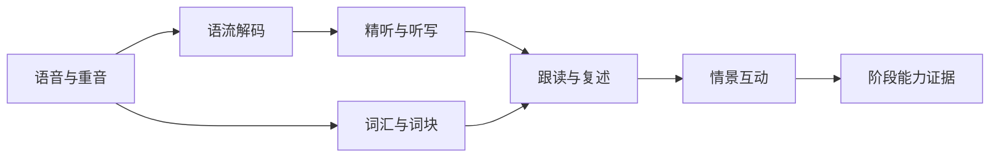
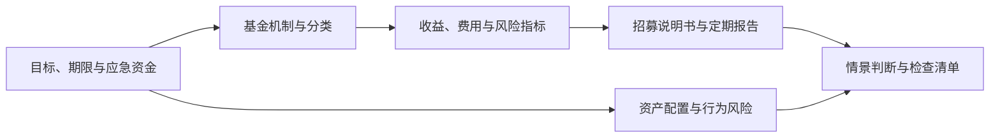
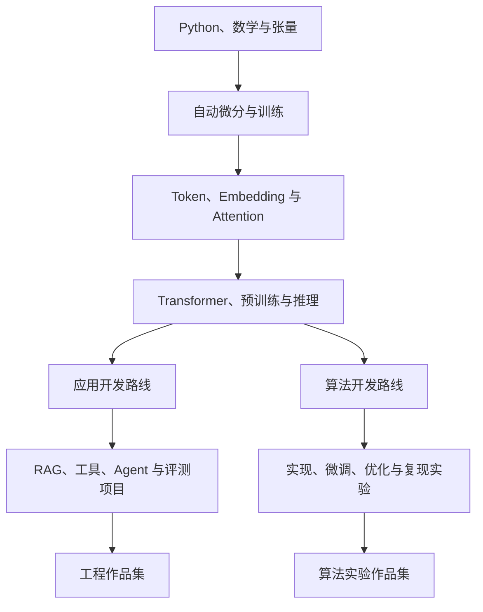

# OmniBox 学习中心首批课程目录与概念图谱

> 文档状态：首批内容设计草案，可进入内容评审
> 对应产品版本：`0.1.0` 规划，不修改应用版本号
> 内容包：`omb.learning.core.zh-CN`
> 依赖文档：`learning-center-prd.md`、`learning-center-database-design.md`

## 1. 文档目标

本文定义英语、基金和大模型三条学习路线的：

- 稳定 `track/module/lesson/concept` ID。
- 首批模块和课程顺序。
- 每课主要概念、核心练习和完成证据。
- 概念前置关系和跨模块迁移关系。
- 首批内容包的优先级、边界与验收规则。

本文是内容设计，不代表课程正文、音频、题库和实验代码已经制作完成。

## 2. 内容设计规则

### 2.1 稳定 ID

ID 不包含内容版本，版本写入独立 `version` 字段：

```text
track.<domain>.<route>
module.<domain>.<topic>
lesson.<domain>.<topic>.<lesson>
concept.<domain>.<concept>
exercise.<domain>.<topic>.<lesson>.<sequence>
lab.<domain>.<lab>
```

示例：

```text
track.english.core
module.english.listening_decode
lesson.english.listening_decode.weak_forms
concept.english.weak_form
exercise.english.listening_decode.weak_forms.01
```

规则：

- 已进入用户记录的 ID 不得直接复用或改变语义。
- 重命名时通过内容包 `content_aliases` 建立旧 ID 到新 ID 的映射。
- 标题可以改，ID 保持稳定。
- 一课可以覆盖多个概念，但必须声明一个 `primary` 概念。

### 2.2 课程粒度

- 单课目标时长为 10–25 分钟。
- 每课只解决一个可观察的主要能力变化。
- 每课至少包含一次主动回忆或产出任务。
- 纯阅读、播放和浏览不能单独成为完成证据。
- 课程完成条件必须能由本地规则或明确评价标准判断。

### 2.3 优先级

| 标记 | 含义 |
|---|---|
| `P0` | 首个可用内容包必须包含，支撑完整学习闭环 |
| `P1` | 首批增强内容，在 P0 运行稳定后补充 |
| `P2` | 路线扩展，不阻塞首期目标 |

### 2.4 证据类型

| 证据 | 适用内容 |
|---|---|
| `explanation` | 用自己的话解释概念、指出边界和反例 |
| `calculation` | 展示公式、参数、过程和结果限制 |
| `dictation` | 听写文本、Diff、错因和无字幕复听 |
| `recording` | 录音、转写、节奏或任务完成情况 |
| `case_judgment` | 基于材料与风险约束作出有依据判断 |
| `lab_run` | 参数、输入、输出、环境和用户结论 |
| `project` | 可运行产物、测试、评测和复盘 |

## 3. 路线总览

- [可编辑 Excalidraw 概念总览](./learning-center-concept-map.excalidraw)
- [PNG 概念总览](./learning-center-concept-map.png)

| 路线 | Track ID | 模块数 | 课程数 | 首期核心结果 |
|---|---|---:|---:|---|
| 英语 | `track.english.core` | 5 | 24 | 完成精听、复述和日常情景表达闭环 |
| 基金 | `track.fund.foundation` | 5 | 25 | 能读材料、算指标并完成投资前检查 |
| 大模型 | `track.llm.engineer` | 7 | 36 | 掌握公共基础，并完成应用或算法项目 |

三个路线不是要求同时推进。今日计划依据用户主方向、时间预算和到期复习选择任务。

## 4. 英语路线

### 4.1 路线目标

英语首批内容聚焦中国成年学习者常见的“认识文字但听不出来、理解句子但说不出来”问题。音标只服务于辨音和发音定位，不设计为脱离语境的大型理论课程。



### 4.2 模块 E01：诊断与语音基础

模块 ID：`module.english.sound_foundation`

| 课程 ID | 标题 | 分钟 | 主要概念 | 核心练习与完成证据 | 优先级 |
|---|---|---:|---|---|---|
| `lesson.english.sound_foundation.baseline` | 建立听说词汇基线 | 15 | 能力维度、证据样本 | 短听写、词汇四维自评、30 秒录音；提交诊断样本 | P0 |
| `lesson.english.sound_foundation.us_uk` | 美式与英式发音的使用方式 | 12 | 发音偏好、变体 | 对比 6 组真实读音并选择默认偏好；辨认不要求模仿一致 | P0 |
| `lesson.english.sound_foundation.syllable` | 音节与单词重音 | 18 | 音节、单词重音 | 标记 10 个高频词重音并录制 5 个词；本地节奏证据 | P0 |
| `lesson.english.sound_foundation.sentence_stress` | 句子重音与信息焦点 | 20 | 内容词、功能词、焦点重音 | 同一句改变重音表达不同焦点；选择题加录音解释 | P0 |

### 4.3 模块 E02：语流解码与精听

模块 ID：`module.english.listening_decode`

前置模块：`module.english.sound_foundation`

| 课程 ID | 标题 | 分钟 | 主要概念 | 核心练习与完成证据 | 优先级 |
|---|---|---:|---|---|---|
| `lesson.english.listening_decode.chunking` | 用意群而不是单词切分语流 | 18 | 意群、停顿、语义单元 | 为 8 句标注意群并跟随音频切句；规则评价 | P0 |
| `lesson.english.listening_decode.weak_forms` | 常见功能词弱读 | 22 | 弱读、句子重音 | 逐句听写 5 句，定位弱读遗漏并无字幕复听 | P0 |
| `lesson.english.listening_decode.linking` | 连读与辅音元音连接 | 22 | 连读、词边界 | A/B 循环、标记词边界并跟读；听写加录音 | P0 |
| `lesson.english.listening_decode.reduction` | 同化、省音与口语缩约 | 22 | 同化、省音、缩约 | 对比规范文本与实际语音，解释 6 处差异 | P1 |
| `lesson.english.listening_decode.dictation_workflow` | 一段材料的完整精听流程 | 25 | 首听、分句、Diff、错因 | 完成 8 句听写、错因分类和一次全文复听 | P0 |

### 4.4 模块 E03：从认识单词到主动词块

模块 ID：`module.english.active_vocabulary`

| 课程 ID | 标题 | 分钟 | 主要概念 | 核心练习与完成证据 | 优先级 |
|---|---|---:|---|---|---|
| `lesson.english.active_vocabulary.four_dimensions` | 单词掌握的四个维度 | 15 | 识别、听辨、拼写、产出 | 将 20 个词标记到四维状态并完成校准题 | P0 |
| `lesson.english.active_vocabulary.context_meaning` | 在上下文中选择词义 | 18 | 语境义、词性 | 从短对话判断词义并引用上下文依据 | P0 |
| `lesson.english.active_vocabulary.collocation` | 搭配比孤立释义更重要 | 20 | 搭配、限制性选择 | 从材料提取 8 个搭配，完成替换和纠错 | P0 |
| `lesson.english.active_vocabulary.lexical_chunks` | 用词块组织口语 | 20 | 词块、句框 | 使用 6 个词块完成 60 秒主题表达 | P0 |
| `lesson.english.active_vocabulary.retrieval` | 主动回忆与间隔复习 | 15 | 提取练习、间隔、迁移 | 完成识别、听辨、拼写和造句四种复习 | P0 |

### 4.5 模块 E04：口语动作与互动

模块 ID：`module.english.spoken_interaction`

前置模块：`module.english.active_vocabulary`；建议同时完成 `module.english.listening_decode`

| 课程 ID | 标题 | 分钟 | 主要概念 | 核心练习与完成证据 | 优先级 |
|---|---|---:|---|---|---|
| `lesson.english.spoken_interaction.shadowing` | 跟读不是背诵：节奏与重音 | 20 | 跟读、节奏、重音 | 保存原始与重录版本，对比时长和停顿 | P0 |
| `lesson.english.spoken_interaction.sentence_frames` | 用句框快速组织表达 | 18 | 句框、替换槽位 | 依据 4 个意图填充句框并脱稿表达 | P0 |
| `lesson.english.spoken_interaction.turn_taking` | 开始、接续和结束话轮 | 20 | 话轮、回应信号 | 完成 6 轮情景对话，结束后复盘漏掉的动作 | P0 |
| `lesson.english.spoken_interaction.clarification` | 没听懂时如何澄清 | 18 | 请求重复、确认、改述 | 在 4 个模拟误解中完成澄清任务 | P0 |
| `lesson.english.spoken_interaction.retelling` | 从听懂到复述 | 25 | 关键词、结构、复述完整度 | 听 60–90 秒材料后用关键词复述并保存录音 | P0 |

### 4.6 模块 E05：真实情景与阶段评估

模块 ID：`module.english.scenarios`

前置模块：`module.english.spoken_interaction`

| 课程 ID | 标题 | 分钟 | 主要概念 | 核心练习与完成证据 | 优先级 |
|---|---|---:|---|---|---|
| `lesson.english.scenarios.small_talk` | 自我介绍与日常寒暄 | 20 | 开场、追问、结束 | 完成 8 轮对话或角色脚本并重说关键句 | P0 |
| `lesson.english.scenarios.meeting` | 会议中表达观点和确认行动 | 25 | 观点、同意、异议、行动项 | 进行 2 分钟会议情景，输出行动项复述 | P1 |
| `lesson.english.scenarios.travel_service` | 旅行与服务场景问题解决 | 22 | 请求、澄清、投诉边界 | 完成预订变更或问题处理情景 | P0 |
| `lesson.english.scenarios.interview` | 面试中的经历叙述 | 25 | STAR 结构、过去时表达 | 录制一段 2 分钟经历回答并自评结构 | P1 |
| `lesson.english.scenarios.stage_assessment` | 首阶段听说综合评估 | 30 | 听写、复述、互动、迁移 | 新材料精听、90 秒复述和情景任务三项证据 | P0 |

### 4.7 英语核心概念

| Concept ID | 概念 | 直接前置 |
|---|---|---|
| `concept.english.syllable` | 音节 | 无 |
| `concept.english.word_stress` | 单词重音 | `concept.english.syllable` |
| `concept.english.sentence_stress` | 句子重音 | `concept.english.word_stress` |
| `concept.english.thought_group` | 意群 | `concept.english.sentence_stress` |
| `concept.english.weak_form` | 弱读 | `concept.english.sentence_stress` |
| `concept.english.linking` | 连读 | `concept.english.syllable` |
| `concept.english.reduction` | 同化、省音与缩约 | `concept.english.linking`、`concept.english.weak_form` |
| `concept.english.dictation_diff` | 听写差异与错因 | `concept.english.thought_group` |
| `concept.english.vocabulary_dimensions` | 词汇四维掌握 | 无 |
| `concept.english.context_meaning` | 语境词义 | `concept.english.vocabulary_dimensions` |
| `concept.english.collocation` | 搭配 | `concept.english.context_meaning` |
| `concept.english.lexical_chunk` | 词块 | `concept.english.collocation` |
| `concept.english.retrieval_practice` | 主动提取 | `concept.english.vocabulary_dimensions` |
| `concept.english.shadowing` | 跟读与节奏模仿 | `concept.english.thought_group`、`concept.english.weak_form` |
| `concept.english.sentence_frame` | 句框 | `concept.english.lexical_chunk` |
| `concept.english.turn_taking` | 话轮管理 | `concept.english.sentence_frame` |
| `concept.english.clarification` | 澄清策略 | `concept.english.turn_taking` |
| `concept.english.retelling` | 复述 | `concept.english.dictation_diff`、`concept.english.lexical_chunk` |

## 5. 基金路线

### 5.1 路线目标与边界

基金路线帮助零基础用户形成教育用途的决策框架，不提供具体基金推荐、收益承诺、真实账户连接或自动交易。



### 5.2 模块 F01：目标、期限与风险基础

模块 ID：`module.fund.goal_and_risk`

| 课程 ID | 标题 | 分钟 | 主要概念 | 核心练习与完成证据 | 优先级 |
|---|---|---:|---|---|---|
| `lesson.fund.goal_and_risk.education_boundary` | 学习工具不等于投资建议 | 12 | 信息、教育、建议边界 | 区分 8 条陈述并解释为何不能保证收益 | P0 |
| `lesson.fund.goal_and_risk.goal_horizon` | 先确定目标和资金期限 | 18 | 目标、期限、流动性 | 为 4 个情景判断资金是否适合承受波动 | P0 |
| `lesson.fund.goal_and_risk.emergency_fund` | 应急资金为什么不应承担高波动 | 18 | 应急资金、流动性 | 编制个人化但不含真实账户的资金分层练习 | P0 |
| `lesson.fund.goal_and_risk.tolerance_capacity` | 风险承受能力与风险偏好 | 20 | 风险能力、风险偏好 | 对比收入期限与心理反应，识别两者冲突 | P0 |
| `lesson.fund.goal_and_risk.loss_volatility` | 亏损、波动和永久损失不是一回事 | 20 | 波动、回撤、损失 | 对 3 条净值曲线说明不同风险含义 | P0 |

### 5.3 模块 F02：基金机制与分类

模块 ID：`module.fund.mechanics_and_types`

| 课程 ID | 标题 | 分钟 | 主要概念 | 核心练习与完成证据 | 优先级 |
|---|---|---:|---|---|---|
| `lesson.fund.mechanics_and_types.nav_share` | 净值、份额和资产价值 | 20 | 单位净值、份额、总资产 | 根据申购金额和净值计算份额并解释误差来源 | P0 |
| `lesson.fund.mechanics_and_types.subscribe_redeem` | 申购、赎回、确认与到账 | 18 | 申赎、确认日、流动性 | 排列一笔模拟申赎流程并指出不确定时间 | P0 |
| `lesson.fund.mechanics_and_types.classification` | 货币、债券、权益与混合基金 | 22 | 投资范围、风险来源 | 根据投资范围对 8 个产品描述分类 | P0 |
| `lesson.fund.mechanics_and_types.active_index` | 主动基金、指数基金与业绩基准 | 20 | 主动管理、指数、基准 | 解释“跑赢基准”和“绝对赚钱”的区别 | P0 |
| `lesson.fund.mechanics_and_types.etf_qdii_fof` | ETF、QDII 与 FOF 的额外机制 | 22 | 场内交易、跨境、基金中基金 | 完成机制对比表并指出额外风险 | P1 |

### 5.4 模块 F03：收益、费用与风险指标

模块 ID：`module.fund.metrics`

前置模块：`module.fund.mechanics_and_types`

| 课程 ID | 标题 | 分钟 | 主要概念 | 核心练习与完成证据 | 优先级 |
|---|---|---:|---|---|---|
| `lesson.fund.metrics.compound_annualized` | 累计收益、复利与年化 | 25 | 复利、累计收益、年化 | 展示公式和过程，识别短期年化的误导 | P0 |
| `lesson.fund.metrics.fee_impact` | 费用如何长期影响结果 | 22 | 申购费、赎回费、管理费 | 计算不同期限费用影响并说明未包含因素 | P0 |
| `lesson.fund.metrics.volatility` | 波动率能说明什么、不能说明什么 | 22 | 收益分布、波动率 | 比较两组收益序列并解释指标局限 | P0 |
| `lesson.fund.metrics.drawdown_recovery` | 最大回撤与回撤恢复 | 25 | 峰值、谷值、最大回撤、恢复收益 | 从净值序列计算回撤并验证恢复所需涨幅 | P0 |
| `lesson.fund.metrics.sharpe_tracking` | 夏普比率、跟踪误差和基准 | 25 | 风险调整收益、跟踪误差 | 为不同类型基金选择适用指标并拒绝错误比较 | P1 |

### 5.5 模块 F04：基金材料阅读

模块 ID：`module.fund.material_reading`

前置模块：`module.fund.mechanics_and_types`；建议完成 `module.fund.metrics`

| 课程 ID | 标题 | 分钟 | 主要概念 | 核心练习与完成证据 | 优先级 |
|---|---|---:|---|---|---|
| `lesson.fund.material_reading.prospectus_map` | 招募说明书结构地图 | 25 | 投资范围、风险、费用、申赎 | 从示例文档定位 8 个字段并保留页码引用 | P0 |
| `lesson.fund.material_reading.periodic_report` | 定期报告阅读顺序 | 25 | 报告期、持仓、规模、说明 | 完成结构化清单并区分时点数据和期间数据 | P0 |
| `lesson.fund.material_reading.holdings_benchmark` | 持仓与业绩基准 | 22 | 集中度、行业暴露、基准 | 对比持仓和基准，提出需要进一步确认的问题 | P0 |
| `lesson.fund.material_reading.manager_history` | 基金经理、历史业绩和归因边界 | 22 | 任职期、团队、归因 | 识别把全部历史收益归因个人的错误结论 | P1 |
| `lesson.fund.material_reading.source_freshness` | 数据来源、日期和口径 | 18 | 来源、更新时间、复权、口径 | 为 6 条数据标记可信范围和不可比较原因 | P0 |

### 5.6 模块 F05：组合方法、行为与检查清单

模块 ID：`module.fund.decision_framework`

前置模块：`module.fund.goal_and_risk`、`module.fund.metrics`、`module.fund.material_reading`

| 课程 ID | 标题 | 分钟 | 主要概念 | 核心练习与完成证据 | 优先级 |
|---|---|---:|---|---|---|
| `lesson.fund.decision_framework.diversification` | 分散不等于买得多 | 22 | 相关性、集中度、分散 | 在沙盘中比较集中和分散组合的风险来源 | P0 |
| `lesson.fund.decision_framework.asset_allocation` | 资产配置服务于目标和期限 | 25 | 资产配置、风险预算 | 为三个虚构目标给出有约束的配置思路 | P0 |
| `lesson.fund.decision_framework.dca` | 定投的作用与边界 | 22 | 定期投入、平均成本、现金流 | 模拟上涨、下跌和震荡情景，说明不能保证盈利 | P0 |
| `lesson.fund.decision_framework.rebalancing` | 再平衡与决策纪律 | 22 | 目标比例、偏离、交易成本 | 在沙盘中执行一次再平衡并记录理由 | P1 |
| `lesson.fund.decision_framework.behavior_checklist` | 追涨、损失厌恶与投资前检查 | 25 | 行为偏差、信息不足、检查清单 | 完成综合案例判断，列出缺失信息和风险边界 | P0 |

### 5.7 基金核心概念

| Concept ID | 概念 | 直接前置 |
|---|---|---|
| `concept.fund.education_boundary` | 教育与投资建议边界 | 无 |
| `concept.fund.goal_horizon` | 目标和资金期限 | 无 |
| `concept.fund.emergency_fund` | 应急资金 | `concept.fund.goal_horizon` |
| `concept.fund.risk_capacity` | 风险承受能力 | `concept.fund.goal_horizon` |
| `concept.fund.risk_tolerance` | 风险偏好 | 无 |
| `concept.fund.liquidity` | 流动性 | `concept.fund.goal_horizon` |
| `concept.fund.nav` | 单位净值 | 无 |
| `concept.fund.share` | 基金份额 | `concept.fund.nav` |
| `concept.fund.subscription_redemption` | 申购与赎回 | `concept.fund.nav`、`concept.fund.share` |
| `concept.fund.fund_classification` | 基金分类与投资范围 | 无 |
| `concept.fund.benchmark` | 业绩基准 | `concept.fund.fund_classification` |
| `concept.fund.compound_return` | 复利和累计收益 | `concept.fund.nav` |
| `concept.fund.annualized_return` | 年化收益 | `concept.fund.compound_return` |
| `concept.fund.fee_impact` | 费用影响 | `concept.fund.subscription_redemption` |
| `concept.fund.volatility` | 波动率 | `concept.fund.compound_return` |
| `concept.fund.max_drawdown` | 最大回撤 | `concept.fund.nav` |
| `concept.fund.recovery_return` | 回撤恢复收益 | `concept.fund.max_drawdown` |
| `concept.fund.risk_adjusted_return` | 风险调整收益 | `concept.fund.volatility`、`concept.fund.benchmark` |
| `concept.fund.tracking_error` | 跟踪误差 | `concept.fund.benchmark` |
| `concept.fund.prospectus` | 招募说明书 | `concept.fund.fund_classification` |
| `concept.fund.periodic_report` | 定期报告 | `concept.fund.prospectus` |
| `concept.fund.diversification` | 分散与相关性 | `concept.fund.volatility` |
| `concept.fund.asset_allocation` | 资产配置 | `concept.fund.goal_horizon`、`concept.fund.diversification` |
| `concept.fund.dca` | 定期投入 | `concept.fund.goal_horizon` |
| `concept.fund.rebalancing` | 再平衡 | `concept.fund.asset_allocation` |
| `concept.fund.behavior_bias` | 常见行为偏差 | 无 |
| `concept.fund.decision_checklist` | 投资前检查清单 | `concept.fund.education_boundary`、`concept.fund.asset_allocation`、`concept.fund.prospectus` |

## 6. 大模型路线

### 6.1 路线目标

大模型路线以“能够解释、能够实验、能够构建、能够评测”为标准。公共基础完成后分为应用开发和算法开发两条支线，允许用户选择一条主路线。



### 6.2 模块 L00：工程与数学前置

模块 ID：`module.llm.prerequisites`

该模块允许通过诊断跳过，但跳过不会自动产生掌握证据。

| 课程 ID | 标题 | 分钟 | 主要概念 | 核心练习与完成证据 | 优先级 |
|---|---|---:|---|---|---|
| `lesson.llm.prerequisites.python_data` | Python 函数、集合与数据处理 | 25 | 函数、迭代、数据转换 | 完成一个文本统计函数及测试 | P0 |
| `lesson.llm.prerequisites.git_test` | Git、环境与最小测试 | 25 | 版本、依赖、测试 | 创建可复现实验目录并通过测试 | P0 |
| `lesson.llm.prerequisites.tensor_linear` | 向量、矩阵与张量形状 | 30 | 向量、矩阵乘、shape | 手算小矩阵并完成 shape 推理练习 | P0 |
| `lesson.llm.prerequisites.probability_gradient` | 概率、损失与梯度直觉 | 30 | 概率、交叉熵、梯度 | 计算简单概率和一维梯度并解释方向 | P0 |

### 6.3 模块 L01：深度学习与训练基础

模块 ID：`module.llm.deep_learning`

前置模块：`module.llm.prerequisites`

| 课程 ID | 标题 | 分钟 | 主要概念 | 核心练习与完成证据 | 优先级 |
|---|---|---:|---|---|---|
| `lesson.llm.deep_learning.autodiff` | 计算图与自动微分 | 30 | 计算图、链式法则、梯度 | 手推两层计算图并与 PyTorch 结果对照 | P0 |
| `lesson.llm.deep_learning.training_loop` | 一个完整训练循环 | 35 | 前向、损失、反向、优化器 | 运行最小分类训练并解释每一步 | P0 |
| `lesson.llm.deep_learning.generalization` | 训练集、验证集与过拟合 | 25 | 泛化、过拟合、正则化 | 从两组曲线判断问题并提出验证方案 | P0 |
| `lesson.llm.deep_learning.data_batching` | 数据、Batch 与随机性 | 25 | 批次、采样、随机种子 | 比较不同 batch 和 seed 的结果并保存结论 | P1 |

### 6.4 模块 L02：Token、Embedding 与 Transformer

模块 ID：`module.llm.transformer_core`

前置模块：`module.llm.deep_learning`

| 课程 ID | 标题 | 分钟 | 主要概念 | 核心练习与完成证据 | 优先级 |
|---|---|---:|---|---|---|
| `lesson.llm.transformer_core.tokenization` | 文本如何变成 Token 和 ID | 25 | Token、词表、子词 | 运行 Tokenizer 实验并解释长度差异 | P0 |
| `lesson.llm.transformer_core.embedding` | Embedding 表示与相似度边界 | 30 | 向量表示、余弦相似度 | 比较词句向量并记录失败案例 | P0 |
| `lesson.llm.transformer_core.qkv_attention` | Q、K、V 与注意力计算 | 35 | Q/K/V、缩放点积 | 手算小型 Attention 并查看权重矩阵 | P0 |
| `lesson.llm.transformer_core.mask_position` | Mask 与位置信息 | 30 | 因果 Mask、位置编码 | 修改 Mask 和位置参数并解释输出变化 | P0 |
| `lesson.llm.transformer_core.block` | Transformer Block 的数据流 | 35 | 多头注意力、MLP、残差、归一化 | 标注张量 shape 并运行最小 Block | P0 |
| `lesson.llm.transformer_core.pretrain_inference` | 预训练目标与自回归推理 | 30 | 下一个 Token、解码、上下文 | 演示逐 Token 生成并解释训练与推理差异 | P0 |

### 6.5 模块 L03：模型生命周期、评测与安全

模块 ID：`module.llm.model_lifecycle`

前置模块：`module.llm.transformer_core`

| 课程 ID | 标题 | 分钟 | 主要概念 | 核心练习与完成证据 | 优先级 |
|---|---|---:|---|---|---|
| `lesson.llm.model_lifecycle.sft_alignment` | 预训练、SFT 与对齐分别解决什么 | 30 | 预训练、SFT、偏好对齐 | 为 6 个行为判断最可能对应的训练阶段 | P0 |
| `lesson.llm.model_lifecycle.decoding` | Temperature、Top-p 与解码 | 25 | 采样、确定性、多样性 | 固定输入比较参数并保存可复现结论 | P0 |
| `lesson.llm.model_lifecycle.evaluation` | 评测集、指标和人工评价 | 30 | 测试集、指标、评分标准 | 为一个问答任务设计 10 条最小评测集 | P0 |
| `lesson.llm.model_lifecycle.safety_limits` | 幻觉、偏差、隐私与能力边界 | 30 | 事实性、安全、隐私 | 分析失败输出，区分未知、错误和越权 | P0 |

### 6.6 模块 L04：应用开发路线

模块 ID：`module.llm.application_engineering`

前置模块：`module.llm.model_lifecycle`

| 课程 ID | 标题 | 分钟 | 主要概念 | 核心练习与完成证据 | 优先级 |
|---|---|---:|---|---|---|
| `lesson.llm.application_engineering.prompt_contract` | Prompt 结构与任务契约 | 30 | 指令、上下文、约束、示例 | 对比三版 Prompt 并用固定评测集评价 | P0 |
| `lesson.llm.application_engineering.api_structured` | 模型 API、流式响应与结构化输出 | 35 | 请求、流式、Schema、重试 | 实现并测试结构化输出失败恢复 | P0 |
| `lesson.llm.application_engineering.tool_calling` | 工具调用与参数校验 | 35 | 工具 Schema、执行边界、错误返回 | 完成一个本地工具调用实验和失败分析 | P0 |
| `lesson.llm.application_engineering.rag_pipeline` | 切分、召回、重排与引用 | 40 | Chunk、Embedding、检索、重排 | 运行 RAG 调试实验并定位一次召回失败 | P0 |
| `lesson.llm.application_engineering.agent_state` | Agent 工作流与显式状态 | 35 | 状态机、计划、工具结果、恢复 | 画出并运行一个可恢复的两工具流程 | P1 |
| `lesson.llm.application_engineering.eval_observe` | 应用评测、成本与可观测性 | 35 | 离线评测、延迟、Token、Trace | 生成包含质量、成本和延迟的报告 | P0 |
| `lesson.llm.application_engineering.security` | Prompt Injection、权限和数据边界 | 35 | 不可信输入、最小权限、审计 | 对一个 RAG/工具应用完成威胁检查清单 | P0 |

### 6.7 模块 L05：算法开发路线

模块 ID：`module.llm.algorithm_engineering`

前置模块：`module.llm.model_lifecycle`

| 课程 ID | 标题 | 分钟 | 主要概念 | 核心练习与完成证据 | 优先级 |
|---|---|---:|---|---|---|
| `lesson.llm.algorithm_engineering.attention_from_scratch` | 从零实现 Self-Attention | 45 | Attention、Mask、shape | 通过数值测试并解释每个张量维度 | P1 |
| `lesson.llm.algorithm_engineering.tokenizer_training` | 数据清洗与 Tokenizer 训练 | 40 | 语料、词表、覆盖率 | 训练小词表并分析中英文切分差异 | P1 |
| `lesson.llm.algorithm_engineering.mini_transformer` | 最小 Transformer 语言模型 | 60 | Block、损失、训练循环 | 训练字符级模型并提交曲线与失败日志 | P1 |
| `lesson.llm.algorithm_engineering.lora` | SFT、LoRA 与数据质量 | 45 | 低秩适配、训练数据、过拟合 | 完成小型 LoRA 实验和前后评测 | P1 |
| `lesson.llm.algorithm_engineering.kv_quantization` | KV Cache、量化与显存 | 40 | KV Cache、精度、显存 | 比较两种设置的显存、速度和质量 | P1 |
| `lesson.llm.algorithm_engineering.distributed` | 数据并行和分布式基础 | 35 | 数据并行、同步、通信 | 用图解释一步训练的跨设备数据流 | P2 |
| `lesson.llm.algorithm_engineering.reproducibility` | 消融、复现与实验报告 | 35 | 控制变量、随机性、消融 | 为一次实验设计可复现清单和消融表 | P1 |

### 6.8 模块 L06：项目与作品集

模块 ID：`module.llm.projects`

前置模块：应用或算法路线至少一个模块达到 `reviewing`

| 课程 ID | 标题 | 分钟 | 主要概念 | 核心练习与完成证据 | 优先级 |
|---|---|---:|---|---|---|
| `lesson.llm.projects.local_rag` | 项目：本地文档问答 | 180+ | RAG、引用、评测、安全 | 可运行项目、测试集、检索失败分析和报告 | P0 |
| `lesson.llm.projects.tool_assistant` | 项目：带工具调用的桌面助手 | 180+ | 工具、状态、权限、恢复 | 可运行流程、错误处理、权限清单和评测 | P1 |
| `lesson.llm.projects.mini_model` | 项目：最小 Transformer 与实验报告 | 240+ | 训练、评测、复现、消融 | 代码、曲线、对照实验和结论 | P1 |
| `lesson.llm.projects.portfolio_review` | 作品集复盘与面试表达 | 45 | 决策日志、证据、表达 | 导出项目报告并完成 5 分钟项目讲解录音 | P1 |

项目课表中的 `180+`、`240+` 表示最低预计时间；写入内容包 `estimated_minutes` 时分别保存整数 `180`、`240`，界面根据项目进度展示跨会话时长。

### 6.9 大模型核心概念

| Concept ID | 概念 | 直接前置 |
|---|---|---|
| `concept.llm.python_data` | Python 数据处理 | 无 |
| `concept.llm.reproducible_environment` | 可复现环境与测试 | `concept.llm.python_data` |
| `concept.llm.tensor_shape` | 张量与 shape | 无 |
| `concept.llm.probability_loss` | 概率与损失 | 无 |
| `concept.llm.gradient` | 梯度 | `concept.llm.tensor_shape`、`concept.llm.probability_loss` |
| `concept.llm.autodiff` | 自动微分 | `concept.llm.gradient` |
| `concept.llm.training_loop` | 训练循环 | `concept.llm.autodiff` |
| `concept.llm.generalization` | 泛化与过拟合 | `concept.llm.training_loop` |
| `concept.llm.tokenization` | Tokenization | `concept.llm.python_data` |
| `concept.llm.embedding` | Embedding | `concept.llm.tensor_shape`、`concept.llm.tokenization` |
| `concept.llm.qkv` | Q、K、V | `concept.llm.tensor_shape` |
| `concept.llm.self_attention` | Self-Attention | `concept.llm.qkv`、`concept.llm.embedding` |
| `concept.llm.causal_mask` | 因果 Mask | `concept.llm.self_attention` |
| `concept.llm.position_encoding` | 位置信息 | `concept.llm.embedding` |
| `concept.llm.transformer_block` | Transformer Block | `concept.llm.self_attention`、`concept.llm.position_encoding` |
| `concept.llm.pretraining` | 预训练 | `concept.llm.transformer_block`、`concept.llm.training_loop` |
| `concept.llm.inference` | 自回归推理 | `concept.llm.pretraining` |
| `concept.llm.decoding` | 采样与解码 | `concept.llm.inference` |
| `concept.llm.sft` | 监督微调 | `concept.llm.pretraining` |
| `concept.llm.alignment` | 偏好对齐 | `concept.llm.sft` |
| `concept.llm.evaluation` | 模型与应用评测 | `concept.llm.generalization`、`concept.llm.inference` |
| `concept.llm.prompt_contract` | Prompt 任务契约 | `concept.llm.inference` |
| `concept.llm.structured_output` | 结构化输出 | `concept.llm.prompt_contract` |
| `concept.llm.tool_calling` | 工具调用 | `concept.llm.structured_output` |
| `concept.llm.retrieval` | 检索 | `concept.llm.embedding` |
| `concept.llm.rag` | RAG | `concept.llm.retrieval`、`concept.llm.prompt_contract` |
| `concept.llm.agent_state` | Agent 显式状态 | `concept.llm.tool_calling` |
| `concept.llm.observability` | 可观测性 | `concept.llm.evaluation` |
| `concept.llm.prompt_injection` | Prompt Injection | `concept.llm.rag`、`concept.llm.tool_calling` |
| `concept.llm.lora` | LoRA | `concept.llm.sft`、`concept.llm.tensor_shape` |
| `concept.llm.kv_cache` | KV Cache | `concept.llm.self_attention`、`concept.llm.inference` |
| `concept.llm.quantization` | 量化 | `concept.llm.inference`、`concept.llm.tensor_shape` |
| `concept.llm.distributed_training` | 分布式训练 | `concept.llm.training_loop` |
| `concept.llm.experiment_reproducibility` | 实验复现与消融 | `concept.llm.reproducible_environment`、`concept.llm.evaluation` |

## 7. 首批实验与案例定义

### 7.1 英语材料与练习集

| ID | 内容 | 处理边界 |
|---|---|---|
| `material.english.everyday_decisions.01` | 60–90 秒日常决策对话 | 内置音频、字幕和句级时间轴 |
| `material.english.meeting_actions.01` | 会议行动项对话 | 内置音频，P1 |
| `scenario.english.clarification.01` | 未听清与信息确认 | 本地脚本可用，AI 可选增强 |
| `scenario.english.travel_change.01` | 预订变更 | 本地角色卡可用，AI 可选增强 |

### 7.2 基金案例

| ID | 案例 | 必须识别的边界 |
|---|---|---|
| `case.fund.short_horizon_high_return` | 六个月后用款，却只看近一年高收益基金 | 期限、回撤、流动性、信息不足 |
| `case.fund.low_nav_is_cheap` | 把低净值理解为便宜 | 净值含义、历史路径、不可比较 |
| `case.fund.chasing_ranking` | 根据短期排名集中投入 | 追涨、样本期、基准、集中度 |
| `case.fund.fee_and_rebalance` | 忽略费用进行频繁再平衡 | 费用、纪律、阈值、税费或规则范围 |

案例材料只能使用明确日期的教学样本，不伪装成当前市场实时结论。

### 7.3 大模型实验室

| Lab ID | 实验 | 输入 | 必须保存的输出 | 优先级 |
|---|---|---|---|---|
| `lab.llm.tokenizer_visualizer` | Tokenizer 可视化 | 中英文文本、Tokenizer | Token、ID、长度、用户结论 | P0 |
| `lab.llm.embedding_similarity` | Embedding 相似度 | 文本集合、模型 | 相似度矩阵、失败案例 | P1 |
| `lab.llm.attention_toy` | 小型 Attention | Q/K/V、Mask | 权重矩阵、shape、解释 | P0 |
| `lab.llm.prompt_compare` | Prompt 对比 | 多版 Prompt、固定样本 | 输出、评分、成本和结论 | P0 |
| `lab.llm.rag_debugger` | RAG 链路调试 | 文档、问题、切分参数 | 召回、重排、引用和失败原因 | P0 |
| `lab.llm.tool_calling` | 工具调用 | 工具 Schema、用户请求 | 参数、结果、错误和恢复 | P0 |
| `lab.llm.eval_runner` | 最小评测运行器 | 数据集、评分规则 | 逐条结果、指标和人工复核 | P0 |
| `lab.llm.cost_latency` | 成本与延迟 | 模型、并发、输入长度 | Token、延迟、吞吐和失败 | P1 |

## 8. 内容包装配顺序

### 8.1 P0 内容切片

首个可用内容包不要求一次制作全部课程，建议按可验证闭环切片：

1. 英语：E01、E02、E03、E04 和 E05 中的 P0 课程。
2. 基金：F01–F05 中的 P0 课程与四个教学案例。
3. 大模型：L00–L04 的 P0 课程、四个核心实验和本地 RAG 项目。
4. 公共：每个 P0 概念至少一张复习模板和一个可评分练习。

### 8.2 单课内容包清单

每课目录至少包含：

```text
lesson.md
lesson.meta.json
exercises/*.json
assets/*
sources.json
```

其中：

- `lesson.meta.json` 声明稳定 ID、版本、时长、概念和完成条件。
- `exercises` 保存题目、评分标准、答案和 AI 依赖标志。
- `sources.json` 保存来源、许可、作者、获取日期和允许的使用范围。
- 音频必须提供语言、口音、说话人许可、时长和句级时间轴。
- 公式和实时数据必须声明口径与日期。

## 9. 内容质量门槛

### 9.1 所有路线

- 每个概念有定义、例子、反例、常见误区和前置关系。
- 每课至少一个无需 AI 即可完成的核心练习。
- AI 评价只能补充反馈，不能成为查看课程答案的必要条件。
- 每个完成条件都能映射到 `learning_evidence`。
- 课程引用、案例数据和音频许可可以审计。

### 9.2 英语

- 音频不是 TTS 冒充真人材料；TTS 材料必须明确标记。
- 美式和英式发音作为变体展示，不将一种正常变体判错。
- 听写、发音和口语反馈区分文本差异、节奏指标和主观评价。
- 新词由用户确认后进入正式词库。

### 9.3 基金

- 所有页面持续展示教育用途与风险边界。
- 案例不包含暗示性“正确购买对象”。
- 计算器展示公式、参数、计算过程和限制。
- 数据材料保留来源、日期和口径，无法引用时不生成事实结论。

### 9.4 大模型

- 理论课程至少包含 shape、最小公式或数据流解释。
- 实验保存参数、环境、输入、输出、日志和用户结论。
- Prompt、RAG、工具和 Agent 课程必须包含失败案例与安全边界。
- 项目以评测和复现为完成条件，不以“成功调用模型”作为完成。

## 10. 首批内容验收

### 10.1 结构验收

- 所有 ID 唯一并符合命名规则。
- 每个课程至少关联一个主概念。
- 所有前置概念和前置模块都能解析。
- 概念依赖图不存在无意循环。
- 被课程引用的实验、案例和材料均存在。

### 10.2 学习闭环验收

- 英语用户能从精听产生错题、生词、录音和复述证据。
- 基金用户能从概念进入计算、材料阅读、案例和检查清单。
- 大模型用户能从理论进入实验，再进入项目和评测报告。
- 三条路线的证据都能进入复习队列、错题本和能力报告。

### 10.3 待内容评审事项

1. 英语 P0 材料的 CEFR 或其他难度范围。
2. 英语真人音频、字幕和发音词典的许可来源。
3. 基金路线首期是否只覆盖中国公募基金基础。
4. 基金案例使用完全虚构数据还是经过许可的历史样本。
5. 大模型前置模块允许跳过的诊断阈值。
6. 算法路线的本地硬件最低要求与远端实验边界。
7. 内容包是否独立仓库维护，以及签名和审校责任人。

## 11. 下一步建议

完成课程目录后，下一项设计产物应是英语 MVP 的音频、录音和反馈技术验证方案，同时开始确认英语材料与发音资源的许可来源。该技术验证只需要证明关键链路可行，不应立即扩展为完整课程生产。
