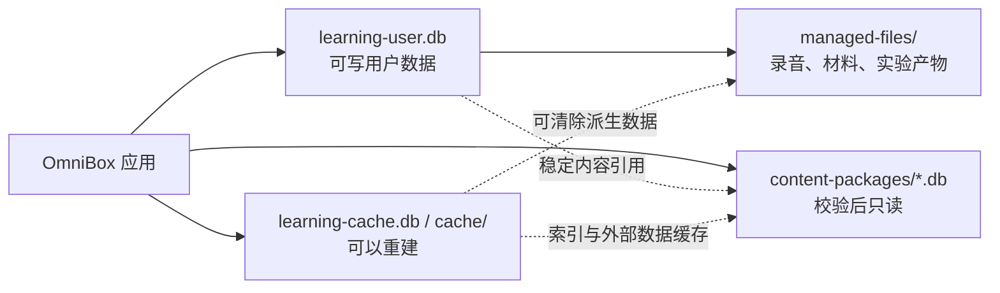
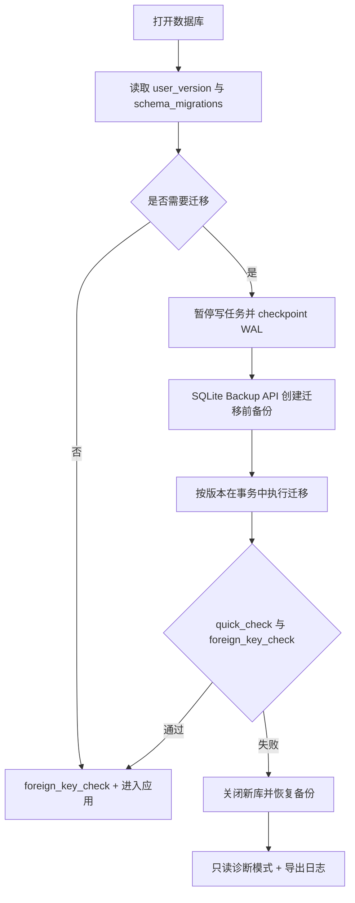

# OmniBox 学习中心 SQLite 数据库设计与迁移策略

> 文档状态：DDL 初稿；大模型实验运行与候选证据子集已进入技术 Spike
> 对应产品版本：`0.1.0` 规划，不修改应用版本号
> SQLite 基线：`3.38+`，要求提供内置 JSON 函数
> 关联文档：`learning-center-prd.md`、`learning-center-interaction-spec.md`

## 1. 设计目标

数据库设计需要支持：

- 今日计划、学习会话、草稿恢复和正式作答。
- 可追溯的练习证据、掌握度变化、复习调度和错题闭环。
- 英语录音、基金模拟和大模型实验等领域数据。
- 课程内容包独立升级，不级联删除用户学习记录。
- 迁移前备份、失败恢复、完整导出和跨平台恢复。
- 纯本地优先，API Key 和其他机密不进入学习数据库。

首期不解决多设备实时同步、多人协作、云端数据库和在线内容编辑。

### 1.1 当前接入状态（2026-08-10）

- `backend/learning.py` 已接入初始迁移、迁移校验和、`user_version`、`quick_check` 和 `foreign_key_check`。
- 应用首次使用学习功能时在用户数据目录创建 `learning-user.db`，类 Unix 权限为 `600`，目录权限为 `700`。
- 当前只开放 `lab_runs`、`learning_evidence` 和 `evidence_concepts` 的受限写入 API；其余表已随初始迁移创建但尚未开放业务写入。
- API Key、密码和服务 Token 字段会在写入前被拒绝；相同 `submission_key` 的不同请求会产生冲突，不覆盖原运行。
- 候选证据不可覆盖；后续订正必须实现显式 `superseded_by_id` 替代流程。

## 2. 数据库与文件分层



### 2.1 `learning-user.db`

保存用户拥有且必须备份的数据：

- 学习档案、目标、计划、任务和会话。
- 草稿检查点、作答、评价和学习证据。
- 掌握度、复习、错题、笔记和导入材料元数据。
- 英语录音元数据、基金模拟、大模型项目和实验运行。
- AI 导师上下文、消息处理边界和能力报告快照。

### 2.2 内容包数据库

每个内容包是独立 SQLite 文件，完成清单、哈希和可选签名验证后以只读模式打开。包含：

- 路线、模块、课程和概念。
- 练习、答案、评分标准和复习模板。
- 基金案例和大模型实验定义。
- 内容 ID 重命名映射。

用户库不对内容包建立数据库外键，因为 SQLite 不能在独立数据库之间维护可靠的跨库外键。用户记录保存稳定 `content_ref` 和提交时快照。

### 2.3 缓存和大文件

以下内容不进入必要备份或允许重新生成：

- 全文索引、向量索引、波形缩略图和派生字幕。
- 外部基金数据、模型响应和下载临时文件。基金课程 P0 的网页正文与 AI 讲解只使用进程内短期缓存，不写入本地缓存库。
- 可重新生成的报告预览和图片缩略图。

录音、用户导入原文件、实验日志和项目产物保存在受管文件目录，用户数据库记录相对路径、SHA-256、大小和引用关系。

## 3. DDL 文件

| 文件 | 用途 |
|---|---|
| [`database/0001_learning_user_initial.sql`](./database/0001_learning_user_initial.sql) | 可写用户库初始迁移草案 |
| [`database/content_package_schema.sql`](./database/content_package_schema.sql) | 只读课程内容包结构草案 |

当前用户库 DDL 创建 37 张业务或元数据表、27 个显式索引；内容包 DDL 创建 16 张表、3 个显式索引。SQLite 还会为主键和唯一约束生成自动索引。

## 4. 通用字段约定

### 4.1 ID

- 主键统一使用应用生成的 `TEXT` ID，建议使用 UUIDv7 或 ULID。
- 不将 `rowid` 暴露给导出文件、内容引用或用户界面。
- 内容引用使用内容包声明的稳定字符串 ID，例如 `english.listening.weak_forms.lesson_01`。
- 重命名内容 ID 时，内容包必须在 `content_aliases` 中保留旧 ID 到新 ID 的映射。

### 4.2 时间

- 数据库存储 UTC ISO-8601 文本，例如 `2026-08-10T03:20:15.123Z`。
- `scheduled_for`、`trade_date` 等日历日期使用 `YYYY-MM-DD`。
- 界面显示时按 `learner_profiles.timezone` 转换。
- 迁移和导出不得假设设备当前时区。

### 4.3 JSON

- 可扩展结构使用 `TEXT` 保存 JSON，并以 `CHECK(json_valid(...))` 保证语法有效。
- 高频过滤、排序和关联字段必须拆成普通列，不能只藏在 JSON 中。
- JSON 字段需要在其所属功能中维护独立结构版本。
- API Key、访问令牌、密码和未脱敏实验变量不得进入 JSON 字段。

### 4.4 布尔值和枚举

- 布尔值使用 `INTEGER`，约束为 `0` 或 `1`。
- 核心业务状态使用 `CHECK` 枚举，避免拼写错误造成无法恢复的状态。
- 高频变化或插件扩展型分类可以使用开放 `TEXT`，由应用层校验。

### 4.5 金额和比率

- 基金模拟中的金额使用 SQLite `NUMERIC` 亲和性，应用层使用十进制库，不能用二进制浮点直接累计货币。
- 单位净值、份额、费用和数据来源在交易时保存快照。
- `score`、`weight` 等内部估计限制在 `0.0–1.0`，界面不得直接包装成绝对能力百分比。

## 5. 用户库表分组

### 5.1 迁移和档案

| 表 | 作用 |
|---|---|
| `schema_migrations` | 记录已应用迁移、校验和与应用版本 |
| `database_meta` | 数据库 ID、创建平台、导入来源等元数据 |
| `learner_profiles` | 本地用户档案和基础偏好 |
| `learning_goals` | 三条学习路线目标与诊断校准状态 |

### 5.2 计划和会话

| 表 | 作用 |
|---|---|
| `learning_plans` | 一天或一周的计划版本 |
| `plan_items` | 可执行任务、完成规则、跳过和延后关系 |
| `learning_sessions` | 一次可恢复的学习上下文和有效操作时长 |
| `draft_checkpoints` | 未提交文本、播放位置、实验参数等草稿 |

`plan_items.rescheduled_to_id` 指向延后后创建的新任务，原任务保持 `rescheduled` 终态，避免修改历史日期。

### 5.3 作答、评价和证据

| 表 | 作用 |
|---|---|
| `attempts` | 一次正式提交后的不可变答案快照 |
| `attempt_evaluations` | 本地规则、人工或 AI 的多版本评价 |
| `learning_evidence` | 跨领域统一的能力证据入口 |
| `evidence_concepts` | 证据影响的概念及角色 |
| `plan_item_evidence` | 哪些证据满足某个任务完成条件 |
| `concept_mastery` | 每个概念的当前掌握状态 |
| `mastery_events` | 每次掌握状态变化的证据和算法版本 |

`learning_evidence.source_type/source_id` 是受控的多态引用。数据库不能为其建立单一外键，因此写入证据必须在同一事务中验证来源存在。

### 5.4 复习和错题

| 表 | 作用 |
|---|---|
| `review_cards` | 复习内容、来源快照和调度参数 |
| `review_logs` | 每次评级、耗时、间隔和算法版本 |
| `mistakes` | 错误原因以及开放、观察、关闭状态 |
| `mistake_concepts` | 错题关联概念 |
| `mistake_attempts` | 原作答、重做和迁移题作答关系 |

“到期”不保存为 `review_cards.status`。它由 `status='active' AND next_review_at <= 当前时间` 派生，避免时间变化后数据库状态失真。

### 5.5 用户内容和领域数据

- `notes`、`note_links`：Markdown 笔记和跨对象引用。
- `materials`、`material_segments`：用户导入文件及本地解析结果。
- `vocabulary_items`：单词在识别、听辨、拼写和主动使用四个维度的状态。
- `audio_recordings`、`speech_assessments`：录音文件与多评价器结果。
- `fund_portfolios`、`fund_transactions`、`fund_snapshots`：教育用途的模拟组合。
- `llm_projects`、`project_milestones`、`lab_runs`：项目制学习和可复现实验。
- `tutor_threads`、`tutor_messages`：绑定具体学习上下文的 AI 导师记录。
- `processing_jobs`：材料解析、异步评价等后台任务。
- `report_snapshots`：固定证据截止时间和指标口径的报告快照。

## 6. 内容引用和快照

### 6.1 引用格式

用户库中的内容引用至少可以定位：

```text
package_id + package_version + entity_type + entity_id
```

DDL 当前使用 `content_ref` 或领域专用 `*_ref` 字段；正式实现可以采用结构化字符串，也可以增加四个拆分列。首期应保持一种统一编码方式。

### 6.2 必须保存快照的场景

- 正式作答：题目 ID、题目版本和用户提交时答案。
- 错题：原题摘要、原答案和评分标准版本。
- 复习卡：正反面、来源和生成规则版本。
- 基金交易：基金名称、代码、单位净值、日期和数据源。
- 实验运行：实验定义版本、参数、环境和输入引用。
- 能力报告：证据截止时间和指标口径版本。

### 6.3 内容缺失

内容包被移除后：

- 历史作答、错题、证据和报告仍可通过快照查看。
- 返回完整原课程的入口显示“内容包未安装”。
- 用户可以重新安装兼容版本，或根据 `content_aliases` 跳转到新内容。
- 不因为内容缺失删除或降低已有掌握度。

## 7. 外键与删除策略

### 7.1 内部强外键

用户库内部使用 `PRAGMA foreign_keys=ON`，主要策略为：

- 删除用户档案时级联删除其结构化学习数据。
- 删除学习计划时级联删除计划任务，但证据来源仍由自身表维护。
- 删除会话时级联删除作答；正常产品操作不直接删除会话，而是通过整组数据删除流程处理。
- 删除录音、材料、项目等用户资产前先展示依赖范围。

### 7.2 软删除

材料、录音、笔记和导师线程包含 `deleted_at`，首期删除流程为：

1. 标记软删除并从常规查询隐藏。
2. 展示将受影响的缓存、评价和导出内容。
3. 在可恢复期限结束或用户确认后删除受管文件。
4. 数据库清理在文件删除成功后完成，失败项进入重试队列。

大量或整路线删除前创建可恢复备份，不直接依赖 SQL 级联作为产品删除操作。

### 7.3 多态引用

以下关系由应用事务验证：

- `learning_evidence.source_type/source_id`
- `note_links.link_type/link_ref`
- `processing_jobs.context_type/context_ref`
- AI 导师的 `context_type/context_ref`

每次完整性检查需要补充查询孤立的多态引用，SQLite `foreign_key_check` 无法发现这类问题。

## 8. 索引与查询约束

初始 DDL只添加能对应首期页面的索引：

- 今日任务：`profile_id + scheduled_for + status + priority`。
- 恢复学习：最近会话与最近草稿。
- 到期复习：活跃卡片的 `next_review_at` 部分索引。
- 概念报告：概念掌握度、证据概念关联和掌握事件。
- 错题本：用户、状态和更新时间。
- 项目与导师：父对象和创建时间。

不在初稿中预先增加大量单列索引。实现后应基于真实查询使用 `EXPLAIN QUERY PLAN` 验证，避免写入放大。

笔记、材料片段的全文搜索建议采用独立 FTS5 表和同步触发器，但应作为后续迁移：

- 首次启动先检测 SQLite 是否包含 FTS5。
- FTS 表视为可重建索引，不作为用户数据唯一来源。
- FTS 损坏时允许删除并重建，不恢复整个用户库。

## 9. 事务边界

以下操作必须在单个用户库事务中完成：

### 9.1 提交练习

1. 以 `submission_key` 查重。
2. 插入 `attempts`。
3. 删除或标记对应草稿检查点。
4. 插入本地评价和候选证据。
5. 根据证据更新任务完成状态。

联网或 AI 评价不得放在数据库事务内。提交先落库，外部调用完成后再以独立事务追加评价版本。

### 9.2 完成异步评价

1. 插入新的 `attempt_evaluations`。
2. 将旧评价 `is_current` 改为 `0`，新评价改为 `1`。
3. 更新 `attempts.current_evaluation_version` 和结果摘要。
4. 创建或替代 `learning_evidence`。
5. 追加 `mastery_events`，更新 `concept_mastery`。
6. 评估错题和复习卡状态。

### 9.3 调整今日计划

1. 比较 `learning_plans.version`。
2. 写入所有排序、跳过、替换和延后变化。
3. 增加计划版本。
4. 若版本冲突，整个事务回滚并要求用户合并。

### 9.4 录音落盘

录音采用“临时文件 → 校验哈希 → 数据库写入 → 原子移动”的顺序。文件移动与 SQLite 无法构成同一事务，因此启动时要清理无引用临时文件并检测缺失正式文件。

## 10. SQLite 运行配置

每次打开可写用户库必须执行并检查：

```sql
PRAGMA foreign_keys = ON;
PRAGMA busy_timeout = 5000;
```

本机应用数据目录建议：

```sql
PRAGMA journal_mode = WAL;
PRAGMA synchronous = NORMAL;
```

约束：

- 数据库不得放在网络盘、云盘实时同步目录或不支持可靠文件锁的路径。
- 备份前执行 WAL checkpoint 或使用 SQLite Backup API，不直接复制正在写入的单个 `.db` 文件。
- 迁移与完整备份期间暂停新的写任务和后台评价落库。
- 内容包数据库以 URI `mode=ro` 或等价只读选项打开。

## 11. Schema 版本管理

### 11.1 双版本记录

- `schema_migrations` 是权威迁移历史，保存版本、名称、模板校验和、应用时间和应用版本。
- `PRAGMA user_version` 保存当前最高整数版本，供启动时快速判断。
- 两者不一致时停止写入并进入修复流程，不能直接选择较大的版本继续。

### 11.2 文件命名

```text
0001_learning_user_initial.sql
0002_add_notes_fts.sql
0003_add_sync_identity.sql
```

要求：

- 版本号只增不减，不复用已经发布的编号。
- 已发布迁移文件不可修改；错误通过新迁移修复。
- 当前 DDL 中的 `DRAFT_REPLACE_WITH_SHA256` 是设计阶段占位符。
- 接入迁移工具时，以包含占位符的规范化迁移模板计算 SHA-256，再把结果作为绑定参数或打包值写入 `schema_migrations`。

## 12. 应用启动迁移流程



详细步骤：

1. 以单实例迁移锁启动，其他窗口等待。
2. 检查数据库 SQLite 版本和必需扩展。
3. 比对迁移历史、校验和与应用包含的迁移集合。
4. 停止后台数据库写入并完成 WAL checkpoint。
5. 使用 SQLite Backup API 创建带时间和来源版本的完整备份。
6. 按版本顺序执行尚未应用的迁移。
7. 每个版本成功后写入迁移记录并更新 `user_version`。
8. 执行 `PRAGMA quick_check`、`PRAGMA foreign_key_check` 和应用级孤立引用检查。
9. 成功后恢复后台任务；失败则关闭连接并恢复迁移前备份。

## 13. 迁移编写规则

### 13.1 优先使用扩展—迁移—收缩

对于重命名或改变字段含义：

1. **扩展**：添加新列或新表，旧代码仍可运行。
2. **迁移**：分批回填并验证新旧数据一致。
3. **切换**：新版本应用开始只读写新结构。
4. **收缩**：至少经过一个稳定发布周期后再移除旧结构。

### 13.2 SQLite 表重建

需要修改 `CHECK`、删除列或改变复杂外键时：

1. 创建 `table_new`。
2. 使用显式列名复制与转换数据。
3. 校验行数、关键聚合、JSON 和外键。
4. 重命名原表为临时备份表。
5. 将新表重命名为正式表并重建索引。
6. 完整性检查通过后删除临时备份表。

不能使用 `SELECT *` 回填，避免列顺序变化导致错位。

### 13.3 大数据迁移

- 大型材料片段、消息或事件表采用分批迁移并记录检查点。
- 长迁移显示阶段和进度，不能让用户误以为应用卡死。
- 可以取消的迁移必须在安全边界取消；已发布的必需 Schema 迁移通常不允许中途跳过。
- 数据变换逻辑复杂时使用受测试的应用迁移代码，SQL 文件只负责结构变化。

### 13.4 不提供破坏性向下迁移

发布版本默认不使用 `down.sql` 删除新数据。回滚方式为：

- 迁移未提交：SQLite 事务回滚。
- 迁移提交后校验失败：恢复迁移前备份。
- 已运行一段时间后发现逻辑错误：发布前向修复迁移。
- 应用降级：只读打开或要求恢复与旧版本匹配的备份。

## 14. 内容包升级策略

内容包升级独立于用户库 Schema 迁移：

1. 下载或导入到临时目录。
2. 验证 manifest、文件哈希、可选签名和最低应用版本。
3. 以只读方式打开并执行 `quick_check`、`foreign_key_check`。
4. 检查所有课程资源文件和 `content_sha256`。
5. 验证稳定 ID；被替换的 ID 必须存在 `content_aliases`。
6. 原子切换“当前版本”指针。
7. 保留上一个可用版本，确认没有活动会话依赖后再清理。

升级过程中用户库不批量改写所有历史引用。解析内容引用时先查当前包，再查别名映射，最后退回用户记录中的快照。

## 15. 备份、恢复与导出

### 15.1 备份内容

完整备份包至少包含：

- 一致性快照后的 `learning-user.db`。
- `managed-files/` 中仍被引用的录音、材料和实验产物。
- `backup-manifest.json`：数据库版本、文件相对路径、大小、SHA-256、创建应用版本和平台。
- 已安装内容包清单，但默认不重复打包可重新下载的官方内容包。

### 15.2 恢复顺序

1. 在临时目录解包，不覆盖当前数据。
2. 验证 manifest 和每个文件哈希。
3. 打开数据库并完成完整性、外键和 Schema 版本检查。
4. 检查受管文件引用，报告缺失或多余文件。
5. 如有需要，先迁移恢复库到当前版本。
6. 关闭当前连接后原子切换数据目录。
7. 保留恢复前备份，直到用户确认。

### 15.3 可移植导出

- 导出使用逻辑 ID 和包内相对路径，不依赖原设备绝对路径。
- `repository_path`、`original_path` 等平台路径作为提示信息，不是唯一关联。
- 默认排除缓存、API Key、系统凭据、临时文件和未授权录音。
- 用户可以只导出某条路线，同时保留被引用的公共概念和证据说明。

## 16. 隐私与敏感数据

- 翻译、模型和其他服务凭据继续由页面密码输入或专用安全配置管理，不写入学习库。
- `lab_runs.parameters_json` 只保存脱敏后的参数，`secret_fields_json` 只记录哪些字段被隐藏。
- `tutor_messages` 记录是否远程发送和同意范围，但不记录鉴权头。
- 基金模块不得保存真实交易账户、身份证明或银行卡数据。
- 数据库日志不能输出完整录音转写、长答案、材料正文或用户 Prompt。

如果未来需要数据库整体加密，应单独评估 SQLCipher 或平台加密容器；不能只对少数字段做自定义可逆混淆并宣称数据库已加密。

## 17. 校验与测试要求

### 17.1 当前 DDL 已完成的验证

在 macOS 自带 SQLite `3.43.2` 的临时数据库中执行：

- 用户库 DDL 完整执行成功。
- 内容包 DDL 完整执行成功。
- 两个数据库 `PRAGMA integrity_check` 均返回 `ok`。
- 两个数据库 `PRAGMA foreign_key_check` 均无错误。
- 用户库 `PRAGMA user_version` 为 `1`。
- `completed` 任务缺少 `completed_at` 时被 `CHECK` 约束拒绝。
- 同一用户重复使用 `submission_key` 时被唯一约束拒绝。
- 删除临时测试档案后，计划、任务、会话和作答的内部外键链无残留。
- 内容包的路线、模块、课程、概念和练习最小关系链可以正常写入。

### 17.2 接入应用前必须补充

- 每个 `CHECK` 枚举的合法和非法写入测试。
- 作答 `submission_key` 和复习提交的重复写入测试。
- 异步评价切换唯一 `is_current` 的事务测试。
- 计划调整版本冲突和事务回滚测试。
- 内容包移除后历史作答、证据和错题仍可读取。
- 录音文件写入中断、数据库写入失败和启动恢复测试。
- 迁移中断、备份恢复、磁盘空间不足和数据库损坏测试。
- Windows 与 macOS 的路径、文件锁、WAL 和原子替换测试。

## 18. 待技术评审事项

1. 用户库驱动采用 `better-sqlite3`、Node 原生 SQLite 还是独立进程访问层。
2. SQLite 最低版本是否由应用自带，避免依赖系统版本差异。
3. 初始 Schema 是否保留单个用户档案，还是预留多个本地档案切换。
4. `learning_evidence` 多态来源是否接受应用层完整性校验。
5. FTS5、向量索引和外部基金数据使用同一缓存库还是独立库。
6. 录音和材料是否需要可选的应用级文件加密。
7. 数据库备份的保留数量、自动清理和用户自选目录策略。
8. 大模型实验日志的最大保留大小和归档策略。

## 19. 下一步建议

[三条路线的首批课程目录和概念图谱](./learning-center-course-catalog.md)已经形成，为内容包提供了第一批稳定 `track/module/lesson/concept` ID。

下一项设计产物是英语 MVP 的音频、录音和反馈技术验证方案，用于验证媒体资源、录音持久化、本地基础分析和可选 AI 评价边界。
