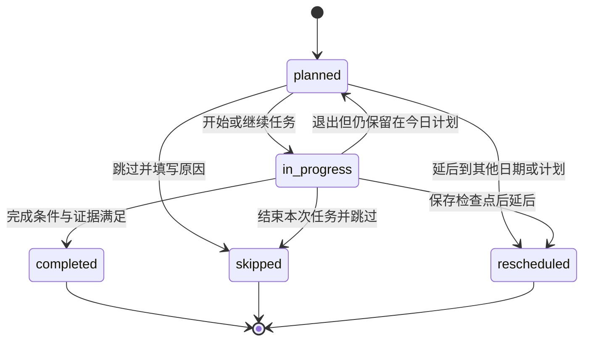
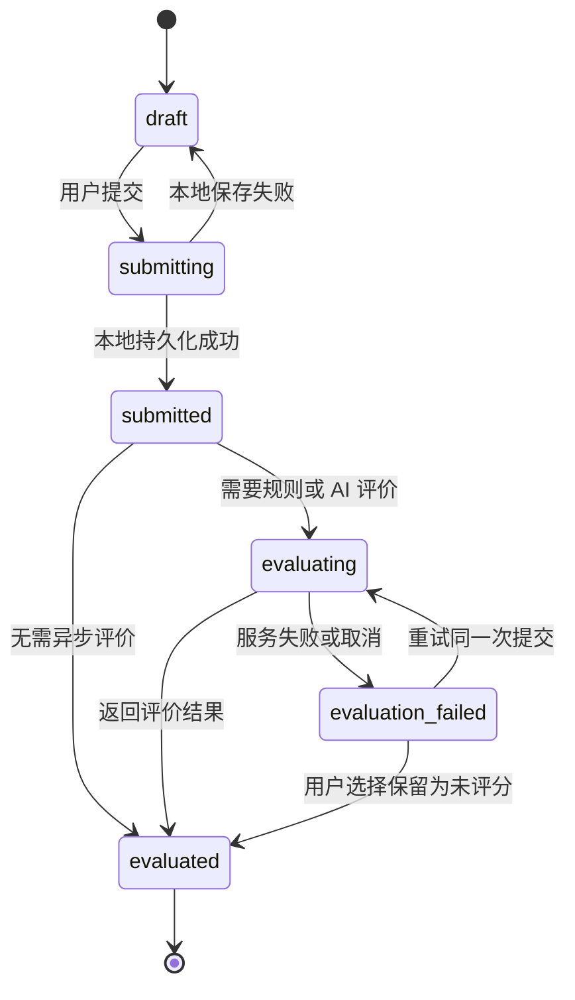
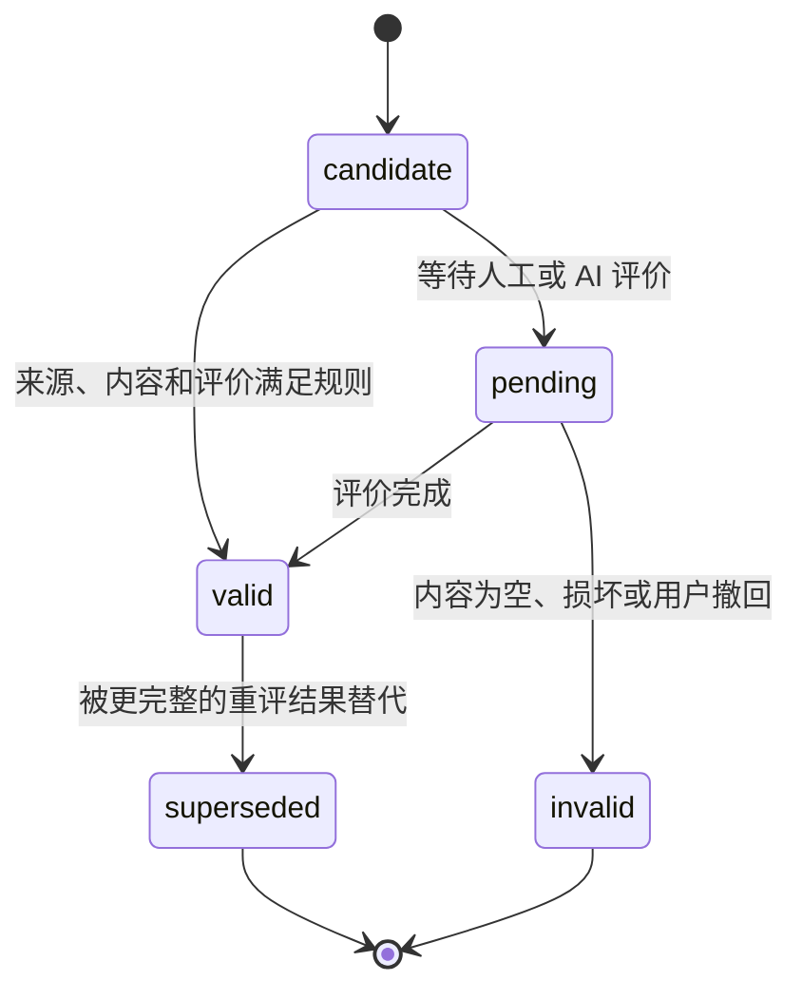
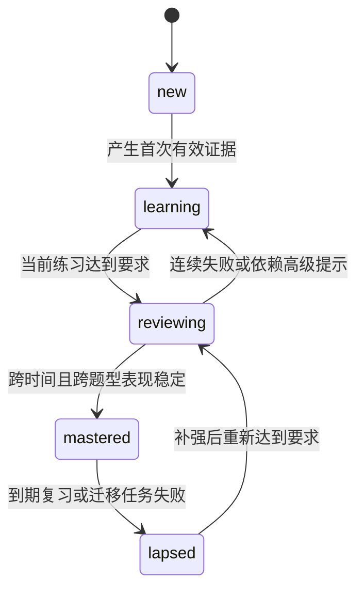
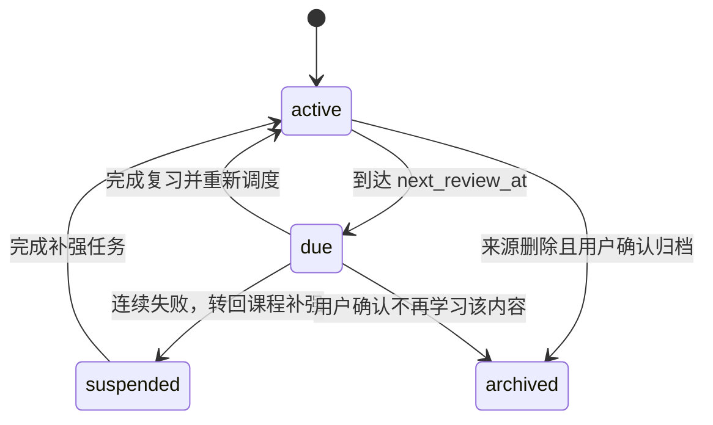
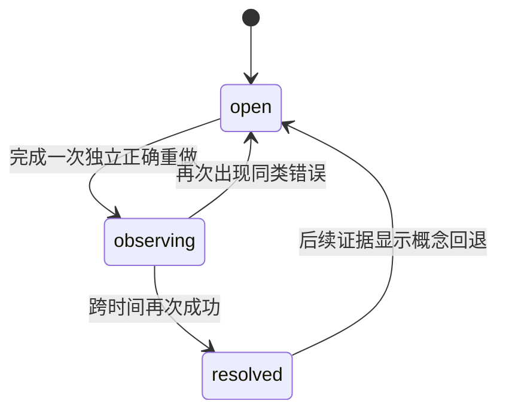
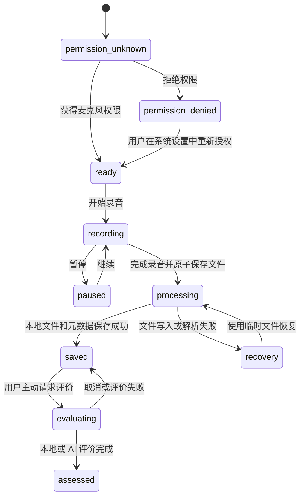
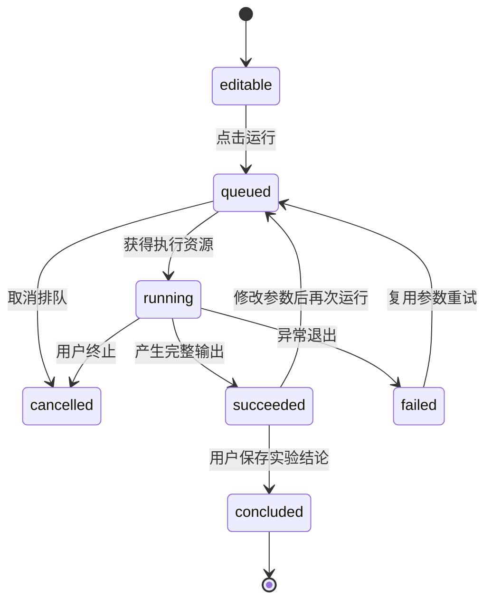

# OmniBox 学习中心交互规则与状态流转规格

> 文档状态：交互规格草案，可进入技术拆分
> 对应产品版本：`0.1.0` 规划，不修改应用版本号
> 依赖文档：`learning-center-prd.md`、`learning-center-wireframes.md`
> 本文范围：学习中心阶段 A 的公共底座，以及三个方向首期页面的关键交互

## 1. 文档目的

本文把产品需求和低保真页面进一步收敛为可实现、可测试的交互契约，重点定义：

- 用户操作何时只保存草稿，何时正式提交。
- 学习任务何时开始、跳过、延后或完成。
- 什么可以成为能力证据，什么只能算浏览或过程记录。
- 作答、录音、案例和实验失败后如何恢复，避免丢失用户输入。
- 复习卡、错题和掌握度如何随练习结果流转。
- 纯本地、联网非 AI、AI 增强三种处理边界如何展示和降级。
- 10 个核心页面的入口、按钮、反馈和退出行为。

本文不规定具体组件库、数据库框架、调度算法实现或视觉细节。

## 2. 统一交互原则

### 2.1 三阶段操作模型

学习中心中的产出统一区分三个阶段：

| 阶段 | 含义 | 示例 | 是否更新能力 |
|---|---|---|---|
| 草稿 `draft` | 用户正在输入，尚未提交 | 未提交答案、案例分析草稿、实验结论草稿 | 否 |
| 提交 `submitted` | 用户明确提交或完成一次不可逆采样 | 提交听写、结束录音、运行实验 | 先生成候选证据 |
| 评价 `evaluated` | 本地规则、人工或 AI 已给出结果 | 正确、部分正确、未评分、口语反馈 | 满足有效性条件后更新 |

“保存”默认只保存草稿或运行记录；“提交答案”“完成录音”“提交分析”才进入评价流程。

### 2.2 完成必须有证据

- 浏览完正文、播放过音频、打开过实验页面都不能单独完成任务。
- 每个 `plan_item` 必须声明 `completion_rule`，例如“提交 5 句听写并完成一次无字幕复听”。
- 完成条件满足后系统自动将任务标记为 `completed`，无需再让用户点击一次“我已完成”。
- 用户可以主动结束任务，但若证据不足，只能保存为“本次暂存”，不能伪装成完成。
- AI 评价不可用时，允许将任务记为“已提交，待评价”；只有不依赖 AI 的完成条件可以立即完成。

### 2.3 先保留输入，再展示错误

- 所有可能失败的操作先本地保存输入，再调用解析、联网或 AI 服务。
- 错误提示必须说明失败对象、失败阶段和可执行操作。
- 重试沿用同一个用户提交，不重复创建学习证据。
- 页面恢复时先显示本地草稿，再加载增强信息。

### 2.4 反馈就地出现

- 练习反馈在原练习位置展开，不强制跳到独立结果页。
- 错误原因、提示使用情况、来源引用和下一步操作放在同一反馈块中。
- 能力报告中的结论必须能点击回到具体作答、录音、案例或实验。

### 2.5 用户始终可以中断

- 学习不是必须连续完成的事务。
- 离开页面时自动保存当前位置、输入、音频位置和实验参数。
- 录音、上传、材料解析、模型调用和实验运行提供取消操作。
- 取消不删除已经产生的草稿；用户明确选择“放弃草稿”时才删除。

## 3. 术语和状态归属

| 名称 | 归属 | 说明 |
|---|---|---|
| 学习计划 `learning_plan` | 日期范围 | 一天或一周的任务集合 |
| 计划任务 `plan_item` | 计划 | 用户今天要完成的最小排程单位 |
| 学习会话 `learning_session` | 用户活动 | 一次连续或可恢复的学习上下文 |
| 作答 `attempt` | 练习 | 一次正式提交，草稿不算作答 |
| 证据 `evidence` | 能力判断 | 可追溯到用户产出的有效记录 |
| 掌握度 `concept_mastery` | 概念 | 系统根据多次证据推断的状态 |
| 复习卡 `review_card` | 调度 | 未来需要再次提取或应用的内容 |
| 错题 `mistake` | 纠错 | 一次错误及其原因、补强和重做历史 |

状态由对应实体持有，页面只能发出状态变更意图，不能以界面是否打开推断业务状态。

## 4. 全局导航与学习会话

### 4.1 导航规则

- 左侧一级导航切换模块时，保留学习中心当前二级路由。
- 学习中心内部切换“今日、英语、基金、大模型、复习、错题本、笔记”时，不结束当前会话。
- 从能力报告、错题或复习卡进入原始课程时，携带 `return_context`，完成后可回到来源位置。
- 浏览器式返回优先恢复页面筛选、滚动位置和展开状态，不重新创建作答。

### 4.2 前台会话规则

- 同一时间只存在一个前台 `learning_session`。
- 从一个任务跳到另一个任务时，旧会话进入可恢复状态，新任务创建或恢复自己的会话。
- 实验运行、材料解析等后台操作可以继续，但必须在全局任务区显示状态。
- 连续 30 分钟无有效操作时，不继续累计 `active_seconds`；用户回来后恢复原会话。

### 4.3 会话派生状态

`learning_sessions` 首期无需强制增加业务状态字段，可根据时间与检查点派生：

| 派生状态 | 判断 |
|---|---|
| `active` | 当前前台会话且近期有操作 |
| `idle` | 会话未结束但长时间无有效操作 |
| `resumable` | 有未完成任务和本地检查点 |
| `ended` | 用户完成、跳过、结束本次学习或显式放弃 |

## 5. 核心状态机

### 5.1 计划任务 `plan_item`

规则：

- `planned → in_progress`：第一次发生有效交互时触发，不以打开卡片触发。
- `in_progress → completed`：由完成条件计算器触发，页面不能直接写入。
- `skipped`：必须记录原因；“已掌握”会生成一次短测建议，而不是直接改变掌握度。
- `rescheduled`：原任务成为终态，同时创建新的 `planned` 任务并保存关联关系。
- 已完成任务默认不可回退；重新练习创建新任务或自由练习记录。

### 5.2 草稿和作答 `attempt`

规则：

- `draft` 不写入 `attempts`，使用独立草稿或检查点存储。
- 正式提交后立即生成稳定 `attempt_id`，后续评价重试复用该 ID。
- `result=unscored` 不等于失败，表示有效产出存在但暂时没有质量判断。
- 已评价作答不能覆盖原答案；“再做一次”创建新的 `attempt`。
- 本地可评分练习先完成本地评价，AI 只能补充解释，不覆盖确定性答案。

### 5.3 学习证据 `evidence`

证据至少包含：

- `source_type`：attempt、recording、case、lab_run、assessment、project。
- `source_id`：可打开的原始记录。
- `evaluator`：local、rule、human、ai。
- `concept_ids`：影响哪些概念。
- `quality`：correct、partial、incorrect、unscored 或领域指标。
- `occurred_at`、内容版本和评价版本。

以下记录不能单独成为有效证据：浏览时长、页面打开次数、音频播放次数、AI 给出的答案、未运行的代码、没有用户结论的实验截图。

### 5.4 概念掌握度 `concept_mastery`

约束：

- 单次正确不能从 `new` 直接进入 `mastered`。
- 至少需要两个不同时间点的有效证据，才能进入 `mastered`；具体阈值由内容包配置。
- 大量使用提示的正确作答降低证据权重，但不否定学习过程。
- AI 评价只能作为一种证据来源，不能单独完成高风险基金能力判断。
- 状态变化必须保存触发它的证据列表和算法版本。

### 5.5 复习卡 `review_card`

其中 `due` 是由“卡片处于 `active` 且 `next_review_at` 已到”计算出的界面状态，不作为持久化枚举，避免时间经过后状态失真。

复习评级与首期调度含义：

| 评级 | 用户含义 | 系统动作 |
|---|---|---|
| `again` | 不会或答案错误 | 短间隔重现；连续失败后转补强任务 |
| `hard` | 模糊、依赖提示或耗时过长 | 小幅延长间隔 |
| `good` | 独立正确且能解释 | 按正常间隔延长 |
| `easy` | 快速、稳定并能迁移应用 | 较大幅度延长，但不直接永久掌握 |

### 5.6 错题 `mistake`

- 创建错题时先自动推断错误类型，用户可以修改原因。
- `open → observing` 需要新的正确证据，不能点击“已理解”完成。
- `observing → resolved` 默认要求另一个时间点或迁移题型的成功证据。
- 原题内容版本变化时保留旧快照，不覆盖历史答案。

## 6. 页面交互规格

### 6.1 W01 学习档案与初始诊断

### 进入条件

- 首次进入且没有完整学习档案。
- 用户从学习设置主动重新进入。
- 新启用某个学习方向，需要补充该方向设置。

### 步骤状态

`profile → tracks → schedule → domain_preferences → diagnostic → plan_preview → completed`

### 关键操作

| 操作 | 前置条件 | 结果 |
|---|---|---|
| 保存并继续 | 当前必填项有效 | 保存本步骤草稿并进入下一步 |
| 返回上一步 | 非首步 | 保留后续草稿，不立即清空 |
| 跳过诊断 | 已完成基础设置 | 对应方向标记 `calibration_pending` |
| 开始诊断 | 已选择方向 | 创建诊断会话，不创建今日任务 |
| 采用计划 | 计划预览已生成 | 创建首个 `learning_plan` 和 `plan_items` |

诊断中断后可从最近未完成题继续；重新诊断创建新批次，不覆盖历史诊断证据。

### 6.2 W02 今日学习

### 页面加载顺序

1. 立即显示本地今日计划和未完成检查点。
2. 计算到期复习与逾期程度。
3. 后台补充 AI 建议或外部状态，但不能阻塞任务卡。

### 任务卡操作

| 操作 | 行为 |
|---|---|
| 开始 | 创建或恢复学习会话，将任务变为 `in_progress` |
| 稍后 | 仅调整当前显示顺序，不改变计划日期 |
| 延后 | 原任务进入 `rescheduled`，创建后续任务 |
| 跳过 | 选择原因后进入 `skipped` |
| 替换 | 展示时长和前置条件相近的候选任务，确认后替换 |
| 缩短 | 切换为内容包定义的最小完成版本，不降低证据要求描述 |

### 调整计划

- 调整总时长时实时展示“已安排/可用分钟数”。
- 拖动排序不改变复习到期时间，只改变推荐开始顺序。
- 删除任务等同于跳过，不能静默丢弃。
- 超出时间预算时优先保留到期复习、进行中的任务和用户主方向。
- 保存调整时使用一次事务更新计划，失败则恢复调整前版本。

### 今日完成态

- 所有必做任务完成或被用户明确处理后显示今日总结。
- 总结区区分“完成”“跳过”“延后”，不合并为完成率。
- “继续自由学习”产生自由会话和证据，但不修改已结束计划。

### 6.3 W03 学习路线总览

### 节点状态

| 状态 | 可执行操作 |
|---|---|
| 未解锁 | 查看前置条件和示例，不可直接开始正式练习 |
| 可开始 | 加入计划或立即学习 |
| 学习中 | 继续课程、查看薄弱概念 |
| 待测评 | 开始阶段测评或继续补强 |
| 已掌握 | 查看证据、自由复习、开启下一阶段 |

规则：

- 用户可以预览未解锁内容，但预览不生成完成记录。
- “立即学习”不必修改今日计划；结束时询问是否计入今天总结。
- 大模型路线分叉时必须选择主路线，另一条可以标记为次路线。
- 前置条件被内容包更新后，不撤销既有证据，只提示新增补充内容。

### 6.4 W04 课程详情与练习

### 内容阅读

- 每个互动块独立保存状态，不因切换章节清空。
- 阅读位置采用章节锚点，不只保存滚动像素。
- 材料来源固定展示版本和引用入口。

### 练习操作

1. 用户输入形成草稿。
2. 使用提示时递增 `hint_level` 并记录提示类型。
3. 提交前进行本地完整性校验。
4. 提交后锁定本次答案，生成 `attempt_id`。
5. 就地展示反馈、错误原因和下一步。
6. “再做一次”创建新草稿，不修改旧作答。

### AI 导师

- 默认折叠，仅在用户点击明确动作后发送内容。
- 首次发送前展示当前会发送的课程、题目、用户答案和必要历史范围。
- 用户可以取消某个上下文项；取消后重新计算是否足以完成请求。
- 未提交练习时，导师默认提供分级提示，不直接输出参考答案。
- AI 返回失败不改变作答结果和任务状态。

### 6.5 W05 英语精听工作台

### 播放状态

`idle → playing → paused → completed`，拖动进度条不计作无字幕复听完成。

### 精听步骤

1. 首听：默认隐藏字幕，可重复播放指定次数。
2. 分句听写：每句独立保存草稿和音频位置。
3. 提交听写：冻结本次文本，进行本地 Diff。
4. 错因标注：用户确认“没听清、连读弱读、生词、拼写或其他”。
5. 无字幕复听：从头连续播放达到内容包要求。
6. 复述或跟读：可选或由任务完成条件要求。

### 关键规则

- 显示字幕前提示“查看后本次首听不再计入独立听辨证据”。
- 切换美式/英式发音不会重置听写草稿。
- 音频加载失败时保留文本和进度，可重新定位本地文件或重试网络资源。
- 句子 Diff 只判断文本差异；弱读、连读等语音结论必须有相应来源或评价器。

### 6.6 W06 英语口语训练

### 录音状态机

规则：

- 权限拒绝不阻塞听力、文本跟读和示例播放。
- 录音先保存到临时文件，成功写入数据库后再移动为正式文件。
- 页面关闭时仍在录音，必须提示“结束并保存”或“放弃本次录音”。
- AI 口语评价前展示是否发送录音、转写文本或两者。
- 本地只能可靠计算的节奏、停顿、时长与文本差异不得包装成完整发音评分。

### 6.7 W07 基金案例与材料分析

### 案例流程

`read_material → draft_judgment → submit → rule_check → explain → reflect`

- 用户提交前不显示完整参考判断，但可以查看概念提示。
- 提交时保存材料版本、数据日期和用户原始判断。
- 反馈分为：事实读取、计算过程、风险识别、结论边界和依据引用。
- “不是买/不买按钮”，选择仅用于教育案例，不产生真实投资操作。
- 真实数据缺失或过期时，禁用依赖该数据的结论，并明确最后更新时间。

### 材料分析

- 导入文件后先展示处理边界：纯本地解析、联网数据补充或 AI 解读。
- PDF/Word/Excel 解析失败不能删除原文件记录。
- AI 摘要中的每个关键事实应能回到页码、表格或原文片段。
- 用户修改 AI 摘要后，分别保存“生成版本”和“用户修订版本”。

### 6.8 W08 大模型交互实验室

### 运行状态机

规则：

- 每次运行保存参数快照、输入引用、环境、日志和输出。
- 敏感值只保存字段名和脱敏状态，不写入运行记录。
- “保存运行”保存可复现记录；“保存结论”才生成高质量实验能力证据。
- 失败运行也是调试证据，但不能作为概念掌握成功证据。
- 重试创建新的 `lab_run`，并通过 `retry_of_run_id` 关联原运行。
- 运行环境不满足时，在运行前列出缺失项，不进入伪运行状态。

### 6.9 W09 复习中心与错题本

### 复习队列

- 默认按逾期程度、薄弱度、预计时长和方向均衡综合排序。
- 用户可以选择“5 分钟快速复习”，系统按可完成数量截取，不改变剩余卡片到期时间。
- 每张卡先要求回忆，再允许翻面；直接翻面不生成成功证据。
- 连续两次 `again` 后暂停该卡，提供原课程、示例或换题型入口。
- 退出复习时保存已完成日志，未作答卡回到队列。

### 错题本

- 筛选条件写入 URL/路由状态，返回时保持。
- “重做”创建新的作答并关联错题。
- 用户可以补充错误原因，但不能修改原答案快照。
- 错题达到关闭条件后先进入 `observing`；界面文案显示“等待巩固”，避免误认为永久掌握。

### 6.10 W10 能力报告

### 报告生成

- 默认展示最近 30 天；样本不足时回退到阶段周期并明确说明。
- 报告从已落库证据计算，打开页面不触发修改掌握度。
- 指标计算保存口径版本；口径变化时不把新旧曲线直接拼接。
- 每个趋势、进步和薄弱点都提供“查看证据”。

### 生成补强计划

1. 用户选择薄弱点。
2. 系统展示建议任务、预计时长和替换影响。
3. 用户确认后写入未来计划。
4. 若与现有计划冲突，必须由用户选择替换、延后或增加时间。

导出 Markdown/PDF 只读取报告快照，不包含 API Key、隐藏提示词、完整导师对话或未授权录音路径。

## 7. 今日计划与复习调度规则

### 7.1 今日任务排序

首期建议采用可解释规则，而不是不可见的模型排序：

1. 正在进行且有检查点的任务。
2. 严重逾期的短复习。
3. 用户主方向的核心练习。
4. 最近薄弱点补强。
5. 次方向的新课或项目任务。

同一方向连续两个高负荷任务时，插入短复习或其他方向任务。

### 7.2 时间预算

- 默认计划不得超过 `daily_minutes`。
- 任务使用内容包的 `estimated_minutes`，用户实际用时只用于后续估算，不追责。
- 不足 10 分钟时优先提供可独立完成的复习或微练习。
- 到期复习过多时只安排预算内部分，其余明确显示“仍有 N 项未安排”。

### 7.3 跳过原因的影响

| 原因 | 后续处理 |
|---|---|
| 没时间 | 降低当日负荷，不改变掌握度 |
| 太难 | 安排前置概念或更低难度练习 |
| 不想学 | 降低同类型连续出现频率 |
| 已掌握 | 安排短测校准，短测前不直接升级状态 |
| 其他 | 保留用户说明，默认只做延后建议 |

## 8. 本地、联网与 AI 模式

### 8.1 处理模式矩阵

| 能力 | 纯本地 | 联网非 AI | AI 增强 |
|---|---|---|---|
| 课程与本地练习 | 可用 | 可用 | 可用 |
| 计划基础排程 | 规则引擎 | 不需要 | 仅补充解释 |
| 精听文本 Diff | 可用 | 可用 | 可补充语义反馈 |
| 口语基础节奏 | 可用 | 可用 | 可做语义或发音增强评价 |
| 基金静态案例 | 可用 | 可用 | 可检查解释，但有风险约束 |
| 基金实时数据 | 不可用或缓存 | 可用且显示来源时间 | AI 只解释已取得数据 |
| 大模型本地实验 | 可用 | 可下载依赖 | 可调用用户配置模型 |

### 8.2 AI 请求状态

`ready → consent_required → sending → streaming/completed → failed/cancelled`

- 用户同意范围按请求保存，不默认扩展到其他材料或录音。
- 发出请求前本地保存输入和上下文清单。
- 取消流式响应时保留已显示内容，但标记“不完整”，不能成为正式评价证据。
- AI 失败时提供：重试、切换已配置服务商、保存为未评分、继续本地学习。
- 相同请求重试使用新的请求 ID，但评价结果绑定同一个 `attempt_id`。

## 9. 自动保存、退出与恢复

### 9.1 检查点内容

| 场景 | 保存内容 |
|---|---|
| 课程 | 章节锚点、展开块、练习草稿、提示级别 |
| 精听 | 音频资源、句子索引、播放位置、听写草稿、字幕状态 |
| 口语 | 任务、录音临时文件、脚本或关键词、评价状态 |
| 基金案例 | 材料版本、选择、计算过程、分析草稿 |
| 大模型实验 | 参数、输入引用、代码草稿、最近运行和结论草稿 |

### 9.2 保存触发

- 文本输入停止后短延迟保存。
- 切换题目、章节或页面前立即保存。
- 音频暂停、定位或切句时保存位置。
- 实验参数变化时保存草稿，不自动运行。
- 应用退出时做最后一次同步保存，但不能只依赖退出事件。

### 9.3 恢复冲突

- 同一设备首期以最新本地修改为准。
- 若未来支持多设备同步，冲突时保留两个草稿版本，不自动覆盖长文本、案例结论或代码。
- 内容包版本变化时，使用旧版本快照恢复草稿，并提供迁移到新版的选择。

## 10. 失败、取消与幂等

### 10.1 错误分层

| 层级 | 示例 | 页面行为 |
|---|---|---|
| 输入错误 | 必填项缺失、公式格式错误 | 就地提示，不发起任务 |
| 本地处理错误 | 文件损坏、录音写入失败 | 保留草稿或临时文件并提供恢复 |
| 外部服务错误 | 超时、限流、鉴权失败 | 展示服务商与可重试时间，不清空输入 |
| 内容错误 | 课程资源缺失、版本不兼容 | 展示内容包与资源 ID，允许跳过该内容 |
| 执行错误 | 实验非零退出、依赖缺失 | 保存日志、参数和环境，提供修复后重试 |

### 10.2 幂等规则

- 每次正式提交生成 `submission_key`；网络重试不能创建第二个 `attempt`。
- 任务完成事件以 `plan_item_id + completion_rule_version` 去重。
- AI 评价重试可以产生多个评价版本，但只有一个标记为当前有效。
- 复习日志每次翻面提交只写一次；按钮提交后立即禁用至本地写入完成。
- 调整计划使用计划版本号，旧页面提交时提示重新合并。

### 10.3 取消语义

| 操作 | 取消后的状态 |
|---|---|
| 材料解析 | 原文件仍存在，处理状态为可重试 |
| AI 请求 | 本地输入保留，部分响应标记不完整 |
| 录音 | 用户选择保存已有片段或明确放弃 |
| 实验运行 | 记录终止信号、日志和 `cancelled` 状态 |
| 报告导出 | 不影响报告快照和学习数据 |

## 11. 建议补充的数据字段

以下是从交互规格推导的数据模型增量，进入技术设计时确认，不要求现在修改代码：

| 实体 | 建议字段 | 用途 |
|---|---|---|
| `plan_items` | `completion_rule_json` | 声明任务完成证据 |
| `plan_items` | `rescheduled_to_id`、`skip_reason` | 追踪延后与跳过 |
| `plan_items` | `version` | 防止并发调整覆盖 |
| `attempts` | `submission_key`、`evaluation_status` | 提交幂等和异步评价 |
| `attempts` | `answer_snapshot_json` | 保留提交时原答案 |
| `learning_sessions` | `checkpoint_json`、`last_active_at` | 恢复上下文和有效时长 |
| 新表 `learning_evidence` | 来源、评价器、概念、质量、版本 | 统一能力证据入口 |
| `review_cards` | `suspension_reason` | 连续失败后转补强 |
| `mistakes` | `observing_since`、`reopened_count` | 支持观察与重新开放 |
| `lab_runs` | `status`、`retry_of_run_id` | 运行失败、取消和重试链 |
| 新表 `draft_checkpoints` | 上下文、版本、内容、更新时间 | 与正式作答分离 |

## 12. 关键产品事件

事件只用于本地学习分析时也应遵守最小化原则；不默认上传。

| 事件 | 关键字段 | 用途 |
|---|---|---|
| `plan_generated` | 日期、预算、任务数量、策略版本 | 验证计划质量 |
| `plan_adjusted` | 调整类型、调整前后分钟数 | 了解计划可执行性 |
| `task_started` | 任务、入口、是否恢复 | 还原学习路径 |
| `task_dispositioned` | completed/skipped/rescheduled、原因 | 区分真实完成 |
| `attempt_submitted` | 练习类型、提示级别、耗时 | 生成练习证据 |
| `attempt_evaluated` | 评价器、结果、评价版本 | 追踪反馈来源 |
| `review_rated` | 评级、前后间隔 | 调整复习调度 |
| `mistake_state_changed` | 前后状态、证据引用 | 验证错题闭环 |
| `ai_request_started` | 服务商、同意范围、上下文类型 | 审计处理边界 |
| `ai_request_finished` | completed/failed/cancelled、耗时 | 评估降级体验 |

禁止在事件中记录完整答案、录音内容、API Key、未脱敏实验参数或基金账户信息。

## 13. 关键验收场景

### S01：开始并完成本地练习

1. 用户从今日页开始一个 `planned` 任务。
2. 有效输入后任务变为 `in_progress`。
3. 用户提交答案，系统创建一个且仅一个 `attempt`。
4. 本地规则完成评价并生成有效证据。
5. 完成条件满足，任务自动进入 `completed`。
6. 能力报告可以回到该作答。

### S02：提交时断网

1. 用户的答案先成功写入本地。
2. 联网评价失败，作答显示“已提交，评价失败”。
3. 关闭并重新打开应用后答案仍存在。
4. 用户重试评价，不创建第二个作答。
5. 本地课程和其他练习仍可继续。

### S03：跳过任务但不伪造完成

1. 用户选择“太难”跳过任务。
2. 原任务进入 `skipped`，不计入完成证据。
3. 系统建议前置概念补强任务。
4. 掌握度不会因为跳过而上升或下降。

### S04：中断精听后恢复

1. 用户完成前三句听写，在第四句退出。
2. 系统保存句子索引、音频位置、草稿和字幕状态。
3. 用户从“继续上次学习”恢复到第四句。
4. 已提交的前三句不被覆盖，未提交草稿可继续编辑。

### S05：口语权限被拒绝

1. 页面说明麦克风用途并请求权限。
2. 用户拒绝后看到系统设置路径。
3. 文本练习、示例播放和已有录音仍可使用。
4. 系统不创建空录音或失败证据。

### S06：实验失败并重试

1. 运行保存参数和环境快照。
2. 实验失败后展示日志并保留结论草稿。
3. 用户修复参数后重试，生成新的 `lab_run`。
4. 新旧运行通过重试链关联。
5. 只有成功运行并保存用户结论后，才生成掌握度成功证据。

### S07：错题关闭

1. 错题重做正确后进入 `observing`。
2. 用户不能通过点击“已理解”直接关闭。
3. 到期复习再次独立正确后进入 `resolved`。
4. 后续同类错误会重新打开并保留历史。

### S08：能力报告证据不足

1. 某能力维度有效样本不足。
2. 页面显示“证据不足”和当前样本数，不绘制误导性趋势。
3. 用户可以进入推荐的最小诊断任务。
4. 完成后报告按新快照重新计算。

## 14. 默认决策与仍待确认事项

### 14.1 本规格采用的默认决策

- 今日页默认混排三个方向，同时允许固定单方向日。
- 学习中心使用永久窄侧栏；窄窗口折叠为抽屉。
- 课程详情中笔记和 AI 导师不能同时占用完整右栏，可切换标签。
- 精听首期以音频和字幕为主，视频作为后续增强。
- 基金材料首期优先 PDF，同时复用已有 Word/Excel 本地解析能力。
- 大模型实验优先“内嵌可控实验 + 调用用户本地项目”组合，具体执行边界进入技术设计确认。
- 能力报告默认 30 天，样本不足时按学习阶段展示。

### 14.2 仍需产品或技术验证

1. 口语首期本地节奏分析能覆盖哪些系统平台。
2. AI 口语评价是否允许上传音频，还是首期仅发送转写文本。
3. 学习证据是否独立建表，或先以统一视图聚合各领域记录。
4. 后台实验在应用退出后是否继续运行。
5. 首期间隔复习参数采用简单分级规则还是直接引入 FSRS。
6. 内容包升级时旧题和旧评分标准的长期保留策略。

## 15. 建议的开发拆分顺序

1. **状态与持久化底座**：`plan_item`、草稿检查点、作答幂等、统一证据。
2. **今日学习闭环**：生成计划、调整、开始、跳过、延后、完成。
3. **通用课程与练习**：正文、草稿、提交、本地评价、错题。
4. **复习与掌握度**：复习卡、评级、调度、概念状态。
5. **领域工作台**：精听、口语、基金案例、大模型实验。
6. **AI 降级链路**：同意范围、请求状态、失败恢复和评价版本。
7. **能力报告**：证据聚合、样本门槛、趋势快照和补强计划。

每一步都应先验证本地闭环，再接入联网或 AI 增强能力。
