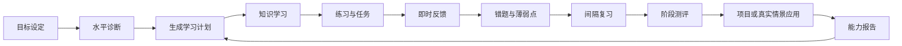
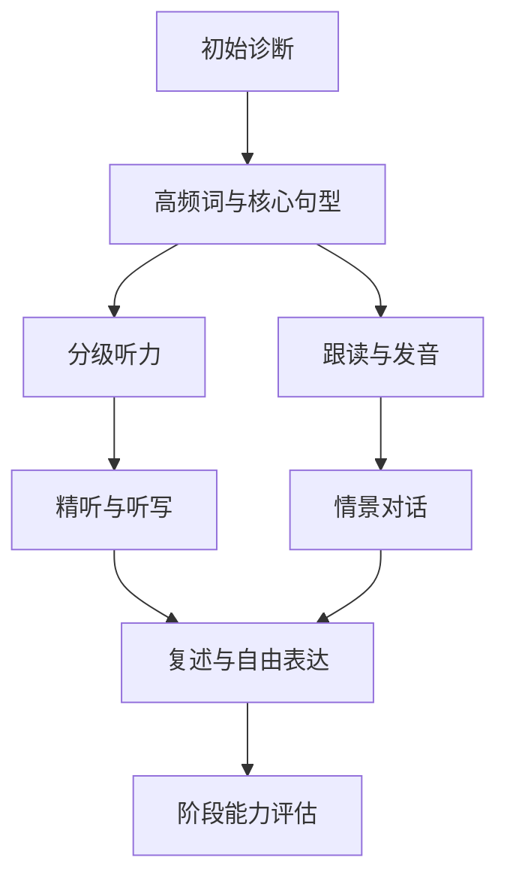
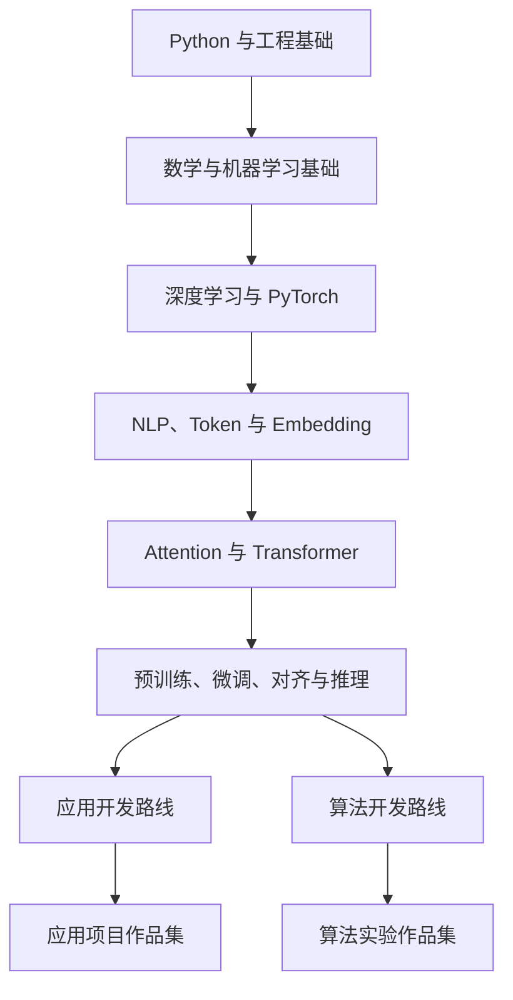
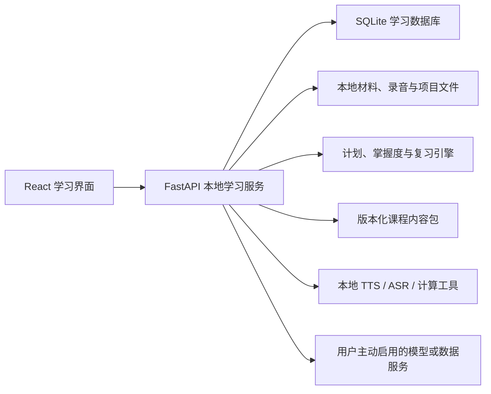
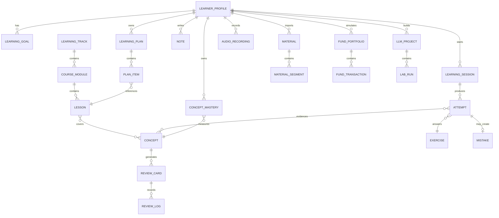

# OmniBox 学习中心产品需求文档

> 文档状态：方案草案，可进入产品评审
> 文档版本：1.0（不代表 OmniBox 产品版本）
> 产品版本约束：开发阶段继续保持 `0.1.0`
> 目标平台：macOS、Windows 桌面端
> 数据策略：本地优先，AI 能力由用户主动启用

## 1. 文档目的

本文档定义 OmniBox“学习中心”的产品定位、功能范围、页面结构、学习闭环、三个首发学习方向、数据模型、AI 使用边界、隐私与投资风险约束、阶段规划及验收标准。

学习中心首期面向三个长期目标：

1. 提升英语能力，重点覆盖单词、听力和口语。
2. 从零学习基金知识，逐步具备理解基金产品和独立分析投资风险的能力。
3. 系统学习大模型理论、应用开发和算法开发，为大模型应用或算法开发岗位积累知识与项目证据。

本文档暂不包含具体代码实现、视觉稿、第三方数据供应商定案及商业化设计。

## 2. 背景与问题

现有学习工具常见问题包括：

- 内容很多，但缺少从目标到练习、反馈、复习和测评的闭环。
- AI 能快速回答问题，却容易让用户停留在“看懂了”的错觉中。
- 单词、听力、口语彼此割裂，学习结果不能互相促进。
- 基金内容容易变成产品推荐，缺少风险、费用、回撤和真实材料阅读训练。
- 大模型课程容易只讲概念或只调用 API，缺少从理论到实验、项目和工程证据的进阶路径。
- 学习记录分散在多个网站、笔记和聊天记录中，难以持续追踪薄弱点。

OmniBox 已经具备本地文件处理、Markdown、语音、模型服务配置及桌面端能力，适合进一步承载一个本地优先的个人能力训练系统。

## 3. 产品定位

### 3.1 一句话定位

OmniBox 学习中心是一个本地优先、以练习和能力证据为核心的个人学习系统。

### 3.2 核心学习闭环



### 3.3 产品原则

- **练习优先**：课程内容必须配套可操作练习，避免只提供阅读材料。
- **证据优先**：掌握度由答题、录音、实验、项目和复习表现共同决定，不以浏览时长代替能力。
- **本地优先**：学习记录、录音、笔记、错题和材料默认保存在本机。
- **AI 可选**：基础课程、复习和本地工具无需模型；需要语义反馈时由用户主动启用 AI。
- **先提示后答案**：AI 导师优先使用追问和分级提示，避免直接代替用户完成学习任务。
- **可解释反馈**：不提供没有依据的精确分数，所有能力判断应展示来源和证据。
- **风险透明**：基金模块明确区分知识教育、模拟训练、数据解释和投资建议。
- **长期可维护**：课程内容与应用代码分离，支持内容包版本更新和用户自定义材料。

## 4. 产品目标与非目标

### 4.1 产品目标

- 让用户每天能够在一个入口完成计划、练习、复习和记录。
- 让三个学习方向共用统一的掌握度、错题、笔记和复习系统。
- 让英语训练形成“听到—理解—说出—纠错—复习”的闭环。
- 让基金学习形成“理解概念—计算—分析材料—情景判断—模拟组合”的闭环。
- 让大模型学习形成“理论—可视化实验—编码—评测—项目作品”的闭环。
- 让用户能够导出自己的学习档案、笔记和项目报告。

### 4.2 非目标

- 不承诺英语考试成绩或固定时间内达到某一等级。
- 不提供基金收益保证、自动交易或未经用户判断的买卖指令。
- 不把 AI 回复次数、在线时长或连续签到作为核心能力指标。
- 不在首期自研完整语音识别模型、行情系统或大模型训练平台。
- 不在首期建设教师、班级、社交社区、排行榜和付费课程市场。

## 5. 目标用户与使用场景

### 5.1 核心用户画像

| 用户角色 | 当前状态 | 目标 | 主要阻碍 |
|---|---|---|---|
| 英语提升者 | 有一定基础，但词汇、听力和表达脱节 | 能听懂常见材料并自然表达 | 缺少稳定训练、口语反馈和复习机制 |
| 基金初学者 | 对基金、风险、费用和指标不熟悉 | 能看懂基金信息并独立作出审慎判断 | 容易追逐收益排名，缺少真实案例训练 |
| 大模型转型者 | 有开发经验或技术兴趣，但知识零散 | 成为大模型应用或算法开发工程师 | 理论、工程、实验和项目路线不连贯 |

### 5.2 典型使用场景

- 工作日前完成 20 分钟英语单词与精听，晚上完成 10 分钟口语复述。
- 阅读基金定期报告时，将不理解的概念加入知识卡片并完成分析清单。
- 学习 Transformer 后立即打开 Attention 实验室验证维度、掩码和权重变化。
- 周末查看能力报告，调整下一周计划，而不是重新从课程第一章开始。
- 将自己的文章、音频、基金报告或技术文档导入为学习材料。

## 6. 成功指标

首期以本地指标为主，默认不上传遥测数据。

### 6.1 通用指标

- 每周实际完成的有效学习会话数。
- 计划任务完成率及主动调整率。
- 到期复习完成率。
- 同一概念在多次复习中的正确率变化。
- 错题关闭率及再次错误率。
- 阶段测评前后能力变化。
- 用户生成的笔记、录音、实验和项目数量。

### 6.2 分方向能力指标

| 方向 | 建议指标 |
|---|---|
| 英语 | 听写词级正确率、连续表达时长、复述完整度、主动词汇量、重复发音问题 |
| 基金 | 概念测评正确率、费用/回撤计算正确率、案例判断依据完整度、报告阅读清单完成度 |
| 大模型 | 实验完成率、代码测试通过率、概念解释能力、项目里程碑、评测报告完整度 |

## 7. 产品范围与优先级

### 7.1 优先级定义

- `P0`：学习中心成立所必需。
- `P1`：首个可用版本需要具备。
- `P2`：增强学习效果，可后续迭代。
- `P3`：长期能力或依赖外部资源。

### 7.2 范围总览

| 能力 | 优先级 | 首期范围 |
|---|---:|---|
| 学习档案、目标与计划 | P0 | 支持三条路线、每日时长和目标调整 |
| 课程、练习、掌握度 | P0 | 统一内容与练习模型 |
| 间隔复习、错题、笔记 | P0 | 三个方向共用 |
| 学习数据本地持久化 | P0 | SQLite 与本地文件目录 |
| 英语单词、精听、录音跟读 | P1 | 优先完成的垂直方向 |
| 基金课程、计算器、案例训练 | P1 | 不包含自动交易 |
| 大模型公共基础与应用实验 | P1 | 应用开发路线优先 |
| AI 导师 | P1 | 用户配置模型后主动启用 |
| 基金模拟组合 | P2 | 使用模拟资金和历史/延迟数据 |
| 大模型算法实验与微调项目 | P2 | 依赖本地环境或外部算力 |
| 真实基金数据分析 | P3 | 数据供应商、授权与更新策略待定 |
| 本地语音识别与离线模型包 | P3 | 允许按需下载，不随基础安装包强制附带 |

## 8. 信息架构与导航

学习中心作为 OmniBox 一级入口，内部采用独立的二级导航，避免继续扩张全局侧栏。

```text
OmniBox
└── 学习中心
    ├── 今日
    ├── 英语
    │   ├── 学习路线
    │   ├── 单词
    │   ├── 听力
    │   ├── 口语
    │   └── 英语能力报告
    ├── 基金
    │   ├── 学习路线
    │   ├── 概念库
    │   ├── 计算与模拟
    │   ├── 案例训练
    │   ├── 基金材料分析
    │   └── 基金能力报告
    ├── 大模型
    │   ├── 公共基础
    │   ├── 应用开发路线
    │   ├── 算法开发路线
    │   ├── 实验室
    │   ├── 项目
    │   └── 大模型能力报告
    ├── 复习
    ├── 错题本
    ├── 笔记
    ├── 学习材料
    └── 学习设置
```

## 9. 页面结构

### 9.1 页面清单

| 页面 ID | 页面名称 | 核心作用 | 主要模块 |
|---|---|---|---|
| `learn_today` | 今日学习 | 每天唯一主入口 | 今日计划、待复习、继续学习、快速记录 |
| `learn_onboarding` | 学习档案 | 设置目标和初始能力 | 目标、时间、诊断、偏好、隐私选择 |
| `track_overview` | 路线总览 | 查看路径、前置关系和进度 | 路线图、阶段、掌握度、下一步 |
| `lesson_detail` | 课程详情 | 学习一个明确知识单元 | 内容、示例、练习、笔记、AI 导师 |
| `review_queue` | 复习中心 | 处理到期复习 | 卡片队列、筛选、复习结果 |
| `mistake_book` | 错题本 | 定位和关闭薄弱点 | 错误原因、关联概念、重做、状态 |
| `notes_library` | 笔记库 | 管理个人知识 | Markdown、双向关联、标签、导出 |
| `materials_library` | 学习材料 | 导入和处理自有材料 | 文件、音频、网页文本、分段、索引 |
| `ability_report` | 能力报告 | 展示能力证据和趋势 | 指标、证据、薄弱点、阶段建议 |
| `learning_settings` | 学习设置 | 控制计划、数据和服务 | 每日时间、提醒、AI、本地模型、备份 |

### 9.2 今日学习页

页面从上到下包含：

1. 日期、今日可用时间和“调整计划”。
2. 三条路线的今日任务卡片，每张卡片展示预计时长、任务类型和完成条件。
3. 到期复习区，按逾期程度而不是按学科强制排序。
4. “继续上次学习”，恢复课程、音频位置、实验参数或未完成练习。
5. 今日总结：完成任务、发现的薄弱点和明日待复习数量。

关键规则：

- 默认每日任务总时长不得超过用户设置。
- 用户可以跳过、延后、缩短或替换任务，不因中断学习而惩罚。
- 任务完成必须满足对应证据，例如提交听写、完成练习或保存实验结果。

### 9.3 路线总览页

路线采用“阶段—模块—课程”三级结构，并显示前置关系：

- 阶段状态：未开始、学习中、待测评、已掌握。
- 模块进度：已完成课程数、掌握概念数、待复习数。
- 课程卡片：目标、预计时长、练习数量、是否需要 AI 或外部环境。
- 路线分叉：大模型公共基础完成后选择应用开发或算法开发，可同时选择但需明确主路线。

### 9.4 课程详情页

建议采用三栏或两栏布局：

- 左侧：章节目录和前置概念。
- 中间：课程正文、示例、互动组件和练习。
- 右侧折叠栏：本课笔记、术语、AI 导师和材料来源。

课程底部必须包含：

- “我能否用自己的话解释”自测。
- 至少一个可评分练习。
- 本课产生的复习卡片预览。
- 下一课和推荐补强内容。

### 9.5 能力报告页

能力报告不展示单一总分，按能力维度展示：

- 当前状态和最近变化。
- 支撑判断的练习、录音、测评或项目证据。
- 反复出现的薄弱点。
- 建议下一阶段目标。
- 可导出的 Markdown/PDF 报告。

## 10. 通用学习引擎需求

### 10.1 学习档案与目标

用户第一次进入学习中心时设置：

- 三个方向的启用状态和优先级。
- 每周学习日和每日可用时间。
- 目标描述与目标日期，日期可选。
- 当前水平自评。
- 是否参加初始诊断。
- 英语发音偏好、基金风险教育确认、大模型主路线。
- 是否允许将当前任务内容发送给已配置模型。

### 10.2 计划生成

计划由规则引擎负责基础排程，AI 仅用于解释和个性化建议。

基础排程考虑：

- 用户可用时间。
- 前置课程是否完成。
- 到期复习数量。
- 连续安排同类高负荷任务的疲劳。
- 用户主动设置的优先方向。
- 最近薄弱点和未完成任务。

### 10.3 掌握度

每个概念维护独立掌握状态：

| 状态 | 定义 |
|---|---|
| `new` | 尚未学习 |
| `learning` | 已接触但不能稳定完成练习 |
| `reviewing` | 当前表现合格，需要间隔复习确认 |
| `mastered` | 多次跨时间、跨题型表现稳定 |
| `lapsed` | 曾掌握但近期复习失败 |

掌握度证据包括：

- 不同题型的正确率。
- 是否使用提示以及提示级别。
- 回答耗时。
- 跨时间复习表现。
- 是否能在新情境中应用。
- 口语、案例分析和项目任务的人工或 AI 反馈。

### 10.4 间隔复习

首期使用可解释的分级调度，后期可替换为 FSRS 等算法：

- 用户反馈：不会、模糊、熟悉、掌握。
- 系统结合正确性、提示和耗时调整下次复习时间。
- 连续失败时回到关联课程，不无限重复同一张卡片。
- 复习卡片必须支持来源追踪，可返回原课程和原材料。

### 10.5 错题本

每条错题记录：

- 原任务与用户答案。
- 正确答案或参考标准。
- 错误类型。
- 用户自己的原因说明。
- 关联概念和材料。
- 推荐补强任务。
- 重做历史。
- 开放、观察、关闭状态。

### 10.6 笔记

- 使用现有 Markdown 编辑与预览能力。
- 笔记可以关联课程、概念、材料、错题、基金案例或大模型项目。
- 支持全文搜索、标签、收藏和导出。
- AI 摘要、问答或整理必须由用户主动发起。

### 10.7 AI 导师

AI 导师提供四种明确动作：

1. 给我一个提示。
2. 换一种方式解释。
3. 根据我的错误出一道相似题。
4. 检查我的解释或方案。

默认策略：

- 优先追问用户当前理解。
- 分级给出提示，不直接泄露练习答案。
- 仅使用当前课程、用户选中材料和必要历史上下文。
- 明确区分课程事实、实时数据和模型推断。
- 基金模块不得输出保证性、煽动性或无来源的投资结论。

## 11. 英语学习空间

### 11.1 英语路线

英语路线围绕词汇、听力、口语三个维度并行推进：



### 11.2 单词模块

每个单词条目包含：

- 拼写、音标、词性和常用释义。
- 美式与英式发音。
- 常见搭配、例句、同义词、反义词和词根词缀。
- 来源材料和出现上下文。
- 识别、听辨、拼写、选义、造句和发音练习记录。

核心功能：

- 每日新词与复习数量控制。
- 单词表导入、导出和去重。
- 从听写错误、课程材料和口语转写中自动生成候选生词。
- 用户确认后才加入正式词库，避免自动堆积。
- 支持“认识但不会用”“能听懂但不会拼”等分维度状态。

### 11.3 听力模块

精听工作台包含：

- 播放、暂停、前后跳句、播放速度。
- 单句循环和 A/B 区间循环。
- 显示或隐藏全文、当前句和关键词。
- 逐句听写及词级 Diff。
- 点击单词查看释义和美式/英式发音。
- 长句意群、连读、弱读和重音提示。
- 完成精听后的无字幕全文复听。

材料来源：

- 内置分级内容包。
- 用户导入音频、视频、字幕和文本。
- 将用户文本通过系统 TTS 生成练习音频。
- AI 生成内容必须标记为生成材料，并允许用户编辑后保存。

### 11.4 口语模块

#### 跟读训练

- 播放标准音频后录制用户语音。
- 对比文本、时长、停顿、语速和主要发音问题。
- 支持逐句重录和保留最佳版本。
- 展示具体证据，不只展示一个总分。

#### 情景对话

- 预设机场、会议、面试、餐厅、日常交流等场景。
- 用户选择难度、角色、目标和发音偏好。
- 对话中尽量不中断，结束后统一反馈。
- 反馈包含用词、语法、自然度、任务完成度及推荐重说句子。

#### 自由表达

- 提供话题、准备时间和目标时长。
- 录音后生成转写、停顿、重复词和表达建议。
- 用户可查看原始版本、修改版本并重新录制。

### 11.5 英语能力报告

- 被动词汇与主动词汇估计。
- 听写词级正确率和常见遗漏类型。
- 不同语速下的听力表现。
- 连续表达时长和复述完整度。
- 高频发音、停顿、语法和用词问题。
- 最近录音与早期录音的可回放对比。

### 11.6 英语首期验收标准

- 用户能创建单词卡并完成至少四种复习题型。
- 用户能导入或选择音频，逐句循环、听写并查看 Diff。
- 用户能录音、回放、保存并获得基础时长和停顿反馈。
- 配置模型后能进行情景对话并获得结束后反馈。
- 听写错误可一键加入候选生词和错题本。

## 12. 基金学习空间

### 12.1 产品边界

基金模块用于知识教育、风险训练、材料阅读和模拟分析，不构成个性化投资建议，不提供自动交易或收益保证。

任何真实基金数据必须展示：

- 数据来源。
- 数据更新时间。
- 复权和口径说明。
- 历史数据不代表未来表现的风险提示。

### 12.2 基金学习路线

| 阶段 | 核心内容 | 关键能力证据 |
|---|---|---|
| 基础概念 | 收益、风险、复利、净值、份额、申赎 | 能解释基本术语并完成简单计算 |
| 基金分类 | 货币、债券、主动权益、指数、ETF、混合、QDII、FOF | 能根据投资范围区分产品 |
| 费用与指标 | 费用、波动率、最大回撤、夏普比率、跟踪误差 | 能计算并解释指标局限 |
| 投资方法 | 资产配置、定投、再平衡、分散、期限 | 能针对情境提出有依据的方案 |
| 材料阅读 | 招募说明书、定期报告、持仓、业绩基准 | 能完成结构化阅读清单 |
| 风险实践 | 市场回撤、追涨杀跌、流动性、集中度 | 能识别常见误区和风险 |

### 12.3 概念学习

- 概念卡片包含定义、公式、例子、反例、常见误区和关联概念。
- 练习包含单选、多选、计算、情景判断和用自己的话解释。
- 对“低净值等于便宜”“短期排名等于能力”等误区设置专门反例。

### 12.4 计算与模拟工具

- 复利计算器。
- 定投模拟器。
- 费用影响计算器。
- 最大回撤与回撤恢复计算器。
- 波动率和收益区间演示。
- 资产配置与再平衡沙盘。
- 组合相关性和分散效果演示。

所有工具必须同时展示计算过程、参数定义和结果限制，不能只输出最终数字。

### 12.5 案例训练

案例由情景、可用材料、用户判断和评价标准组成。例如：

> 某权益基金过去一年收益较高、最大回撤较大、费用较高。用户的资金六个月后需要使用，是否适合投入？

评价维度：

- 是否识别资金期限冲突。
- 是否讨论回撤和流动性。
- 是否检查费用与产品类型。
- 是否避免仅依据短期收益作判断。
- 是否说明信息不足及需要补充的材料。

### 12.6 基金材料分析

支持导入基金招募说明书、定期报告和用户拥有的研究材料，通过现有 PDF/Word 能力在本机提取正文。

阅读工作台提供：

- 文档章节导航。
- 关键字段手动或辅助提取。
- 业绩基准、费用、投资范围、风险、持仓和基金经理信息清单。
- 原文定位和引用。
- 用户判断与 AI 解释并列展示。

AI 不得在找不到原文时臆造字段；所有解释必须能回到材料原文或标记为一般知识。

### 12.7 模拟组合

首期或后续版本可提供纯模拟组合：

- 初始模拟资金。
- 模拟申购、赎回和定投。
- 费用和现金流记录。
- 组合收益、回撤和资产配置变化。
- 决策日志：每次操作前记录理由，之后复盘。
- 禁止连接真实证券账户或自动下单。

### 12.8 投资前检查清单

- 是否保留应急资金。
- 资金何时需要使用。
- 是否理解可能出现的损失和回撤。
- 是否理解产品投资范围和风险等级。
- 是否查看费用和赎回规则。
- 是否因为近期上涨才准备购买。
- 是否存在单一资产过度集中。

### 12.9 基金首期验收标准

- 用户能按路线完成概念、计算和情景练习。
- 每个计算器展示公式、输入、结果和限制说明。
- 用户能导入一份基金材料并完成结构化阅读清单。
- AI 输出不能覆盖原文，必须展示引用或“一般知识”标识。
- 所有基金页面持续展示教育用途和风险边界。

## 13. 大模型学习空间

### 13.1 路线结构



### 13.2 公共基础

- Python、Git、测试和基本工程能力。
- 线性代数、概率统计、微积分和优化基础。
- 机器学习、深度学习和 PyTorch。
- NLP、Tokenizer、Embedding、Attention、Transformer。
- 预训练、指令微调、对齐、推理、评测和安全。

每个理论模块至少包含：

- 可视化解释。
- 最小公式推导。
- 小型计算或代码练习。
- 常见误区。
- 用自己的话解释题。

### 13.3 应用开发路线

- Prompt 设计与结构化输出。
- 模型 API、流式响应和错误处理。
- Function Calling 和工具调用。
- Embedding、向量检索和 RAG。
- 文档切分、召回、重排和引用。
- Agent 工作流与状态管理。
- 对话记忆和上下文压缩。
- 评测数据集、自动评测和人工评测。
- 成本、延迟、并发、缓存和模型路由。
- Prompt Injection、权限、隐私和可观测性。
- MCP、部署和生产故障处理。

### 13.4 算法开发路线

- 张量、自动微分和训练循环。
- Self-Attention、位置编码、Mask 和 KV Cache。
- Transformer 从零实现。
- 数据清洗、采样和 Tokenizer 训练。
- 预训练目标和损失函数。
- SFT、LoRA、QLoRA 和全参数微调。
- DPO、RLHF 基础和偏好数据。
- 量化、推理优化和显存分析。
- 数据并行、模型并行和分布式训练基础。
- 评测、消融实验、复现和实验报告。

### 13.5 交互式实验室

| 实验室 | 目标 | 关键输出 |
|---|---|---|
| Tokenizer 可视化 | 理解文本如何被切分 | Token、ID、长度和成本 |
| Embedding 相似度 | 理解向量语义和局限 | 相似度矩阵、检索结果 |
| Attention 实验 | 理解 Q/K/V、Mask 和权重 | 参数变化与注意力图 |
| Prompt 对比 | 理解提示结构对输出的影响 | 多版本输出与评测记录 |
| RAG 调试 | 理解切分、召回、重排和引用 | 检索链路和失败原因 |
| Tool Calling | 理解模型与工具协议 | 请求、参数、结果和错误 |
| 模型评测 | 建立可复现评测 | 数据集、指标和报告 |
| 成本与延迟 | 建立工程权衡意识 | Token、延迟、吞吐和费用 |
| 微调实验 | 理解训练数据和超参数 | 配置、曲线、模型和报告 |

### 13.6 项目制学习

应用开发推荐项目：

- 本地文档问答系统。
- 带工具调用的桌面助手。
- 代码知识库检索系统。
- 模型评测平台。
- 多模型路由与可观测服务。

算法开发推荐项目：

- 字符级语言模型。
- Self-Attention 与 Transformer 最小实现。
- 小模型 LoRA 微调。
- 量化方式与推理性能对比。
- 数据清洗和消融实验。

每个项目包含：

- 需求说明。
- 里程碑和验收标准。
- 本地代码目录关联。
- 测试和评测记录。
- 决策日志和失败分析。
- 可导出的项目报告。

### 13.7 大模型首期验收标准

- 用户能在公共基础路线中查看前置关系和掌握状态。
- 至少提供 Tokenizer、Prompt、RAG 和 Tool Calling 四个可操作实验。
- 实验结果能够保存参数、输入、输出和结论。
- 用户能创建一个项目并管理里程碑、实验和报告。
- AI 导师能够解释当前实验，但不能替代用户提交最终答案。

## 14. 离线、联网与 AI 模式边界

| 能力 | 纯本地模式 | 联网非 AI | AI 增强模式 |
|---|---|---|---|
| 通用学习 | 课程、计划、复习、错题、笔记 | 内容包更新 | 解释、出题、答案反馈 |
| 英语 | 单词、录音、系统 TTS、基础统计 | 合法词典/发音资源 | 对话、语义纠错、表达反馈 |
| 基金 | 课程、计算器、案例、材料阅读 | 基金公开数据 | 材料解释、案例反馈 |
| 大模型 | 课程、代码、可视化实验 | 文档或模型元数据 | 导师、代码审查、模型实验 |

关键规则：

- 页面必须明确标识当前操作是否会联网或调用模型。
- 音频、文档和代码默认不上传。
- AI 请求前展示将发送的内容范围，允许用户取消或删减。
- 基金实时数据和课程知识必须分开存储，避免过期数据混入静态内容。
- 大模型实验产生的 API Key 继续使用 OmniBox 当前服务配置，不写入课程文件或项目日志。

## 15. 技术与内容架构建议

### 15.1 逻辑架构



### 15.2 内容包

课程内容与应用代码分离，建议采用版本化目录：

```text
learning-content/
├── manifest.json
├── english/
│   ├── track.json
│   ├── lessons/
│   └── exercises/
├── fund/
│   ├── track.json
│   ├── lessons/
│   └── cases/
└── llm/
    ├── track.json
    ├── lessons/
    ├── labs/
    └── projects/
```

每个内容单元包含：

- 稳定 ID 和内容版本。
- 标题、目标、预计时长和难度。
- 前置课程和关联概念。
- Markdown 正文及本地资源。
- 练习和评分规则。
- 来源、作者、更新时间和许可信息。
- 是否需要联网、AI、本地模型或开发环境。

## 16. 数据模型

### 16.1 存储原则

- 结构化学习数据使用 SQLite。
- 大文件、音频、项目和导入材料保存在应用数据目录，以数据库记录路径和哈希。
- 内容包只读；用户进度与内容通过稳定 ID 关联。
- 所有时间以 UTC 存储，界面按用户时区显示。
- 删除课程内容不能直接删除用户笔记、录音和项目证据。
- 支持完整导出和恢复，不把数据库与缓存混为一体。

### 16.2 核心实体关系



### 16.3 通用数据表

#### `learner_profiles`

| 字段 | 类型 | 说明 |
|---|---|---|
| `id` | TEXT PK | 本地用户 ID |
| `display_name` | TEXT | 展示名称，可为空 |
| `timezone` | TEXT | IANA 时区 |
| `daily_minutes` | INTEGER | 默认每日学习分钟数 |
| `active_days` | TEXT/JSON | 每周学习日 |
| `created_at` | DATETIME | 创建时间 |
| `updated_at` | DATETIME | 更新时间 |

#### `learning_goals`

| 字段 | 类型 | 说明 |
|---|---|---|
| `id` | TEXT PK | 目标 ID |
| `profile_id` | TEXT FK | 用户 |
| `track_id` | TEXT FK | 英语、基金或大模型路线 |
| `goal_text` | TEXT | 用户目标 |
| `priority` | INTEGER | 优先级 |
| `target_date` | DATE NULL | 可选目标日期 |
| `status` | TEXT | active、paused、completed |

#### `learning_tracks`、`course_modules`、`lessons`

| 表 | 核心字段 |
|---|---|
| `learning_tracks` | `id`、`domain`、`title`、`version`、`difficulty` |
| `course_modules` | `id`、`track_id`、`title`、`order_index`、`prerequisite_json` |
| `lessons` | `id`、`module_id`、`title`、`content_path`、`estimated_minutes`、`requirement_flags` |

#### `concepts`、`lesson_concepts`

`concepts` 保存可复用知识点，字段包括 `id`、`domain`、`name`、`definition`、`difficulty` 和 `version`。`lesson_concepts` 建立课程与概念多对多关系，并标记 `primary`、`supporting` 或 `prerequisite`。

#### `exercises`

| 字段 | 类型 | 说明 |
|---|---|---|
| `id` | TEXT PK | 练习 ID |
| `lesson_id` | TEXT FK | 所属课程 |
| `type` | TEXT | choice、text、calculation、dictation、speech、code、case、project |
| `prompt_json` | JSON | 题目与资源 |
| `rubric_json` | JSON | 评分标准 |
| `answer_json` | JSON NULL | 可本地评分时保存参考答案 |
| `ai_required` | BOOLEAN | 是否需要 AI 评价 |
| `version` | INTEGER | 练习版本 |

#### `learning_plans`、`plan_items`

`learning_plans` 保存日期范围、可用时间和生成策略。`plan_items` 保存具体任务、计划日期、预计时间、优先级、来源、状态和完成证据引用。

任务状态：`planned`、`in_progress`、`completed`、`skipped`、`rescheduled`。

#### `learning_sessions`

| 字段 | 类型 | 说明 |
|---|---|---|
| `id` | TEXT PK | 学习会话 |
| `profile_id` | TEXT FK | 用户 |
| `domain` | TEXT | english、fund、llm、common |
| `started_at` | DATETIME | 开始时间 |
| `ended_at` | DATETIME NULL | 结束时间 |
| `active_seconds` | INTEGER | 有效操作时间 |
| `context_json` | JSON | 课程、材料、实验等上下文 |
| `summary` | TEXT | 本次总结 |

#### `attempts`

| 字段 | 类型 | 说明 |
|---|---|---|
| `id` | TEXT PK | 作答记录 |
| `session_id` | TEXT FK | 学习会话 |
| `exercise_id` | TEXT FK | 练习 |
| `response_json` | JSON | 用户答案或产物引用 |
| `score` | REAL NULL | 可选分数 |
| `result` | TEXT | correct、partial、incorrect、unscored |
| `hint_level` | INTEGER | 使用提示级别 |
| `duration_ms` | INTEGER | 作答耗时 |
| `feedback_json` | JSON | 规则、人工或 AI 反馈 |
| `created_at` | DATETIME | 提交时间 |

#### `concept_mastery`

| 字段 | 类型 | 说明 |
|---|---|---|
| `profile_id` | TEXT FK | 用户 |
| `concept_id` | TEXT FK | 概念 |
| `state` | TEXT | new、learning、reviewing、mastered、lapsed |
| `mastery_score` | REAL | 0～1 的内部估计，不直接伪装成绝对能力 |
| `evidence_count` | INTEGER | 有效证据数量 |
| `last_practiced_at` | DATETIME | 最近练习 |
| `next_review_at` | DATETIME NULL | 下次复习 |
| `algorithm_data` | JSON | 调度算法参数 |

#### `review_cards`、`review_logs`

- `review_cards`：卡片类型、正面、背面、来源、概念、状态和调度参数。
- `review_logs`：复习时间、用户评级、正确性、耗时、前后间隔和下次复习时间。

#### `mistakes`

字段包括 `attempt_id`、`error_type`、`reason_note`、`concept_ids`、`remediation_json`、`status`、`resolved_at` 和重做次数。

#### `notes`

字段包括 `title`、`markdown`、`tags_json`、`link_type`、`link_id`、`created_at`、`updated_at`。笔记正文不得存储 API Key 等敏感字段。

#### `materials`、`material_segments`

- `materials`：文件名、类型、原始路径或受管路径、哈希、大小、语言、来源、许可、导入时间和处理状态。
- `material_segments`：页码或时间区间、文本、顺序、术语和索引数据。

### 16.4 英语专用数据表

#### `vocabulary_items`

| 字段 | 说明 |
|---|---|
| `lemma` | 词元 |
| `language` | 语言，首期为英文 |
| `phonetic_us`、`phonetic_uk` | 音标 |
| `meanings_json` | 词性和释义 |
| `examples_json` | 例句和来源 |
| `source_material_ids` | 来源材料 |
| `recognition_state` | 识别掌握状态 |
| `listening_state` | 听辨掌握状态 |
| `spelling_state` | 拼写掌握状态 |
| `production_state` | 主动使用状态 |

#### `audio_recordings`

字段包括 `file_path`、`duration_ms`、`sample_rate`、`purpose`、`source_text`、`transcript`、`consent_scope`、`created_at`。删除录音时同步清理相关缓存，但保留用户明确要求保存的反馈摘要。

#### `speech_assessments`

字段包括 `recording_id`、`engine`、`engine_version`、`transcript_diff`、`pace_metrics_json`、`pause_metrics_json`、`pronunciation_findings_json` 和 `feedback`。

### 16.5 基金专用数据表

#### `fund_instruments`

仅在启用真实数据后使用，字段包括基金代码、名称、类型、币种、业绩基准、数据来源、数据口径和更新时间。静态课程不得依赖该表中的最新数值。

#### `fund_cases`

字段包括案例情景、材料引用、所需概念、评价标准、风险标签和版本。

#### `fund_portfolios`、`fund_transactions`、`fund_snapshots`

- `fund_portfolios`：模拟组合名称、初始资金、基准和创建时间。
- `fund_transactions`：模拟申购、赎回、定投、费用、日期、价格和决策日志。
- `fund_snapshots`：组合价值、现金、收益、回撤、配置和数据更新时间。

### 16.6 大模型专用数据表

#### `llm_projects`

字段包括 `title`、`track_type`、`goal`、`repository_path`、`status`、`rubric_json`、`started_at`、`completed_at`。

#### `project_milestones`

字段包括里程碑名称、验收标准、截止日期、状态、证据引用和复盘。

#### `lab_runs`

| 字段 | 说明 |
|---|---|
| `lab_id` | 实验定义 |
| `project_id` | 可选关联项目 |
| `parameters_json` | 可复现实验参数，敏感值必须脱敏 |
| `input_refs_json` | 输入或数据集引用 |
| `output_refs_json` | 输出、图表或模型引用 |
| `metrics_json` | 指标 |
| `environment_json` | Python、库、模型和硬件信息 |
| `conclusion` | 用户实验结论 |
| `created_at` | 运行时间 |

### 16.7 AI 导师数据

#### `tutor_threads`、`tutor_messages`

- 对话必须绑定当前课程、练习、材料或项目，避免成为无上下文聊天历史。
- 保存模型、服务商、是否发送远端、上下文摘要和用户同意范围。
- API Key 不进入消息表。
- 用户可单独删除导师对话而不删除课程进度。

## 17. 数据导出、备份与删除

### 17.1 导出

- 完整学习档案：SQLite 快照加受管文件目录。
- 可阅读档案：JSON、Markdown、CSV 和媒体文件。
- 能力报告：Markdown/PDF。
- 单词表：CSV/JSON。
- 项目与实验：结构化清单和报告。

### 17.2 备份

- 默认只提供用户主动触发的本地备份。
- 后续可增加用户自选目录的定期备份。
- 恢复前校验内容包版本、数据库版本和文件哈希。

### 17.3 删除

- 支持按录音、材料、路线或全部学习数据删除。
- 删除前展示影响范围。
- 大批量删除优先移入废纸篓或创建可恢复备份。
- 清除学习数据不影响 OmniBox 其他工具设置，除非用户明确选择。

## 18. 隐私、安全与合规

### 18.1 通用隐私

- 学习数据库、录音、笔记和材料默认只存本机。
- 页面明确显示“本地处理”“联网数据”或“AI 增强”。
- 发送模型前对路径、API Key、身份证明和其他敏感内容进行检测与提示。
- 导入文档中的提示词视为不可信内容，不能覆盖系统规则或自动调用外部工具。
- 本地服务继续只监听 `127.0.0.1`。

### 18.2 英语音频

- 录音前显示本地或远端识别模式。
- 未经确认不得把录音发送给模型或第三方语音服务。
- 提供原始录音保留周期和自动清理选项。

### 18.3 基金风险控制

- 明确标识教育与模拟用途。
- 禁止保证收益、预测确定性价格或诱导频繁交易。
- AI 建议必须展示依据、信息缺口和风险。
- 真实数据必须有来源、更新时间和口径。
- 涉及地区法规、税务和产品规则时提示用户查阅最新官方材料。

### 18.4 大模型项目安全

- 运行用户代码前展示命令、目录和资源影响。
- 默认不把本地项目代码发送到模型。
- 实验日志自动脱敏 API Key、Token 和常见凭据。
- 外部模型、数据集和代码应记录来源与许可。

## 19. 非功能需求

### 19.1 性能

- 今日学习页在普通本地数据量下 1 秒内完成首屏展示。
- 学习记录写入不得阻塞录音、播放和代码编辑。
- 大型材料分段处理，支持取消和断点恢复。
- 录音、模型和实验产物设置可见的磁盘占用上限。

### 19.2 可靠性

- 学习会话异常退出后能恢复到最近保存点。
- 数据库升级使用迁移并在迁移前自动备份。
- 课程内容更新不破坏用户进度和笔记关联。
- 外部 AI 或数据服务不可用时，本地学习功能仍可使用。

### 19.3 可访问性

- 所有核心操作支持键盘。
- 播放、录音、对错和掌握状态不能只依赖颜色表达。
- 字号和界面缩放不破坏课程与练习布局。
- 音频材料提供文本替代，动态图表提供数据表。

### 19.4 跨平台

- macOS 和 Windows 共用学习数据模型。
- 系统 TTS、录音权限、文件路径和本地模型按平台适配。
- 导出数据不使用平台特有的绝对路径作为唯一关联。

## 20. 阶段规划

### 阶段 A：统一学习底座

- 学习中心入口和二级导航。
- 学习档案、目标、路线、课程和计划。
- 会话、练习、掌握度、复习、错题和笔记。
- 本地数据库、导出和基础能力报告。

完成标准：使用演示内容能够完整走通一次学习闭环。

### 阶段 B：英语 MVP

- 单词库和间隔复习。
- 音频材料、逐句播放、循环、听写和 Diff。
- 录音、回放和基础口语指标。
- 配置模型后的情景对话和表达反馈。

完成标准：用户能够连续使用一周，系统能根据错误生成后续复习。

### 阶段 C：基金 MVP

当前开发状态：P0 已实现按实际购买问题组织的 5 节零基础课程骨架、权威来源在线提取、“一句话理解—实际用途—现在怎么做”的入门讲解、基于原文的可选 AI 讲解与测验、本地评分、学习证据与概念掌握度。课程正文和 AI 响应只做进程内短期缓存，不写入用户数据库；计算器、案例和材料阅读仍按以下顺序继续开发。

- 基础课程和概念库。
- 复利、定投、费用和回撤计算器。
- 情景案例与风险检查清单。
- 基金 PDF 材料阅读工作台。

完成标准：用户能够完成从概念学习到一份基金材料分析报告的流程。

### 阶段 D：大模型 MVP

- 公共基础与应用开发路线。
- Tokenizer、Prompt、RAG、Tool Calling 实验室。
- 项目、里程碑、实验和报告。
- 算法开发路线的基础课程结构。

完成标准：用户能够完成一个小型 RAG 或工具调用项目并导出项目报告。

### 阶段 E：增强与整合

- 本地语音识别模型包。
- 基金模拟组合与合规数据接入。
- 大模型算法实验和外部算力衔接。
- 更成熟的复习调度和跨领域能力报告。

## 21. 整体验收标准

- 三个方向均可设置目标、加入计划并形成完成证据。
- 用户能在今日页完成学习、练习、反馈、错题和复习闭环。
- 学习记录重启应用后完整保留。
- 用户能解释每一个联网或 AI 操作发送了什么数据。
- AI 服务断开时，课程、计划、复习、笔记和本地练习仍可使用。
- 基金模块不出现无来源实时数据、保证收益或自动交易入口。
- 能力报告中的结论能回溯到具体练习、录音、案例或项目。
- 用户能完整导出并恢复学习数据。
- 白天和黑夜主题、macOS 和 Windows 均具备可用布局。

## 22. 待决策事项

进入开发前需要完成以下产品决策：

1. 首期英语目标人群的基础水平和内容难度范围。
2. 英语词典、发音和课程材料的来源、授权及离线包大小。
3. 本地语音识别采用按需模型包还是完全依赖系统/第三方能力。
4. 基金课程适用的市场和法规范围，首期是否只覆盖中国公募基金基础。
5. 真实基金数据是否进入首期，以及合法数据源、频率和缓存策略。
6. 大模型路线默认面向具备何种编程基础的用户。
7. 实验室是内嵌运行、调用用户本地环境，还是只生成可复制项目。
8. 学习内容由项目内置维护，还是支持独立内容仓库和签名内容包。
9. 学习数据是否需要可选的跨设备同步；首期建议不做。
10. AI 导师的默认模型、预算上限和单次可发送上下文范围。

## 23. 建议的下一步产物

在不进入代码开发的前提下，当前已形成：

1. [学习中心低保真页面线框图](./learning-center-wireframes.md)。
2. [阶段 A 的详细交互说明和状态机](./learning-center-interaction-spec.md)。
3. [SQLite 数据库 DDL 初稿及迁移策略](./learning-center-database-design.md)。
4. [三条路线的首批课程目录与概念图谱](./learning-center-course-catalog.md)。

5. [英语 MVP 的音频、录音和反馈技术验证方案](./english-mvp-audio-validation.md)。
6. [基金内容审校规范与风险文案规范](./fund-content-review-and-risk-copy.md)。
7. [大模型实验室的运行边界和安全设计](./llm-lab-runtime-security-design.md)。
8. [大模型实验室 P0 计算契约与页面交互规格](./llm-lab-p0-contracts-and-interactions.md)。

大模型实验室已拆出 JSON Schema、黄金测试资产和通用实验壳，接入 Tokenizer、Attention、BM25 三个纯本地执行器，并完成运行记录与候选学习证据持久化。下一阶段应实现 Prompt Compare 静态评价器和 Tool Calling 模拟管线；仍不代表授权开发任意代码执行能力。
