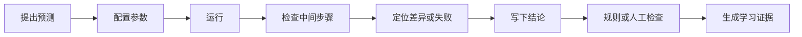

# OmniBox 大模型实验室 P0 计算契约与页面交互规格

> 文档状态：详细设计，可进入实现拆分与技术 Spike
> 对应产品版本：`0.1.0` 规划，不修改应用版本号
> 规则核验日期：`2026-08-10`
> 依赖文档：`llm-lab-runtime-security-design.md`、`learning-center-interaction-spec.md`、`learning-center-course-catalog.md`
> 当前范围：Tokenizer、Attention、Prompt Compare、RAG Debugger、Tool Calling、Eval Runner 六个 P0 实验

## 1. 文档目标

本文把 P0 大模型实验从功能名称细化为可以独立实现、测试和评审的契约，统一定义：

- 实验的学习目标和完成证据。
- 输入 Schema、范围、默认值和拒绝条件。
- 计算过程、排序、精度和确定性边界。
- 统一输出、错误恢复和受管产物。
- 页面布局、按钮、状态、空态和对比方式。
- 黄金测试向量和 P0 验收标准。

本文不授权任意代码执行、依赖安装、外部 MCP、GPU 训练或自动运行导出项目。

### 1.1 Spike 1 落实状态（2026-08-10）

- 通用实验页面壳已接入 OmniBox 首页和侧边栏。
- 六个实验的 Draft 2020-12 JSON Schema 位于 `src/llm-lab/contracts/`。
- 六组黄金夹具位于 `src/llm-lab/golden/`。
- Tokenizer、单 Head Attention、BM25 三个确定性执行器已接入，位于 `src/llm-lab/runtime.mjs`。
- Prompt Compare、Tool Calling、Eval Runner 当前只展示契约就绪状态，运行按钮保持禁用。
- 实验运行、结论与候选证据已通过本地 API 持久化到 `learning-user.db`，页面展示当前实验最近 10 条记录。
- 运行保存使用 `submission_key` 和请求哈希保证幂等；不同内容复用 Key 会被拒绝，学习库拒绝保存声明的敏感字段。
- 前端黄金测试位于 `tests/llm-lab-runtime.test.mjs`，后端持久化测试位于 `tests/test_learning_api.py`，统一通过 `npm run test:learning` 执行。

这仍是 P0 技术 Spike。保存的证据状态固定为 `candidate`，不会直接提升掌握度；当前不包含真实模型调用、真实工具执行或任意代码评分器。

## 2. P0 实验总览

| Lab ID | 实验 | 默认模式 | 是否需要模型 | 核心学习证据 |
|---|---|---|---|---|
| `lab.llm.tokenizer_visualizer` | Tokenizer 可视化 | `embedded_deterministic` | 否 | 解释分词粒度、Token ID 与文本长度关系 |
| `lab.llm.attention_toy` | 小型 Attention | `embedded_deterministic` | 否 | 正确解释 Q/K/V shape、缩放、Mask 与权重 |
| `lab.llm.prompt_compare` | Prompt 对比 | `brokered_model` | 是；提供静态示例预览 | 用固定样本和相同设置比较 Prompt |
| `lab.llm.rag_debugger` | RAG 调试 | `curated_local`，生成可选 | 检索不需要，生成可选 | 定位切分或召回失败并保留引用 |
| `lab.llm.tool_calling` | Tool Calling | `brokered_model` + 模拟工具 | 解析练习可离线，真实生成可选 | 解释 Schema、参数错误、执行和恢复 |
| `lab.llm.eval_runner` | 最小评测运行器 | `curated_local` + 可选模型 | 取决于被评对象 | 生成逐条结果、指标、失败样本和人工复核 |

P0 上线顺序：

1. Tokenizer。
2. Attention。
3. RAG 本地检索。
4. Tool Calling 离线夹具。
5. Prompt Compare 模型代理。
6. Eval Runner 组合评测。

前四项先建立无模型 Key 的完整学习链路，再接入真实模型成本和非确定性。

## 3. 通用实验契约

### 3.1 学习动作闭环



仅点击运行、成功调用模型或得到一个正确输出不能完成实验。完成条件至少包含：

- 一条运行记录。
- 一次中间过程检查。
- 用户提交的预测或解释。
- 用户结论满足当前实验 Rubric。

### 3.2 通用输入外壳

```json
{
  "contract_version": "llm-lab-p0-1",
  "lab_ref": "lab.llm.tokenizer_visualizer",
  "lab_version": "1.0.0",
  "idempotency_key": "uuid-or-ulid",
  "parameters": {},
  "input_refs": [],
  "prediction": {
    "prompt_ref": "prediction.tokenizer.count_change",
    "answer": "increase"
  }
}
```

要求：

- 使用 JSON Schema Draft 2020-12。
- 所有对象默认 `additionalProperties: false`。
- 数组、字符串、数值、嵌套深度和总 JSON 字节数必须有限制。
- 未声明字段返回 `SCHEMA_VALIDATION_FAILED`，不能静默忽略。
- `idempotency_key` 只防止同一次提交重复创建，不覆盖已有运行。

### 3.3 通用输出外壳

```json
{
  "status": "success",
  "summary": "实验运行成功",
  "next_actions": [],
  "artifacts": [],
  "data": {},
  "metrics": {},
  "warnings": [],
  "audit": {
    "contract_version": "llm-lab-p0-1",
    "lab_ref": "lab.llm.tokenizer_visualizer",
    "lab_version": "1.0.0",
    "implementation_sha256": "...",
    "policy_version": "llm-lab-policy-1",
    "started_at": "2026-08-10T00:00:00.000Z",
    "finished_at": "2026-08-10T00:00:00.010Z"
  }
}
```

### 3.4 通用页面结构

```text
┌──────────────────────────────────────────────────────────────────────────────┐
│ 实验名称  [纯本地/联网模型]  实验 v1.0.0   [说明] [关联课程] [运行历史]     │
│ 数据：0 个文件 / 不联网    预算：无 / 最多 N 次调用                         │
├──────────────────────────┬──────────────────────────┬────────────────────────┤
│ ① 预测与参数             │ ② 过程与结果             │ ③ 解释与结论           │
│                          │                          │                        │
│ [输入控件]               │ [逐步 Trace / 表格]       │ [提示问题]             │
│ [参数说明]               │ [图形与可访问表格]       │ [用户结论]             │
│                          │                          │                        │
│ [运行前检查] [运行实验]  │ [查看原始结构化结果]     │ [检查结论] [保存证据]  │
├──────────────────────────┴──────────────────────────┴────────────────────────┤
│ 状态 / 警告 / 错误原因 / 安全重试 / 停止条件                               │
└──────────────────────────────────────────────────────────────────────────────┘
```

桌面窄窗口下变为纵向步骤，不允许结果表格横向溢出后无法读取。

### 3.5 通用按钮规则

| 按钮 | 可用条件 | 行为 |
|---|---|---|
| `运行前检查` | 参数 Schema 有效 | 只生成计划，不产生模型费用 |
| `运行实验` | 策略允许或用户已确认 | 创建不可变 `lab_run` |
| `取消` | `queued/running` | 进入取消状态，等待真实终止 |
| `重试` | 失败且 `retryable=true` | 复制参数创建新运行 |
| `保存运行` | 存在结构化结果或可解释失败 | 保存可复现记录 |
| `检查结论` | 用户已填写结论 | 按 Rubric 给反馈 |
| `保存证据` | 运行和结论均满足完成条件 | 创建学习证据 |

## 4. Tokenizer 可视化实验

### 4.1 学习目标

用户需要理解：

- “字符”“用户感知字符”“词”和“Token”不是同一概念。
- Tokenizer 的词表与合并规则决定分词和 Token ID。
- 同一句文本在不同 Tokenizer 下可能产生不同长度。
- P0 教学 Tokenizer 不代表任何商业模型的真实计费结果。

### 4.2 P0 Tokenizer

P0 内置两种模式：

| ID | 作用 |
|---|---|
| `omb-unicode-grapheme-v1` | 按 Unicode extended grapheme cluster 展示用户感知字符 |
| `omb-grapheme-bpe-v1` | 使用内置小词表和固定 merge 表演示 BPE |

必须持续显示：

> `omb-*` 是 OmniBox 教学 Tokenizer，用于理解分词机制，不等同于 GPT、Qwen、DeepSeek 或其他模型的真实 Tokenizer，也不能用于精确账单估算。

真实模型 Tokenizer 作为后续独立资产接入，必须记录来源、许可、版本、词表哈希和特殊 Token 规则。

### 4.3 输入契约

```json
{
  "text": "low lower",
  "tokenizer_id": "omb-grapheme-bpe-v1",
  "normalization": "NFC",
  "show_merge_trace": true
}
```

限制：

| 字段 | 限制 |
|---|---|
| `text` | 1–10,000 UTF-8 字节 |
| `tokenizer_id` | 仅安装包允许列表 |
| `normalization` | P0 固定 `NFC`，界面不可改 |
| 输出 Token | 最多 4,096 个 |
| 合并步骤 | 最多 16,384 条 Trace |

文本包含孤立 surrogate、非法 Unicode 或归一化后超过限制时拒绝。

### 4.4 计算契约

#### Unicode 模式

- 输入先按 Unicode NFC 规范化。
- 使用固定记录版本的 Unicode extended grapheme cluster 规则切分。
- 计数分别显示：UTF-8 字节、Unicode code point、grapheme cluster 和 Token。
- 原文与规范化文本不同时，两者并列展示；Token span 只对应 `normalized_text`。

#### 教学 BPE 模式

1. 输入按 NFC 规范化。
2. 空白只作为预分词边界，不进入词内 merge。
3. 每个非空词切为 grapheme cluster，并追加 `</w>`。
4. 按 merge 表顺序重复合并相邻符号。
5. 若同一轮可合并多处，从左到右应用，不重叠。
6. 使用固定词表映射 Token ID；缺失符号使用显式 `<unk>`，不临时扩词表。
7. 输出 normalized UTF-8 byte span、grapheme span 和原始 substring。

词表、merge 表、Unicode 版本和实现哈希写入 `environment_json`。

### 4.5 输出契约

```json
{
  "normalized_text": "low lower",
  "normalization_changed": false,
  "tokenizer": {
    "id": "omb-grapheme-bpe-v1",
    "version": "1.0.0",
    "vocab_sha256": "...",
    "merges_sha256": "...",
    "unicode_version": "17.0.0"
  },
  "tokens": [
    {
      "index": 0,
      "piece": "low</w>",
      "display_text": "low",
      "token_id": 100,
      "utf8_start": 0,
      "utf8_end": 3,
      "grapheme_start": 0,
      "grapheme_end": 3
    }
  ],
  "merge_trace": [],
  "counts": {
    "utf8_bytes": 9,
    "code_points": 9,
    "graphemes": 9,
    "tokens": 3
  }
}
```

### 4.6 黄金测试 T-TOK-001

固定 merge 顺序：

```text
l + o       -> lo
lo + w      -> low
low + </w>  -> low</w>
e + r       -> er
er + </w>   -> er</w>
```

固定词表：

```text
100 low</w>
101 low
102 er</w>
```

输入：

```text
low lower
```

期望 Token：

```json
[
  {"piece": "low</w>", "token_id": 100, "utf8_start": 0, "utf8_end": 3},
  {"piece": "low", "token_id": 101, "utf8_start": 4, "utf8_end": 7},
  {"piece": "er</w>", "token_id": 102, "utf8_start": 7, "utf8_end": 9}
]
```

### 4.7 页面交互

- 输入时只更新字符统计，不自动执行完整 BPE Trace。
- 用户先预测“中文、英文、Emoji 哪种 Token/字符比例更高”，再运行。
- 结果区同时提供彩色片段和可排序表格，不能只靠颜色区分 Token。
- 点击 Token 高亮 normalized text 中的 span，并定位产生它的 merge 步骤。
- `对比文本` 允许并排两段，但不允许同时切换 Tokenizer 和文本后直接归因。
- 归一化改变文本时显示差异提示，禁止静默修改原输入。

### 4.8 完成条件

- 运行至少两段不同文字。
- 正确指出至少一个“字符数不等于 Token 数”的例子。
- 能说明教学 Tokenizer 与真实模型 Tokenizer 的边界。

## 5. 小型 Attention 实验

### 5.1 学习目标

- 理解 `Q @ Kᵀ` 产生位置之间的相似度分数。
- 理解除以 `sqrt(d_k)` 的缩放位置。
- 理解 Softmax、Mask 和 `weights @ V`。
- 能跟踪 shape，并区分分数、权重和输出。

### 5.2 P0 范围

- 单 batch、单 head。
- 不包含可训练投影矩阵 `Wq/Wk/Wv`。
- `Q` shape 为 `[Tq, Dk]`。
- `K` shape 为 `[Tk, Dk]`。
- `V` shape 为 `[Tk, Dv]`。
- 输出 shape 为 `[Tq, Dv]`。

多 batch、多 head、投影、反向传播和 KV Cache 后移到 P1。

### 5.3 输入契约

```json
{
  "q": [[1, 0], [0, 1]],
  "k": [[1, 0], [0, 1]],
  "v": [[1, 2], [3, 4]],
  "mask_type": "none",
  "custom_mask": null,
  "precision": "float64"
}
```

限制：

- `1 <= Tq,Tk <= 8`。
- `1 <= Dk,Dv <= 8`。
- 所有值必须是有限数，绝对值不超过 `1e4`。
- P0 只使用 `float64` 计算，显示可选择 3–8 位小数。
- 自定义 Mask shape 必须为 `[Tq,Tk]`，值只能是 `0/1`。

### 5.4 计算契约

标准公式：

```text
scores  = Q × Kᵀ / sqrt(Dk)
masked  = apply_mask(scores)
weights = softmax(masked, axis=-1)
output  = weights × V
```

Softmax 使用数值稳定形式：

```text
softmax(x_i) = exp(x_i - max(x)) / Σ_j exp(x_j - max(x))
```

Mask：

- `none`：不屏蔽。
- `causal`：当 `key_index > query_index` 时屏蔽；仅允许 `Tq == Tk`。
- `custom`：`1` 表示允许，`0` 表示屏蔽。
- 被屏蔽位置在 Softmax 前视为负无穷，输出权重必须为 0。
- 某一查询行全部被屏蔽时返回 `FULLY_MASKED_ROW`，不产生 NaN 结果。

不将屏蔽值实现为任意固定大负数写入契约；实现可以选择安全表示，但黄金结果必须满足零权重语义。

### 5.5 输出契约

```json
{
  "shapes": {
    "q": [2, 2],
    "k": [2, 2],
    "v": [2, 2],
    "scores": [2, 2],
    "weights": [2, 2],
    "output": [2, 2]
  },
  "scale": 0.7071067811865475,
  "raw_scores": [],
  "scaled_scores": [],
  "masked_scores": [],
  "weights": [],
  "output": [],
  "invariants": {
    "weight_rows_sum_to_one": true,
    "masked_weights_are_zero": true,
    "finite_output": true
  }
}
```

### 5.6 黄金测试 T-ATT-001

输入为 5.3 示例，期望：

```json
{
  "scale": 0.7071067811865475,
  "weights": [
    [0.6697615493266569, 0.3302384506733431],
    [0.3302384506733431, 0.6697615493266569]
  ],
  "output": [
    [1.6604769013466862, 2.6604769013466862],
    [2.3395230986533138, 3.3395230986533138]
  ]
}
```

验收容差：绝对误差 `<= 1e-12`。

### 5.7 黄金测试 T-ATT-002：Causal Mask

相同 Q/K/V，`mask_type="causal"`：

```json
{
  "weights": [
    [1.0, 0.0],
    [0.3302384506733431, 0.6697615493266569]
  ],
  "output": [
    [1.0, 2.0],
    [2.3395230986533138, 3.3395230986533138]
  ]
}
```

### 5.8 页面交互

- 矩阵输入支持表格编辑和三个内置示例，不支持粘贴代码执行。
- `逐步计算` 依次展示 `QKᵀ → 缩放 → Mask → Softmax → ×V`。
- 点击某个输出单元格时，高亮对应权重行和 V 列的乘加路径。
- 热力图必须有数值表格和色标，不能只用颜色表达。
- 用户切换 Mask 前先预测受影响单元格。
- shape 不匹配时在输入处显示期望 shape，不进入运行状态。

### 5.9 完成条件

- 正确填写一次输出 shape。
- 解释缩放发生在 Softmax 之前。
- 通过一次 causal Mask 预测题并解释被屏蔽权重为何为 0。

## 6. Prompt Compare 实验

### 6.1 学习目标

- 用固定任务和样本比较 Prompt，而不是凭单个漂亮答案判断。
- 区分确定性检查、人工评价和模型评价。
- 识别输出质量、延迟、Token 和费用之间的取舍。
- 理解真实模型结果具有时间和服务非确定性。

### 6.2 输入契约

```json
{
  "variants": [
    {"id": "v1", "label": "基础版", "system": "...", "user_template": "{{input}}"},
    {"id": "v2", "label": "结构化版", "system": "...", "user_template": "{{input}}"}
  ],
  "cases": [
    {"id": "c1", "input": "...", "expected": {}}
  ],
  "model_ref": "configured-model",
  "settings": {
    "temperature": 0,
    "max_output_tokens": 512,
    "seed": null
  },
  "repetitions": 1,
  "checks": [
    {"type": "json_schema", "schema_ref": "schema.output.v1"}
  ],
  "blind_manual_review": true
}
```

限制：

- Prompt 变体 2–4 个。
- 样本 1–20 条。
- 重复次数 1–3 次。
- 总调用数为 `variants × cases × repetitions`，不得超过当前运行预算。
- 每个 Prompt 和样本有独立字节限制，总请求预览超限时拒绝。
- P0 检查类型只允许 `exact_match`、`contains_all_literals`、`json_schema`、`numeric_tolerance`。
- 不接受用户提供的任意正则、代码评分器或模板执行器。

### 6.3 运行契约

1. 对所有变体使用同一 Provider、模型和生成设置。
2. 每个 case 为独立请求，不把上一个输出带入下一个请求。
3. 运行顺序按 case 交错变体，并保存实际序列。
4. Provider 支持 seed 时传递并记录，但复现等级仍不能自动标为 `exact`。
5. 每个响应单独记录状态、Token、延迟、响应 ID 和时间。
6. 单条失败不取消整个批次；达到预算或策略停止条件除外。
7. 输出不自动进入下一个 Prompt 或工具调用。

### 6.4 评价契约

#### 确定性检查

- `exact_match`：默认按原字符串比较；可显式启用 `trim`。
- `contains_all_literals`：按字面量查找，不解释正则。
- `json_schema`：解析为一个 JSON 值并按 Draft 2020-12 校验。
- `numeric_tolerance`：指定 JSON Pointer、目标值、绝对或相对容差。

#### 人工评价

- 盲评时隐藏变体名称，随机显示为 A/B/C/D。
- 同一 case 的输出并列，评价维度来自内容包 Rubric。
- 用户必须能查看原始输出，不能只显示总分。
- 解除盲评后才展示 Prompt 与结果对应关系。

#### AI Judge

P0 不把 AI Judge 作为完成条件。后续启用时必须作为独立模型调用记录，并展示 Judge Prompt、模型和偏差风险。

### 6.5 输出契约

```json
{
  "run_plan": {
    "variants": 2,
    "cases": 5,
    "repetitions": 1,
    "planned_requests": 10,
    "actual_sequence": []
  },
  "items": [
    {
      "variant_id": "v1",
      "case_id": "c1",
      "repetition": 0,
      "status": "succeeded",
      "output_ref": "artifact-output-01",
      "checks": [],
      "usage": {},
      "latency_ms": 0
    }
  ],
  "summary_by_variant": [],
  "partial_failure_count": 0
}
```

### 6.6 静态黄金测试 T-PRM-001

不调用模型，使用内置响应夹具：

```text
Case c1 要求输出 {"name": string, "risk": string}
v1 fixture: Name: demo, Risk: low
v2 fixture: {"name":"demo","risk":"low"}
```

JSON Schema 检查期望：

```text
v1: failed / JSON_PARSE_ERROR
v2: passed
```

该测试验证评价器，不证明 v2 在所有任务中更好。

### 6.7 页面交互

- 默认先进入“静态夹具”模式，无 Key 也能学习比较方法。
- 切换“真实模型”后显示 Provider Origin、模型、调用总数和费用状态。
- Prompt 编辑器突出变量，但不执行其中的代码或 HTML。
- 结果页包含“逐条”“汇总”“成本与延迟”“人工盲评”四个 Tab。
- 汇总卡必须显示分母，例如 `8/10`，不能只显示 `80%`。
- Provider 错误与校验失败分开统计。
- 用户结论需回答“哪个变化可能导致差异”和“证据是否足够”。

### 6.8 完成条件

- 至少比较两个变体和三个固定样本。
- 查看至少一个失败样本。
- 完成一次盲评或确定性评价。
- 结论包含质量和成本/延迟中的至少两个维度。

## 7. RAG Debugger 实验

### 7.1 学习目标

- 理解导入、切分、索引、检索、重排、上下文组装和生成是不同阶段。
- 能区分“知识不在文档”“切分失败”“召回失败”和“模型未使用证据”。
- 每个答案引用能回到材料快照和 span。
- Prompt Injection 文本不能扩大工具权限。

### 7.2 P0 检索基线

P0 使用内置、可完全复算的 `omb-bm25-v1`：

- 无 Embedding 模型。
- 无网络。
- 无依赖下载。
- 保留逐项 BM25 分数解释。

Embedding 和重排器在 P1 以独立阶段加入，不能静默替换 P0 排序结果。

### 7.3 材料限制

| 项目 | P0 限制 |
|---|---:|
| 材料数 | 1–20 |
| 提取后总文本 | 最大 5 MB |
| Chunk 数 | 最大 500 |
| 单次问题 UTF-8 | 最大 8 KB |
| `top_k` | 1–10 |
| 生成上下文 | 最大 20 个 Chunk，受模型 Token 预算二次限制 |

所有材料先生成受管快照和 SHA-256。解析失败的材料不进入索引分母。

### 7.4 切分契约

输入：

```json
{
  "material_refs": ["snapshot-01"],
  "chunking": {
    "max_graphemes": 600,
    "overlap_graphemes": 80,
    "boundary_preference": ["paragraph", "sentence"]
  },
  "retrieval": {
    "engine": "omb-bm25-v1",
    "k1": 1.5,
    "b": 0.75,
    "top_k": 5,
    "min_score": 0
  }
}
```

规则：

1. 换行统一为 `LF`，正文按 NFC 规范化，但保存原始快照。
2. 以 extended grapheme cluster 计数，不能在 grapheme 内截断。
3. 从当前起点向后查看 `max_graphemes`。
4. 在窗口后 30% 范围内优先选择最后一个段落边界，其次句子边界。
5. 没有可用边界时在 `max_graphemes` 硬切。
6. 下一个起点为 `end - overlap_graphemes`，但必须严格大于上一块起点。
7. 空白 Chunk 丢弃。
8. `chunk_id = sha256(source_sha256 + start_utf8 + end_utf8 + chunk_config_sha256)`。

`overlap_graphemes` 必须小于 `max_graphemes / 2`。

### 7.5 检索 Token 化

- 文本按 NFC 规范化。
- 拉丁字母使用 Unicode lowercase；不做语言学词干化。
- 连续字母或数字按 Unicode word boundary 切为 term。
- 连续 CJK 字符生成相邻二元 term；单字符序列保留单元 term。
- 标点和空白不作为 term。
- Term 位置和频次保留用于解释。
- Tokenizer 版本写入索引元数据。

P0 不提供停用词表，避免语言和版本差异被隐藏。

### 7.6 BM25 契约

对查询 term `t` 和文档 Chunk `d`：

```text
idf(t) = ln(1 + (N - df(t) + 0.5) / (df(t) + 0.5))

score(t,d) = idf(t) *
             tf(t,d) * (k1 + 1) /
             (tf(t,d) + k1 * (1 - b + b * |d| / avgdl))

score(q,d) = Σ score(t,d)
```

规则：

- 查询中的重复 term 只计算一次，P0 不加入 query term frequency 权重。
- `|d|` 为检索 term 数，`avgdl` 为非空 Chunk 平均 term 数。
- 分数使用 `float64`。
- 排序：分数降序、材料选择顺序、`start_utf8` 升序、`chunk_id` 字典序。
- `min_score=0` 时仍只返回至少匹配一个查询 term 的 Chunk。
- 空查询或全部无有效 term 返回 `EMPTY_QUERY_TERMS`。

### 7.7 输出契约

```json
{
  "index": {
    "engine": "omb-bm25-v1",
    "documents": 3,
    "avgdl": 3,
    "config_sha256": "..."
  },
  "query": {
    "original": "cat fish",
    "terms": ["cat", "fish"]
  },
  "results": [
    {
      "rank": 1,
      "chunk_id": "chunk-02",
      "score": 0.9400072584914712,
      "term_contributions": [
        {"term": "cat", "tf": 1, "df": 2, "idf": 0.47000362924573563, "score": 0.47000362924573563},
        {"term": "fish", "tf": 1, "df": 2, "idf": 0.47000362924573563, "score": 0.47000362924573563}
      ],
      "source_ref": "snapshot-02",
      "utf8_start": 0,
      "utf8_end": 12,
      "text": "cat ate fish"
    }
  ]
}
```

### 7.8 黄金测试 T-RAG-001

Chunk：

```text
chunk-01: cat sat mat
chunk-02: cat ate fish
chunk-03: dog ate fish
```

查询：

```text
cat fish
```

配置：`k1=1.5`、`b=0.75`。三个 Chunk term 数均为 3。

期望：

```json
[
  {"chunk_id": "chunk-02", "score": 0.9400072584914712},
  {"chunk_id": "chunk-01", "score": 0.47000362924573563},
  {"chunk_id": "chunk-03", "score": 0.47000362924573563}
]
```

第二、三名同分，按材料选择顺序稳定排序。

### 7.9 生成阶段

生成是检索后的可选步骤：

- 发送前显示问题、选中 Chunk、来源和模型预算。
- 每个 Chunk 使用不可执行的数据边界和稳定引用 ID。
- System Prompt 规定只使用提供证据，无法回答时明确说明。
- 模型引用必须解析为本次上下文内的 Chunk ID。
- 未引用、引用不存在或引用不支持结论时标记问题，不自动修正事实。
- 生成失败不影响检索 Trace 和用户结论。

### 7.10 页面交互

页面阶段：

```text
[材料] → [切分] → [索引] → [检索] → [上下文] → [可选生成] → [失败归因]
```

- 材料区显示快照哈希和本地/联网状态。
- 切分区支持拖动参数后预览 Chunk 边界，但修改参数会生成新索引计划。
- 检索结果同时显示排名、总分和 term contribution。
- 点击结果跳到原文 span，并显示 overlap。
- 用户可以标记“应当召回”的黄金 Chunk，系统计算 `hit@k`。
- Prompt Injection 夹具以醒目边界显示为“不可信文档内容”。
- 失败归因只能从 `missing_source/chunking/retrieval/context/generation/citation` 选择并补充说明。

### 7.11 完成条件

- 导入或选择至少一份材料快照。
- 对同一问题比较两组切分或检索参数。
- 标记一个召回成功或失败样本。
- 结论明确指出问题发生在哪个阶段及证据。

## 8. Tool Calling 实验

### 8.1 学习目标

- 理解模型只产生候选工具名与参数。
- 理解 JSON Schema、参数规范化、权限决策、执行和观察结果是独立步骤。
- 能处理未知工具、参数错误、工具失败、重试和循环。
- 明白批准模型请求不等于批准工具副作用。

### 8.2 P0 模拟工具

#### `training.add_numbers`

```json
{
  "$schema": "https://json-schema.org/draft/2020-12/schema",
  "type": "object",
  "properties": {
    "a": {"type": "number", "minimum": -1000000, "maximum": 1000000},
    "b": {"type": "number", "minimum": -1000000, "maximum": 1000000}
  },
  "required": ["a", "b"],
  "additionalProperties": false
}
```

结果为 `float64` 加法；非有限结果返回 `NUMERIC_OVERFLOW`。

#### `training.lookup_weather_fixture`

- 城市只能从 `beijing/shanghai/shenzhen/london` 枚举选择。
- 返回内容包内固定天气夹具和 `fixture_date`。
- 不联网，不表示真实天气。

#### `training.search_course_notes`

- 只搜索当前课程随附的固定笔记夹具。
- 查询最大 200 字符，`top_k` 为 1–5。
- 不读取用户笔记和磁盘。

#### `training.unstable_service`

- 输入 `behavior` 为 `success/timeout/rate_limit/invalid_payload`。
- 用固定错误演示重试和停止条件，不真正等待长时间。

### 8.3 输入契约

```json
{
  "mode": "offline_fixture",
  "user_request": "把 12.5 和 7.5 相加",
  "candidate_tool_call": {
    "call_id": "call-01",
    "name": "training.add_numbers",
    "arguments": {"a": 12.5, "b": 7.5}
  },
  "max_steps": 4,
  "error_fixture": null
}
```

- `offline_fixture` 由用户或课程夹具提供候选调用，不调用模型。
- `model_generated` 通过 Broker 生成候选调用，需要模型授权。
- P0 每一步只执行一个候选调用。
- `max_steps` 固定范围 1–4。
- Schema 总大小、深度和 `$ref` 使用受限；P0 不解析外部 `$ref`。

### 8.4 处理管线

```text
candidate_received
→ tool_name_lookup
→ JSON parse
→ Draft 2020-12 validation
→ policy decision
→ normalized_arguments snapshot
→ execute simulated tool
→ structured observation
→ optional next model step
→ stop condition
```

任何阶段失败都不能跳过后续校验直接执行。

### 8.5 黄金测试 T-TOOL-001

候选调用：

```json
{"name":"training.add_numbers","arguments":{"a":12.5,"b":7.5}}
```

期望：

```json
{
  "status": "success",
  "data": {"result": 20},
  "audit": {"risk_level": "R0", "side_effect": "none"}
}
```

### 8.6 黄金测试 T-TOOL-002：多余参数

```json
{"name":"training.add_numbers","arguments":{"a":1,"b":2,"path":"../../.ssh"}}
```

期望：

```json
{
  "status": "error",
  "error": {
    "code": "SCHEMA_VALIDATION_FAILED",
    "retryable": true
  }
}
```

工具不得执行，`path` 不得被解释或访问。

### 8.7 黄金测试 T-TOOL-003：未知工具

```json
{"name":"execute_shell","arguments":{"cmd":"whoami"}}
```

期望 `UNKNOWN_TOOL`，`next_actions` 只列当前教学工具，不提供相似高权限工具。

### 8.8 页面交互

- 左侧显示用户请求、可用工具 Schema 和“模型候选调用”。
- 中间按管线逐步显示每一关，失败处停止并解释。
- 参数差异以结构化 Diff 展示，禁止用可执行代码编辑器提交。
- 权限卡显示风险等级、读取、写入、网络和副作用。
- 右侧显示工具观察结果、模型最终回答和用户恢复方案。
- “注入错误”允许选择未知工具、缺字段、多余字段、超时、限流和循环。
- 模型模式下，候选调用产生后仍显示策略结果；P0 R0 模拟工具可以自动执行。

### 8.9 完成条件

- 成功完成一次合法调用。
- 处理至少两个不同失败类型。
- 能解释“模型建议调用”和“工具实际执行”的边界。
- 为一个错误写出安全重试和停止条件。

## 9. Eval Runner 实验

### 9.1 学习目标

- 用固定数据集和明确指标评价应用，而不是挑选演示样本。
- 区分任务失败、模型服务失败和评分器失败。
- 理解样本数、分母、人工复核和非确定性。
- 能从失败分组形成下一轮改进假设。

### 9.2 P0 被评对象

| 类型 | 示例 |
|---|---|
| `fixture_outputs` | 内置静态输出，验证评分器 |
| `prompt_variant` | Prompt Compare 中的一个版本 |
| `rag_retrieval` | RAG 的排名结果 |
| `tool_pipeline` | Tool Calling 的候选调用和结果 |

不运行任意用户代码作为被评对象。

### 9.3 数据集契约

```json
{
  "dataset_id": "dataset.structured_extract.v1",
  "version": "1.0.0",
  "cases": [
    {
      "id": "case-001",
      "input": {},
      "expected": {},
      "tags": ["happy_path"],
      "weight": 1
    }
  ]
}
```

限制：

- 1–50 条 case。
- case ID 唯一且稳定。
- 权重范围 `0 < weight <= 10`。
- P0 指标默认同时报告未加权和加权结果。
- 数据集包含许可、来源、敏感分类、版本和 SHA-256。
- case 顺序不影响评分；实际执行顺序单独保存。

### 9.4 评分器

P0 允许：

- `exact_match`。
- `contains_all_literals`。
- `json_schema`。
- `numeric_tolerance`。
- `retrieval_hit_at_k`。
- `tool_call_match`：工具名和规范化参数相等。
- `manual_rubric`：人工标签，不参与自动完成条件，除非内容包明确要求。

不允许用户提交可执行评分代码或任意正则。

### 9.5 指标契约

#### 通过率

```text
pass_rate = passed_cases / eligible_cases
```

服务失败、超时和评分器错误不从分母静默删除，分别报告：

```text
task_pass_rate
execution_error_rate
scoring_error_rate
```

#### 加权通过率

```text
weighted_pass_rate = Σ(weight_i * passed_i) / Σ(weight_i)
```

#### 延迟

- 只对实际完成请求计算延迟分布，同时报告缺失数量。
- `median` 使用排序后中位数。
- `p95` 使用 nearest-rank：索引为 `ceil(0.95 * n)`，从 1 开始。
- 样本少于 20 时标记 `small_sample_warning`。

#### 成本

- 汇总 Provider 返回的输入、输出和总 Token。
- 价格可用时计算估算成本，并保存价格来源日期。
- Provider 未返回用量时单独报告 `usage_unknown_count`。

### 9.6 输出契约

```json
{
  "dataset": {
    "id": "dataset.structured_extract.v1",
    "version": "1.0.0",
    "sha256": "...",
    "cases": 20
  },
  "items": [],
  "summary": {
    "eligible_cases": 20,
    "passed_cases": 16,
    "task_pass_rate": 0.8,
    "execution_errors": 2,
    "execution_error_rate": 0.1,
    "scoring_errors": 0,
    "manual_review_pending": 2,
    "median_latency_ms": 800,
    "p95_latency_ms": 1500,
    "usage_unknown_count": 0
  },
  "groups": [
    {"tag": "nested_json", "passed": 2, "total": 5}
  ]
}
```

### 9.7 黄金测试 T-EVAL-001

10 个静态 case：

- 7 个通过。
- 1 个任务输出不匹配。
- 1 个执行错误。
- 1 个评分器错误。

期望：

```json
{
  "eligible_cases": 8,
  "passed_cases": 7,
  "task_pass_rate": 0.875,
  "execution_errors": 1,
  "execution_error_rate": 0.1,
  "scoring_errors": 1,
  "scoring_error_rate": 0.1
}
```

`eligible_cases` 只排除无法产生有效评分的执行错误和评分器错误，但总样本、两类错误数量和错误率必须同时显示，防止结果看起来比实际更好。

### 9.8 页面交互

- 第一步选择被评对象、数据集和评分器。
- 运行前显示 case 数、请求数、并发、Token 上限和费用状态。
- 运行中显示 `完成/总数`、成功、任务失败、执行错误和已取消。
- 结果默认打开“失败样本”，而不是只显示总分。
- 支持按 tag、错误类型、变体和人工复核状态筛选。
- 指标卡总是显示分子、分母和样本量。
- “对比运行”要求数据集版本和评分器版本相同，否则只显示并列结果并警告不可直接比较。
- 用户结论必须引用至少一个失败分组和下一步假设。

### 9.9 完成条件

- 在至少 10 个 case 上运行一个被评对象。
- 查看至少两个失败或错误样本；若全部通过，查看两个边界样本。
- 完成一个失败分组。
- 写出可验证的下一轮改进假设。

## 10. 六个实验的页面路由与导航

建议路由：

```text
/learning/llm/labs
/learning/llm/labs/tokenizer
/learning/llm/labs/attention
/learning/llm/labs/prompt-compare
/learning/llm/labs/rag-debugger
/learning/llm/labs/tool-calling
/learning/llm/labs/eval-runner
/learning/llm/runs/:runId
```

### 10.1 实验目录

每张实验卡显示：

- 本地/联网模型标识。
- 前置课程和掌握状态。
- 预计时间。
- 是否需要 Key。
- 最近运行及结论状态。
- 能力等级：`R0/R1/R2`。

不能用“已运行”替代“已完成”。

### 10.2 运行详情

运行详情是不可变快照，包含：

- 参数、输入引用和运行计划。
- 过程 Trace 和结构化输出。
- Provider 用量和错误。
- 环境、实现与内容版本。
- 用户结论和评价。
- `从此运行重试` 与 `复制参数到新实验`。

重试不修改原运行。

## 11. 状态、空态与故障态

| 状态 | 页面反馈 | 主操作 |
|---|---|---|
| 无输入 | 显示最小示例和学习问题 | 加载示例 |
| 参数无效 | 就地显示字段错误和期望范围 | 修正参数 |
| 需 Key | 本地部分仍可使用，模型部分锁定 | 打开设置 |
| 需同意 | 展示数据、Origin、调用数和预算 | 确认运行 |
| 排队 | 显示队列位置或等待原因 | 取消 |
| 运行中 | 显示阶段、进度和已用预算 | 取消 |
| 部分失败 | 保留成功项，列出失败分母 | 查看失败/安全重试 |
| 策略拒绝 | 显示被拒能力和替代模式 | 切换安全模式 |
| 取消中 | 明确仍在终止任务 | 等待 |
| 已取消 | 展示取消前完整产物 | 保存运行/新建运行 |
| 成功未结论 | 结果可查看但未形成高质量证据 | 写结论 |
| 已完成 | 展示证据和下一练习 | 查看证据 |

## 12. 可访问性与可视化规则

- Token 颜色、Attention 热力图、RAG 排名和评测状态都必须有文本/表格等价形式。
- 矩阵单元格可键盘导航，行列标题被屏幕阅读器识别。
- 动画可以暂停；逐步计算不依赖快速闪烁。
- 错误不能只用红色，必须有图标、错误码和文字。
- 大表格支持固定表头、列选择和导出结构化 JSON。
- 数字展示保留完整值入口，默认舍入不能影响复制的原始结果。
- 公式提供纯文本和 MathML/可访问替代，不只使用图片。

## 13. 受管产物

| 实验 | 必须产物 | 可重建缓存 |
|---|---|---|
| Tokenizer | 输入、Token 表、merge Trace、词表/merge 哈希 | 彩色分词图 |
| Attention | Q/K/V、Mask、各阶段矩阵、精度 | 热力图 |
| Prompt Compare | Prompt、样本、响应引用、检查和用量 | 汇总图 |
| RAG | 材料快照引用、Chunk、索引配置、检索 Trace、引用 | 索引文件 |
| Tool Calling | Schema、候选调用、策略、规范化参数、观察结果 | 流程图 |
| Eval Runner | 数据集版本、逐条结果、指标、错误和人工复核 | 图表 |

所有必要产物记录 SHA-256。缓存删除后必须能从必要产物重建，不能反向依赖截图。

## 14. 数据模型映射

### 14.1 `lab_definitions`

六个 P0 实验的 `parameters_schema_json` 保存各自输入 Schema；安全能力、实现和资源限制遵循运行边界文档建议字段。

### 14.2 `lab_runs`

| 字段 | 内容 |
|---|---|
| `parameters_json` | 已通过 Schema 的规范化输入 |
| `input_refs_json` | 数据集、材料快照、Prompt 和夹具引用 |
| `output_refs_json` | 必要产物引用 |
| `metrics_json` | 指标与口径版本，不放大对象 |
| `environment_json` | 实现、Unicode、Tokenizer、Provider 和模型版本 |
| `log_path` | 受管、脱敏日志 |
| `conclusion` | 用户提交的最终结论 |

大型逐条结果、矩阵 Trace、Chunk 和响应正文放在受管产物或明细表，不塞入单个 JSON 字段。

### 14.3 运行关系

- Prompt Compare 可以生成一个子 Eval Run，但二者保持独立 `lab_run`。
- RAG 的生成阶段引用检索运行或同一运行中的检索产物，不能重算后覆盖。
- Eval Runner 引用被评运行 ID 和不可变输出哈希。
- 重试始终使用 `retry_of_run_id`，对比使用单独关系或对比快照。

## 15. 测试分层

### 15.1 契约测试

- JSON Schema 接受/拒绝样本。
- 未声明字段、超长输入、NaN/Infinity 和深层 JSON。
- 统一成功/错误外壳。
- 错误恢复包含 root cause、safe retry 和 stop condition。

### 15.2 黄金数值测试

- T-TOK-001。
- T-ATT-001、T-ATT-002。
- T-PRM-001。
- T-RAG-001。
- T-TOOL-001 至 003。
- T-EVAL-001。

黄金测试资产进入内容包或测试目录时必须带版本和哈希。

### 15.3 属性测试

- Attention 每个非全屏蔽权重行和为 1。
- Attention 被屏蔽权重为 0。
- Token span 不重叠越界，合并后覆盖相应 normalized text。
- RAG 相同输入、配置和实现哈希结果顺序一致。
- Tool Calling 未通过 Schema 时执行次数为 0。
- Eval 指标分子不大于分母，错误率以总 case 为分母。

### 15.4 页面测试

- 无 Key 仍能进入 Tokenizer、Attention、RAG 检索、Tool 夹具和 Eval 夹具。
- 刷新和返回恢复草稿，不重复创建运行。
- 运行中取消、断网、Provider 失败和应用重启。
- 键盘完成矩阵、表格、Tab 和结论操作。
- 主题切换后热力图和状态仍可辨认。
- 导出结果包含模式、版本、数据范围和必要警告。

## 16. 技术 Spike 任务拆分

### Spike 1：通用实验壳

- 路由、三栏布局、预测草稿、运行状态和历史入口。
- 通用输入/输出外壳、错误卡和受管产物引用。
- 不接模型。

### Spike 2：Tokenizer

- Unicode 17 grapheme、NFC、教学 BPE、span 和 Trace。
- T-TOK-001 与 Emoji/组合字符边界测试。

### Spike 3：Attention

- Float64 矩阵计算、Mask、稳定 Softmax、Trace 和热力图。
- T-ATT-001/002 与 fully masked row。

### Spike 4：RAG 本地检索

- 材料快照、切分、term 化、BM25、Trace 和原文定位。
- T-RAG-001 与 Prompt Injection 夹具。

### Spike 5：Tool Calling 离线夹具

- Draft 2020-12 校验、模拟工具、错误注入、循环和统一观察结果。

### Spike 6：模型 Broker

- Prompt Compare 和 Tool Calling 模型候选调用。
- 发送预览、预算、流式响应、取消和 Provider 错误。

### Spike 7：Eval Runner

- 数据集、确定性评分器、逐条结果、指标和失败分组。
- 组合 Prompt/RAG/Tool 运行引用。

每个 Spike 独立验收，不能因为模型 Broker 未完成而阻塞纯本地实验。

## 17. P0 总体验收标准

- 六个实验都有稳定 ID、版本化输入 Schema 和统一输出外壳。
- 所有黄金测试通过，数值容差和排序规则明确。
- Tokenizer 页面明确标识教学词表，不冒充真实模型计费。
- Attention 能查看每一步矩阵和 shape，不只显示热力图。
- Prompt Compare 使用相同模型、设置和样本，并保存实际执行顺序。
- RAG 的 Chunk、BM25 term contribution 和引用可以回溯。
- Tool Calling 在 Schema 或策略失败后不会执行工具。
- Eval Runner 同时报告通过分母、执行错误和评分器错误。
- 无 Key 时五类本地或夹具学习路径仍可使用。
- 真实模型调用前显示 Origin、数据、请求数、Token 和费用状态。
- 用户结论满足 Rubric 后才生成高质量学习证据。
- 全部功能仍遵守“不执行任意代码、不安装依赖、不连接外部 MCP”的 P0 边界。
- 产品版本保持 `0.1.0`。

## 18. 后续实现前待确定项

- `omb-grapheme-bpe-v1` 的正式教学词表、merge 表和内容许可。
- 浏览器与 Python 的 Unicode 17 grapheme 实现一致性。
- 中文 BM25 term 化是否在 P1 加入可选分词器。
- 内容包 JSON Schema 是内嵌、按引用加载还是编译缓存。
- Provider 对 seed、usage、流式 tool call 和取消的兼容矩阵。
- 受管产物采用 JSON、JSONL、SQLite 明细表或组合格式。
- W08 页面在当前 OmniBox 视觉体系中的高保真设计。

## 19. 官方与原始参考

- [Attention Is All You Need](https://arxiv.org/abs/1706.03762)
- [Neural Machine Translation of Rare Words with Subword Units](https://arxiv.org/abs/1508.07909)
- [The Probabilistic Relevance Framework: BM25 and Beyond](https://www.nowpublishers.com/article/DownloadEBook/INR-019)
- [JSON Schema Draft 2020-12](https://json-schema.org/draft/2020-12)
- [Unicode Text Segmentation](https://unicode.org/reports/tr29/)
- [Unicode Normalization Forms](https://www.unicode.org/reports/tr15/)
